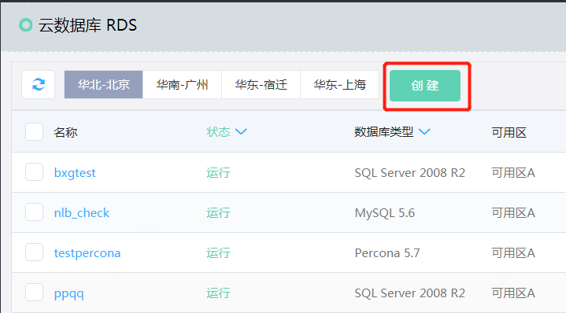
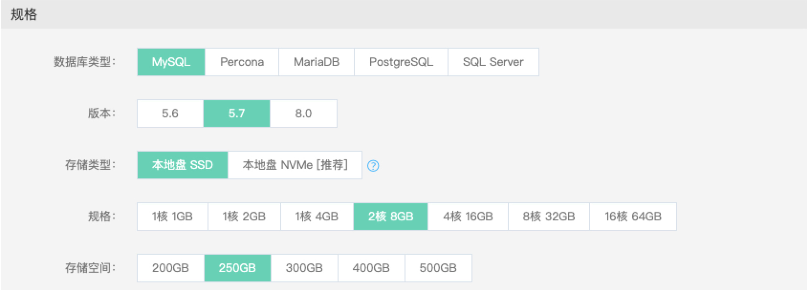
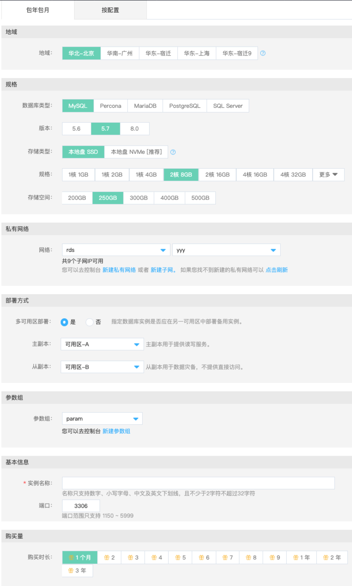
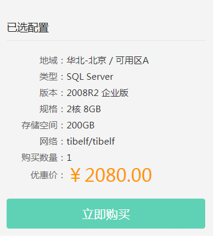
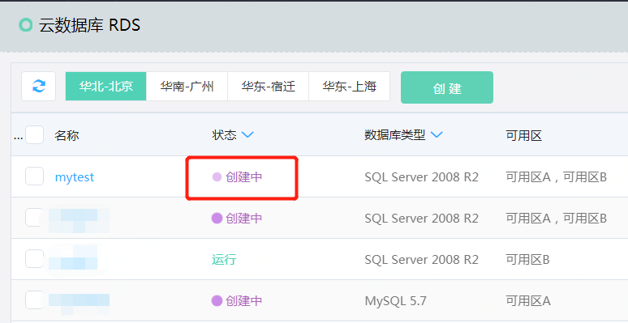

# 创建实例

## 1. 操作入口
- 进入RDS实例列表页，可以看到当前区域下的各个云数据库实例（MySQL或SQL Server）的概要信息，包括计费信息和过期时间等。
- 点击【创建】按钮，新建一个实例。

   
## 2. 选择实例配置信息
- 进入到数据库配置页面，选择计费方式（包年包月或按配置），地域，数据库类型SQL Server及其相关配置信息。右边可以查看在当前配置下的价格信息。
- 建议用户选择最靠近您用户的地域，可降低访问时延、提高下载速度。

**注意：不同地域间的内网互不连通。**

## 3. 实例名、网络及其他必要信息
- 输入实例名称，并选择实例所在的私有网络，子网。
- 实例名称的规则及限制在控制台上有提示，也可参考文档 名称及密码限制 
- 只支持在私有网络中创建。如果用户没有私有网络及子网，可以通过【新建私有网络】和【新建子网】的链接创建私有网络和子网。创建完成后，点击【刷新】，就可以看到新创建的私有网络和子网了。

**说明：由于管理的需要，选择的子网保留若干剩余IP才允许创建实例。**
- MySQL：需要4个以上的剩余IP
- SQL Server：需要10个以上的剩余IP

- MySQL 数据库还需输入数据库名，账号名及密码

## 4. 选择可用区

目前 **“华北-北京”** 和 **“华东-上海”** 区域支持多可用区，用户可以选择数据库是多可用区部署还是单可用区部署。
- **多可用区部署**：数据库主从分别位于不同的可用区，可用性更高：一个可用区发生故障，整个实例仍然可提供服务。但由于SQL Server镜像使用同步的高安全模式 ，主从位于不同的机房，性能会比单可用区部署略差。
- **单可用区部署**：主从位于同一可用区，如果该可用区发生故障，整个实例无法对外提供服务。由于主从位于同一机房，性能比多可用区部署略好。

**备注：**“多可用区部署”的可用区选择只表示实例在最初创建时的主从副本所在的可用区。实例运行后，会由于主从切换使实际的主从副本的可用区与创建时不一致，这是正常现象。

## 5. 选择购买时长
如果是包年包月方式，请选择购买的时长。

## 6. 确认购买
信息输入完成后，可查看点击页面右边的价格信息，并点击【立即购买】

## 7. 支付订单
然后进入订单确认页面，确认购买信息无误后，点击【立即支付】

## 8. 实例创建中
- 支付成功后自动返回实例列表页面，能看到实例状态为"创建中"
- 然后进入订单确认页面，确认购买信息无误后，点击【立即支付】

## 9. 创建完成
稍等一会后，点击刷新按钮，手工刷新页面，显示实例创建完成，正常“运行”中

