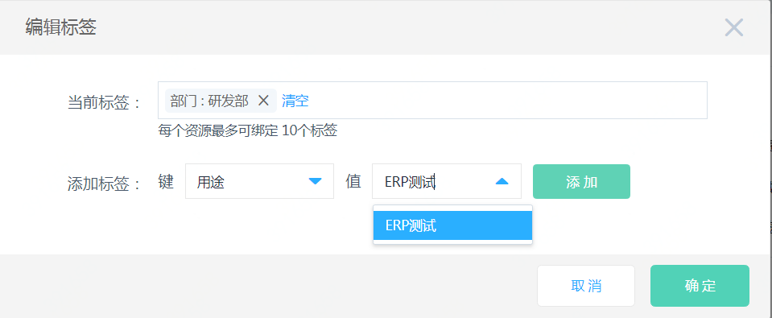

# 编辑标签
## 操作入口
选定需要编辑标签的数据库实例，点击“更多”中的【编辑标签】

或点击实例名称进入实例详情页，点击右上角【操作】—【编辑标签】

## 编辑标签 
- 在“编辑标签” 弹窗里，默认显示当前实例已绑定的标签，若当前实例已有10个标签则【添加】按钮置灰
- 可根据已有标签直接下拉选择或者根据输入进行模糊匹配后选择对应标签键/值（Key-Value）进行添加标签，点击【添加】则将显示在当前标签内
- 单击【确定】，将按照当前标签内显示情况完成编辑，并实际绑定到实例上
- 完成编辑标签后，您可以通过数据库列表页/详情页查看标签是否编辑成功。

## 注意
- 同一个资源，标签键（Key）不能重复，编辑前后标签键（Key）相同而值不同则将以新的值覆盖旧的值。
- 点击【添加】按钮不触发编辑标签，只有点击【确定】按钮会触发编辑标签
- 编辑时，系统会对当前实例先解绑不需要的标签，后绑定新标签/覆盖原有标签。因此若遇到网络抖动可能会遇到解绑成功而绑定/覆盖不成功的情况，此时还请再次操作编辑标签。
