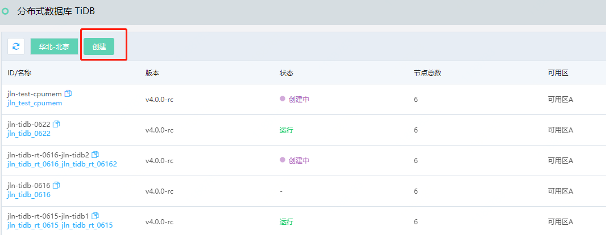

# 创建实例

您可以通过控制台快速创建分布式数据库 TiDB 实例

**前提条件**
已经开通分布式数据库 TiDB 权限

**操作步骤**
1. 登录 分布式数据库 TiDB 管理控制台。
2. 在实例列表页， 点击 创建 按钮，进入创建页。

3. 公测期间计费方式默认按配置计费，关于计费标准，请参考计费方式。
4. 实例配置的参数说明如下：
- **地域**：选择实例所在的地域，不同地域资源的内网不互通，创建后不能更改。关于地域的详细说明，请参考 地域与可用区。公测期间，只只支持“华北-北京”的“可用区A”。
- **数据库类型**：目前支持的数据库类型为 TiDB+TiKV。
- **版本**：指的是数据库类型的版本，目前提供最新的2.04 版本，不同地域支持的版本不同，具体以控制台为准。

- TiDB 规格：TiDB 节点的 CPU 和内存
- TiDB 节点数：节点数默认为 2 个，目前不支持修改，关于 TiDB 的介绍，请参考 节点管理

- TiKV 规格：TiKV 节点的 CPU 和内存
- TIKV 存储空间：该存储空间包含了数据文件，系统文件。
- TiKV 数据副本数：数据副本数默认为 3 个，不支持修改；在 2 个数据副本丢失的情况下，确保服务还可以继续正常工作。
- TiKV 节点数：节点数默认为 3 个，目前不支持修改，关于 TiKV 的介绍，请参考 节点管理。

- 网络：目前只提供 基础网络 部署这一种方式。
- 数据库账号：目前暂不支持自定义数据库账号，默认使用 root 账号。  
- 密码：实例创建成功后，你就可以用系统默认账号，密码登录实例； 密码的长度和字符有一定限制，具体以控制台为准。

5. 点击 立即购买 进入订单确认页。 

6. 阅读完《分布式数据库 TiDB 使用服务条款》，按照提示完成后续操作。 
