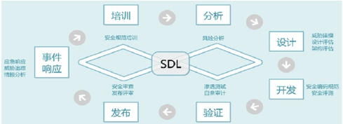

# 运营管理安全

## 1. 流程管理

### 1.1 SDL 流程

京东云非常注重内部流程的安全性。所有为用户提供服务的云产品，在开发过程中严格遵循产品的安全开发生命周期(SDL)安全开发流程。京东云的安全开发基于业界安全开发的最佳实践，并专门针对其中的几个环节做了优化。在产品开发各个阶段中消除信息安全和隐私问题，确保所有的云产品在其生命周期内均能获得足够的安全管控与评估。

如上图所示，整个云产品安全生命周期分为七个阶段：培训阶段、分析阶段、设计阶段、开发阶段、验证阶段、发布阶段、事件响应阶段。

**· 培训阶段 :** 开发团队的所有成员都接受适当的安全培训，了解相关的安全知识，培训对象包括开发人员、测试人员、项目经理、产品经理等。

**· 分析阶段：** 在项目确立之前，提前与项目经理或者产品 owner进行沟通，确定安全的要求和需要做的事情，确认项目计划和里程碑。

**· 设计阶段 :** 安全团队进行威胁建模，评估现有的需求和设计架构，沟通设计中的安全问题及应对方式。

**· 开发阶段 :** 项目组严格遵守安全编码规范或指南，最大限度减少编码时出现的安全漏洞。项目组使用安全团队提供的安全评测工具，确保开发编码的安全性。

**· 验证阶段 :** 安全团队提供对产品的人工渗透测试工作和白盒代码审计工作，并修复其漏洞。

**· 发布阶段 :** 产品上线前，需经过产品安全部的最终审查后，产品才能发布到线上环境。安全团队发现存在安全需求落地执行不到位等情况时，将告知项目组产品的发布流程终止。

**· 事件响应：** 受 SDL 要求约束的每个软件在发布时都必须包含事件响应计划。

### 1.2 运营运维流程

京东云运营管理团队的运维流程包括发布管理，变更管理，问题管理，和配置管理。发布管理是对产品服务上线前到上线后的准确流程。变更管理是针对生产环境中的变化，提出的有序流程。问题管理包括漏洞管理、事件处置流程和应急响应流程。配置管理则是对业务中所需的所有组件做配置的管理。

## 2. 风险管理

京东云通过十多年互联网电商安全经验自主研发的云安全运营平台，通过多层次、多维度的实时监控和离线分析，为云用户提供体系化的安全服务，解决出现的各种突发性安全事件，以增强云用户业务系统的抗风险能力，防止系统发生重大安全事件。并根据漏洞提供有针对性的安全修复方案，尽最大可能确保云用户业务系统在上云后不发生安全入侵事件，系统能够安全可靠的运行和帮助云用户安全。

为保障数据中心基础设施及云平台的安全稳定运行，由京东云安全团队负责云平台日常运行与维护，并提供云平台的技术支撑及远程维护工作。京东云安全运营机制可以及时获知最新网络安全、监管、攻防手段，会在第一时间处理相关安全事件，保证京东云平台的安全稳定及用户数据业务安全。

京东云安全运营服务体系主要分为两大板块：

**· 基础安全运营服务：** 依托平台防护体系提供的基础安全运营服务，为用户提供更专注、更可靠的基础安全运营服务。

**· 增值安全运营服务：** 在基础安全运营服务之上建立高级、定制化的保障服务，为用户提供更为专注性的服务。包括用户上云安全保障服务、高级应急响应服务、安全培训服务、安全咨询等服务。

### 2.1 资产管理

京东云致力于为用户掌握和可视化展现全网网络的全部网络设备资产信息。资产维护包括资产的发现以及资产管理，资产发现提供了一套切实有效的资产探知系统，采用以大数据为基础的空间扫描技术，获取用户位于不同站点的所有资产信息。资产管理对所有资产信息集中管理，提供统一的管理平台，为用户掌控、监察资产建立了完善而科学的资产维护体系。

### 2.2 权限管理

京东云团队为保障云平台的平稳运行，建立了一套严格的、细粒度的权限管理机制。结合自动化的运营管理机制，京东云提出了统一的云安全运维规范，所有对产品的运维操作都受到严密的权限控制和监控。

京东云要求权限管理分离到具体的运维操作，例如操作内容的平台化管理时，要求操作步骤按照操作规范，且经过2人以上评估通过后方可发起操作，并禁止在线上环境测试操作内容。京东云同样看重每位运营管理团队成员的权限管理，对于职责必须的权限，例如堡垒机管理审计权限，京东云要求运维人员的堡垒的管理审计权限必须每隔三个月重新申请一次。对于职责转变的情况，京东云将立刻撤销与该员工原职责相关的权限。

京东云为保障运维管理的安全质量，十分关注运营管理团队的安全意识培养。运营管理团队为每一位新加入的成员指派导师，导师均是行业内经验丰富的安全专家，导师对运维操作结果负责。京东云定期为运营管理团队做安全意识培训，定期进行运维操作规范更新及团队规范学习，使团队的安全意识和安全技术可持续的增长。

### 2.3 业务连续性管理

京东云十分关注用户的业务连续性，最大限度避免问题给用户的业务运行造成影响。京东云提供DNS、负载均衡等网络服务；应用、数据库、缓存、云存储、云硬盘等均采用集群架构部署，保证各个应用层、数据层、网络层等多个层次均具备冗余和高可用能力，保障业务连续性。京东云针对不同场景，精心为用户设计了基础架构、信息架构和应用结构的不同业务解决方案，提供业务连续性和灾难恢复管理服务。

## 3. 安全运营

### 3.1 安全情报

京东云建立了多层次立体的安全情报系统。结合内部的威胁情报分析系统，京东云将在互联网中关联分析网络攻击的特征，即时定位到网络攻击的源头。京东云的安全情报信息收集来自权威机构认证的外部威胁情报源，包含安全事件的信息、威胁事件的级别、IP 地址信誉等等。内部情报分析来自于京东的态势感知系统，可以收集到具体的操作日志和威胁特征等。

### 3.2 漏洞管理

京东云的漏洞管理包括漏洞感知、漏洞响应机制。京东云安全运营团队依托强健完备的漏洞管理平台，确保从基础设施、服务器，网络设备，操作系统，应用系统和云服务的自研和第三方漏洞在 SLA 时间内完成响应和修复，保障用户业务不受漏洞影响的风险。

京东云的漏洞感知系统利用安全扫描评估工具扫描公有云服务器及重要的网络设备，以对网络设备进行安全漏洞检测和分析，对识别出的能被入侵者利用来非法进入网络或者非法获取信息资产的漏洞，提醒管理员，及时完善安全策略，降低安全风险。

漏洞感知的流程中遵循以下原则 :

##### · 规范性

安全扫描的实施由专业的安全扫描人员依照规范的操作流程进行，对操作过程和结果要提供规范的记录，并形成完整的服务记录、报告和成果。

##### · 可控性

安全扫描的工具、方法和过程要在双方认可的范围之内，保证双方对于服务过程的可控性。安全工程师要在双方认可的情况下提供服务支持。

##### · 最小影响

确保安全扫描工作对本项目范围内系统和网络正常运行的可能影响降低到最低限度，不会对网络的运行和业务的正常提供产生显著影响。

京东云的漏洞响应工单系统，直接接受漏洞感知系统的漏洞报警。应急响应团队初步确定入侵路径、木马行为、是否影响数据、影响范围、感染用户（OA），危害级别、影响范围、漏洞利用场景，排查方案，并结合京东的相关应用场景，初步确定是否为安全事件, 及事件等级（特大、重大、严重、一般），第一时间响应。

应急响应团队与业务方研发、业务运维和 IT资源服务安全官和涉及人员共同参与讨论止损策略可行性、受影响环境规模、进一步确认风险、业务环境等。同时，应急响应团队针对该漏洞，结合外界信息和专业分析，确定修复方案。

### 3.3 安全响应

云安全事件是由于自然或者人为以及软硬件本身缺陷或故障的原因，对品牌、数据、用户、财务、业务、系统造成危害，或对社会造成负面影响的事件。一般特指因黑客入侵系统造成的安全事件。这些攻击行为包括但不仅限于植入病毒和后门、IDC服务器多台机器感染木马、被挂 Webshell 等成功控制服务器行为。

京东云安全运营团队会从事件发现之前，对入侵的可能：隐患、漏洞、风险、盲点做整改并推进，减少安全事件的发生。一旦安全事件发生，安全运营团队第一时间发现该入侵情况，发现立即响应。安全运营团队评估事件的影响范围和危害程度，根据安全事件的影响范围和危害程度进行紧急处置，深入分析安全事件的根本原因；进一步调查处理事件涉及的业务和系统，降低事件影响和损失。针对存在问题和隐患的系统，进行安全修复及复测；帮助用户快速解决安全问题。

## 4. 监控与审计

京东云要求对内部运营管理团队的运营操作实现全自动监控，监控范围覆盖内部、外部的关键服务组件，关键上下游服务组件等。监控对不同的服务组件设置了内存、磁盘、网卡等核心资源使用率等监控，设置更为严格的异常阈值线。及时告知运营团队通过错误统计结果，快速评估解决问题。监控的新增、删除、编辑需要有明确的流程，监控新增要明确监控等级、目标、监控接收人、异常处理预案，确保警报发生时的应急响应计划能第一时间进行。为了确定监控的有效性，京东云会定期触发测试报警进行监控有效性确认。

京东云自主研发一套基于服务树角色授权的线上机器认证登录系统，通过该系统对云平台所有的主机进行访问控制、操作历史记录等。运营管理团队人员通过该系统对服务器进行运维操作时，一旦出现高危命令，该系统能实时审计报警。统一日志审计系统将运营管理团队的所有后台运维操作记录加密存储，内部审计团队定期对运维操作记录进一步审核。

安全运维中应针对用户管理、系统认证、系统授权、系统登陆、数据获取 / 访问 / 修改等行为有完整的日志记录。记录内容包含如下必要信息：日志标签、时间、操作、用户ID、用户名、用户组、IP地址、访问方式，访问内容、访问结果。确保日志字段能够定位用户对组件访问时的具体操作。安全日志按照规定留存事件不少于180 天。

## 5. 服务支持

京东云的运营安全能力完备强大，可以提供全天候 7x24 小时专业技术支持服务，以及强大的解决方案支持能力，最大化满足用户需求。在标准服务的基础上，针对大型用户或特殊用户，京东云能够确保提供一对一的专家服务，帮助用户更好地应用京东云提供的云产品。

京东云 365天全方位为用户护航，为用户建立短信、邮件、站内信、公告等渠道推送通知、告警和安全事件等。
