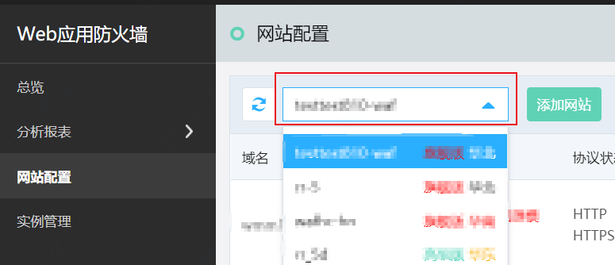
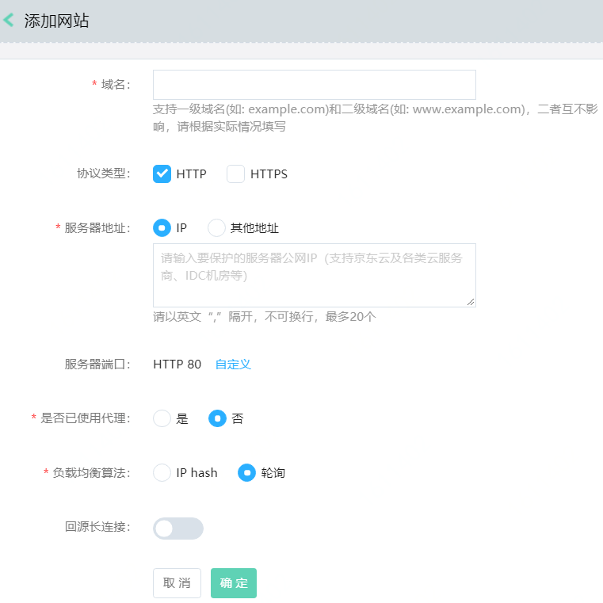
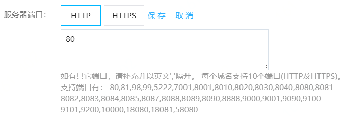

# 添加网站

本文介绍了开通Web应用防火墙（简称WAF）服务后，如何添加网站接入WAF，为网站开启Web应用防火墙防护。

****

## 背景信息

在添加网站接入WAF前，您需要确认以下条件：

- 已开通Web应用防火墙服务，且当前实例支持接入的域名数量（包括一级域名数量和总域名数量）未超过限制。

  > 说明： 支持接入的域名数量由Web应用防火墙的实例规格和扩展域名包数量决定。 更多信息，请参见[版本功能说明](../Pricing/Price-Overview.md)和[域名扩展包说明](../Pricing/domain-Expansion-Pack.md)。

- 接入中国大陆的Web应用防火墙服务时，待添加的网站必须已完成中华人民共和国工业和信息化部ICP备案。

## 添加网站步骤

1、登录[Web应用防火墙控制台](https://cloudwaf-console.jdcloud.com/overview/business)。

2、在左侧导航栏，单击**网站配置**。

3、在**网站配置**页面上方，选择当前实例。选择实例后，点击**添加网站**。

4、进入**添加网站**页面，填写网站信息。相关说明，请看下表。

| 参数 | 说明                                                         |
| :------------- | ------------------------------------------------------------ |
| **域名** | 请输入要防护的域名。 1.支持使用精确域名，如`www.example.com`。 2.支持使用泛域名（仅限旗舰版），如`*.example.com`。       a.如果您有域名：a.example.com，b.example.com和c.example.com，且各子域名对应的服务器IP地址相同，那么您可以直接添加泛域名`*.example.com`       b.添加泛域名后，Web应用防火墙将自动匹配该泛域名对应的所有子域名。       c.如果同时存在泛域名和精确域名配置，则精确域名的转发规则和防护策略优先生效。  |
| **协议类型** | 选择网站使用的网络协议类型。可选值： **1.HTTP** **2.HTTPS**：如果网站支持HTTPS加密认证，请选择HTTPS协议并在添加网站后，在网站配置页面上传域名的证书和私钥文件。更多信息，请参见[上传HTTPS证书](update-certificate.md)。 以上填写的均是网站提供的服务协议。如果网站选择HTTPS协议后，将显示下图的菜单。    **a、开启HTTPS的强制跳转**：客户端流量的请求是否强制跳转成HTTPS流入WAF，且默认跳转到443端口。**如果选择是，开启HTTPS强制跳转开关前，请先取消网站支持HTTP协议。**如果您需要强制客户端使用HTTPS请求访问网站，提高安全性，则可以开启该功能。     **b、开启HTTP回源**：开启后，Web应用防火墙使用HTTP协议发送回源请求，默认回源端口是80。开启HTTP回源可以在无需改动源站服务器的前提下，通过Web应用防火墙实现HTTPS访问，帮助降低源站的负载损耗。如果您的网站不支持HTTPS回源，请务必开启该功能。  |
| **开启HTTP2.0**(可选) | 选中HTTPS协议后，可以支持开启选项。 |
| **SSL协议类型**（可选） | 选择HTTPS协议后，可以选择支持的SSL和TSL协议类型。 默认选中TSL1.0版本、TSL1.1和TSL1.2版本，即只提供符合TSL1.0、TSL1.1和TSL1.2协议类型的客户端请求访问，低于TSL1.0的版本的请求，将无法正常访问网站，满足网站的安全需求。 您也可以勾选SSLv3、SSLv2协议，即提供符合您选择的协议类型的客户端请求访问，不符合将无法正常访问网站。 **协议安全性顺序如下**：SSLv2 < SSLv3 < TSL1.0 （默认选择，可取消）< TSL1.1(默认选择，不可取消) < TSL1.2（默认选择，不可取消） **说明**：SSL（Secure Socket Layer，安全套接字）协议是Web浏览器与Web服务器之间安全交换信息的协议，提供鉴别和保密的能力。HTTPS协议是由SSL（TSL）+HTTP协议构建的可进行加密传输、身份认证的网络协议。 |
| **加密套件等级**（可选） | 加密套件**默认选择中级**。适用于正常访问，兼容性较好，支持的客户端广泛，安全性适中。 如果您需要过等保测评，请选择**高级**，低版本浏览器可能无法访问。 如果您希望支持更多的客户端访问，请选择**低级**。 **1、IP地址格式**：填写源站服务器的公网IP地址（一般对应该域名在DNS服务商处配置的A记录）。多个IP地址之间使用英文逗号(,)分隔。最多支持填写20个IP地址。不支持换行。 支持以下两种IP格式：        a、IPv4，例如：192.168.1.1        b、IPv6，例如：2001:0db8:3c4d:0015:0000:0000:1a2f:1a2b 其中至少要填写一个IPv4地址。如果源站在京东云，一般填写ECS的公网IP地址。当源站在京东云外的IDC机房，建议您ping（或dig）域名查询域名的公网IP地址，再填域名的公网IP地址。 **2、其他地址**：填写服务器回源域名，域名应保证公网可解析（一般对应该域名在DNS服务商处配置的CNAME）。 |
| **服务器端口** | 设置网站使用的转发端口，用于WAF转发客户端请求到服务器的业务端口。 WAF通过此处设置的端口为网站提供流量的接入与转发服务，网站域名的业务流量只通过已设置的服务端口进行转发。对于未设置的端口，WAF不会转发任何该端口的访问请求流量到源站服务器。 默认端口： 1、HTTP 80：选中HTTP协议后默认设置。 2、HTTPS 443：选中HTTPS协议后默认设置。 对于自定义端口，您可以单击**自定义**，分别设置HTTP和HTTPS协议的自定义端口。  可选端口如提示所示，多个端口之前请以英文逗号（”,“）隔开。每个域名支持10个端口(包括HTTP端口和HTTPS端口)。 |
| **是否已使用代理** | 如果在Web应用防火墙前需要配置其他七层代理服务进行业务转发（如IP高防、CDN、云加速等），请务必选择**是**（您勾选是后，Web应用防火墙将会对请求头的X-Forwarded-For字段进行解析，获取客户端真实IP），否则**用HTTP连接的对端IP作为**客户端真实IP。 如果在Web应用防火墙前没有配置其他七层代理服务进行业务转发，请选择**否**。 |
| **负载均衡算法 ** | 设置了多个IP地址时，选择多源站IP间的负载均衡算法。可选： 1、IP hash：将某个IP请求按照一定的计算方式转发到同一个源站服务器。 2、轮询（默认）：将所有请求轮流转发到源站服务器。 |
| **回源长连接 ** | 设置WAF与源站的请求会话是否开启长连接。开启回源长连接可以一定程度的减轻源站的通信资源消耗。 |

填写完上述网站信息，点击确定。成功添加网站后，您可以在网站配置的页面查看已经添加的网站，并根据需要执行以下操作：

- **DNS解析状态**：只有当域名DNS已解析到Web应用防火墙的CNAME地址且Web应用防火墙检测到域名的访问流量，DNS解析状态才显示正常。如果**DNS解析状态**显示异常，您可以将鼠标放到**异常**上，浮窗展示异常原因，修复异常后，单击重新检测。请注意，修改DNS解析距离生效会有一定延时，可以稍后再试。

- **CNAME查看**：鼠标放到**CNAME**上，浮窗展示CNAME的值，您可以点击复制，用于[本地验证](Step-3.md)环节。

- **模式**：有云端和回源两种模式。
- 云端模式是指客户端请求访问WAF，经过WAF的流量识别，将安全的流量返回源站服务器。
  
- 回源模式是指客户端请求直接访问源站服务器。如果源站做了白名单只接受WAF出口IP的请求，则需要把该白名单下线后，再切回源模式，避免业务故障。
  
- **上传HTTPS证书**：如果网站支持HTTPS协议，请务必确保在Web应用防火墙上传正确的证书和私钥，保证正常防护HTTPS业务流量。您可以单击**未关联证书** ,上传域名的HTTPS证书和私钥。更多信息，请参见[上传HTTPS证书](update-certificate.md)。

- **防护设置**：可以查看防护状态，如果开启防护，则展示防护次数。关闭防护，则展示关闭。

- **工作模式**：添加的域名是否**开启防护**，如果关闭防护，则只转发请求，不对请求流量进行防护。

- **编辑**：单击操作列下的**编辑**修改网站信息，如协议类型、服务器地址、服务器端口等信息。

- **删除**：单击操作列下的**删除**删除域名。

- **防护配置**：单击操作列下的**防护配置**，跳转到该域名的防护**规则配置**页面，设置Web防护、访问控制、CC防护、BOT管理、业务风控、流量管理和网站合规防护策略。
  

