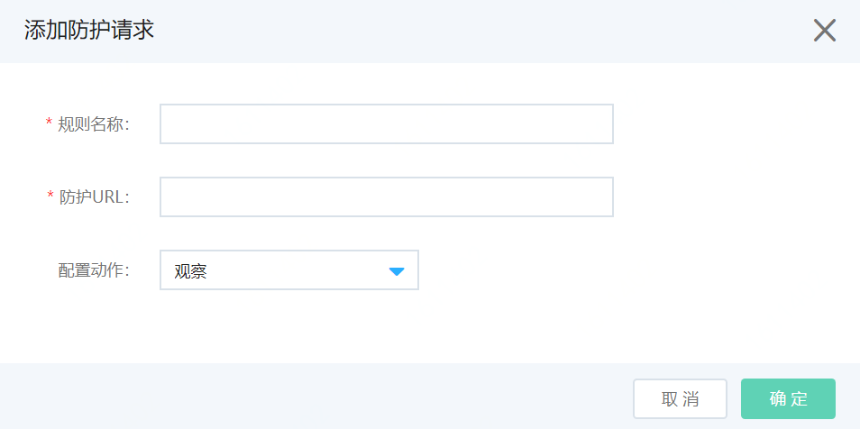
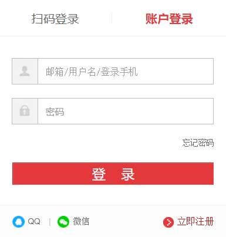

# 数据风控

网站接入Web应用防火墙后，您可以为其开启数据风控功能。数据风控帮助防御网站关键业务（例如注册、登录、活动、论坛）中可能发生的机器爬虫欺诈行为。您可以根据实际需求设置数据风控的防护策略。

## 前提条件

- 已开通Web应用防火墙实例，企业版及以上的套餐版本，更多信息，请参见[开通Web应用防火墙](https://docs.jdcloud.com/cn/web-application-firewall/purchase-process)。
- 已完成网站接入。更多信息，请参见[添加域名](https://docs.jdcloud.com/cn/web-application-firewall/step-1)。
- 只支持网页，通过浏览器访问并且可以执行JS程序。

## 背景信息

数据风控基于京东云的大数据能力，通过业内领先的风险决策引擎，结合人机识别技术，防止各类场景的关键业务欺诈行为。您只需将业务接入Web应用防火墙即可使用数据风控功能，轻松获取风控能力，且无需在服务器或客户端进行任何改造。

数据风控支持防护的场景包括但不限于以下内容：垃圾注册、短信验证码滥刷、撞库、暴力破解、恶意抢购、秒杀、薅羊毛、抢红包、机器人抢票、刷票。

## 操作步骤

1. 登录[Web应用防火墙控制台](https://cloudwaf-console.jdcloud.com/overview/business)。

2. 在左侧导航栏，单击**网站配置**。

3. 在**网站配置**页面定位到要防护的域名，在操作栏单击**防护配置**。

4. 在防护配置页面，单击**业务风控**页签，定位到**数据风控**模块，开启**状态**开关。开启数据风控后，Web应用防火墙默认将在网站所有（或指定的）页面中插入JS插件用于安全防护。

   

5. 在防护请求Tab页，点击**添加防护请求**，按照下表填写防护请求。

   

   | 配置项        | 配置项说明                                                   |
| :------------ | :----------------------------------------------------------- |
   | **规则名称 ** | 输入防护规则的名称                                           |
| **防护URL **  | 输入防护请求URL，更多信息，参加什么是**防护请求URL**。       |
   | **配置动作**  | 数据风控的防护模式。可选值： **观察**：识别到业务攻击时，只记录风险日志、不进行拦截，可通过业务风控日志查看详细风险情况。 **人机交互**：识别到业务攻击时，进行算法挑战进行二次验证。 |

6.点击**确定**，添加规则。防护请求添加成功后，10分钟左右生效。

7.（可选）指定JS插入页面。

由于部分页面前端代码与数据风控的JavaScript脚本可能存在兼容性问题。如果遇到此类问题，建议您通过指定页面插入JS功能仅添加部分页面进行安全防护。

**说明** 仅在部分页面插入JS插件时，数据风控将可能无法获取完整的用户访问行为，并对最终的防护效果产生影响。

使用限制：最多支持指定20个页面地址。

​	i.单击**JS插入页面**Tab页。

​	ii.选中**指定页面插入JS**，并单击**添加页面**。

​	iii.在**添加URL**对话框，输入要插入JS的页面的地址（以“/”开头），并单击**确定**。

成功添加URL后，数据风控将仅在您所添加的URL路径下的页面中插入JS插件。

开启数据风控后，您可以使用Web应用防火墙的全量日志功能查看防护结果。关于日志示例，请参见**查看防护结果**。

## 什么是防护请求URL

防护请求URL指执行业务动作的接口地址，而不是页面本身的URL地址。例如，下图所示注册页面本身的URL地址为 `www.abc.com/login`，登录按钮对应的业务接口地址是 `www.abc.com/register.do`。

这种情况下，登录按钮对应的接口地址`www.abc.com/login.do`添加防护请求，并设置为防护请求URL，防止撞库登录风险。如果将登录页面地址`www.abc.com/login`设置为防护请求URL，当正常用户访问该页面时也将收到算法挑战，影响用户体验。

**防护请求URL注意事项**

- 防护请求URL必须精确到实际请求URL，不支持模糊匹配。

  例如，将`www.exzample.com/test`设置为防护请求URL，则数据风控只匹配test路径的访问请求，不会匹配test路径下所有页面的访问请求。

- 直接请求数据风控已防护的URL一定会触发算法挑战。因此，请确保所配置的防护请求URL在正常情况下不会被用户直接请求，即正常用户通常需要经过一系列的前置访问后才会请求该URL地址。

- 直接调用API接口的场景不适合使用数据风控进行防护。由于API调用是直接发起的机器行为，无法通过数据风控的人机识别验证。但是，对于正常用户单击页面中的某按钮调用API接口的情况，可以通过数据风控功能进行防护。

