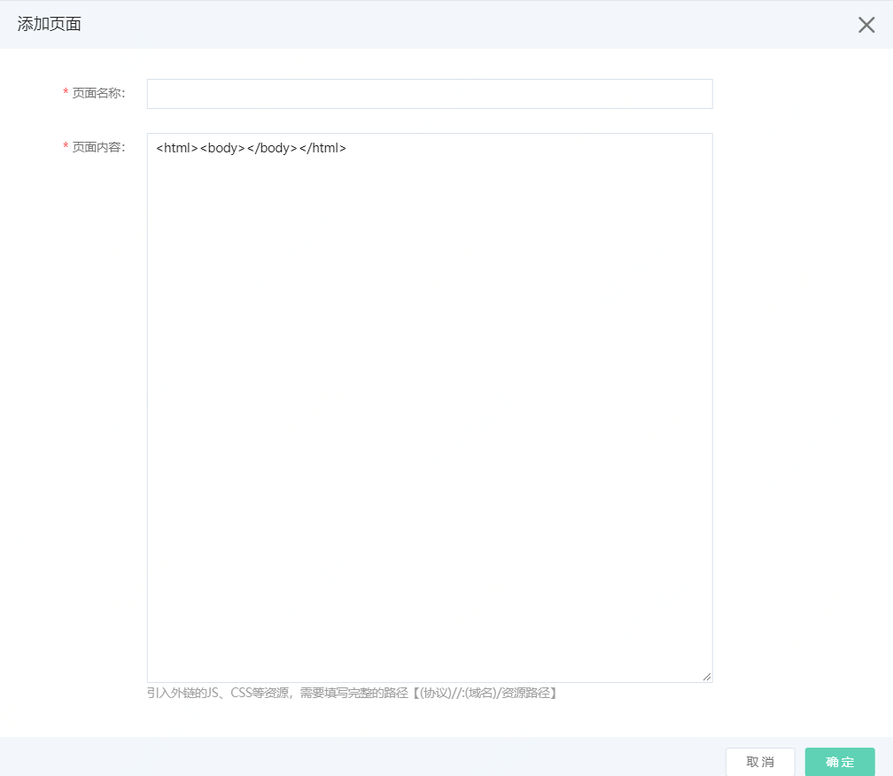

# 配置Web应用攻击防护

网站接入Web应用防火墙后，Web应用攻击防护默认开启。Web应用攻击防护引擎基于内置的专家经验规则集，自动为网站防御SQL注入、XSS跨站，webshell上传、命令注入、后门隔离、非法文件请求、路径穿越、常见应用漏洞攻击等通用的Web攻击。本文为您介绍，如何配置Web应用攻击防护。

## 前提条件

- 已开通Web应用防火墙实例。更多信息，请参见[开通Web应用防火墙](https://docs.jdcloud.com/cn/web-application-firewall/purchase-process)。
- 已完成网站接入。更多信息，请参见[添加网站](https://docs.jdcloud.com/cn/web-application-firewall/step-1)。

## 操作步骤

1、登录[Web应用防火墙控制台](https://cloudwaf-console.jdcloud.com/overview/business)。

2、在左侧导航栏，单击**网站配置**。

3、在**网站配置**页面定位到要设置的域名，在操作栏单击**防护配置**。

4、在防护配置页面，默认打开**Web防护**页签，确保**总体防护开关**是开启状态。如果是关闭状态，WAF将不再防护，仅保留转发流量功能。如图

5、在**Web防护**页签定位到**Web应用攻击防护**模块，如下图。按照下表配置。

| 配置项               | 说明                                                         |
| -------------------- | ------------------------------------------------------------ |
| **状态开关**         | 开启或关闭Web应用攻击防护功能。                              |
| **模式**             | 检测发现攻击请求时，对攻击请求执行的操作。可选操作： **检测模式**：只记录日志，不阻断攻击请求。 **拦截模式**：发现攻击后，直接阻断攻击请求。 |
| **防护规则策略等级** | 要应用的检测规则。支持规则的等级： **正常**：检测常见的Web应用攻击（默认选择）。 **严格**：当您需要更严格地防护路径穿越、SQL注入、命令执行时，建议选择此等级。 **宽松**：当发现存在较多误拦截，或者业务存在较多不可控的用户输入时，可以选择此等级。 |
| **拦截返回页面**     | 当选择拦截模式时，在阻断攻击请求时，返回默认拦截页面。支持下拉框选择已有的自定义返回页面。点击**画笔**，可添加自定义页面，如下图  点击添加页面 信息填写：添加页面名称，将页面代码输入到页面内容，大小不超过5K。输入完毕后，点击**确定**，将发起审批流程，审批通过后，上传页面将展示在自定义页面列表，如下图   |

