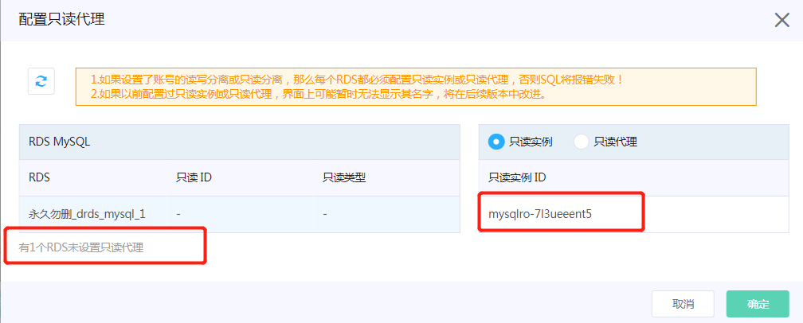

# DRDS 读写分离设置

**前提条件**
在DRDS 读写分离设置前，需要先配置好该DRDS后端 RDS MySQL的只读实例和只读代理，具体方式可参考[只读实例帮助文档](https://docs.jdcloud.com/cn/rds/create-readonly-instance) 以及[只读代理帮助文档](https://docs.jdcloud.com/cn/rds/create-readonlygroup)

1. 进入DRDS实例的【库信息】页面中，点击数据库名，进入数据库设置页面。 
2. 点击【配置只读代理】，对当前数据库进行只读实例或只读代理的设置。

3. 弹出的窗口中，左边列表是该数据库后端的RDS MySQL，右边列表是选中RDS MySQL相关的只读实例或只读代理。  
对于左边列表中每个RDS MySQL，在右边列表中点击只读实例或只读代理，将选择只读实例/代理关联到RDS MySQL上。  
**建议优先选择只读代理，以获得只读操作的高可用性。**  

4. 注意：需要对每个RDS MySQL设置只读代理/实例，否则应用会由于访问不到RDS MySQL的只读实例/代理而报错。 可通过窗口左下角的提示信息，检查是否所有的RDS MySQL都配置完成了

