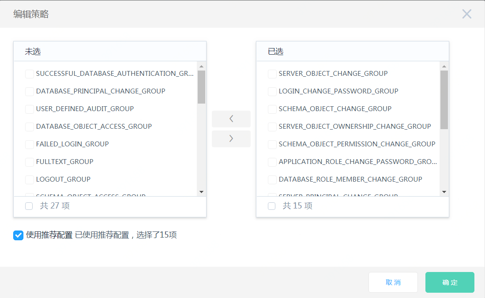

# 开启审计
SQL Server的审计分为实例级审计和数据库级的审计。
- 实例级的审计可以在控制台上进行开启、关闭及编辑
- 数据库级的审计由于涉及到具体的对象及SQL语句，需要首先开启实例级审计后，再连接到具体的数据库中执行SQL进行操作。

## 实例级审计的开启
### 1. 操作入口
进入实例详情中的审计页面，点击右边的开关按钮，开启审计


### 2. 进入到审计策略编辑页面
- 开启审计时，将直接进入到审计策略编辑界面中。
- 缺省会使用推荐的审计策略，具体的编辑方法可查看[编辑审计策略](Edit-Audit.md)
- 选择要开启的审计策略点击【确认】后即可。


## 数据库级审计的开启
1. 开始数据库级的审计，需要首先开启实例级的审计，并且至少选择一项审计策略。
2. 使用具有rw（读写）权限的账号，连接到要开启审计的数据库中。
3. 执行相应的SQL 语句，即可开启数据库的审计。例如对表tb1 开启USER1的 select，insert和delete审计，对tab2开启USER2的审计
```SQL
CREATE DATABASE AUDIT SPECIFICATION [Audit Name] -- 自己随意定义审计规则别名
FOR SERVER AUDIT [RDSAudit]                      -- 固定名称: RDSAudit,不能修改
ADD (SELECT ON OBJECT::[DBO].[tb1] BY [USER1]),
ADD (INSERT ON OBJECT::[DBO].[tb1] BY [USER1]),
ADD (DELETE ON OBJECT::[DBO].[tb1] BY [USER1]),
ADD (SELECT ON OBJECT::[DBO].[tb2] BY [USER2]),
ADD (INSERT ON OBJECT::[DBO].[tb2] BY [USER2]),
ADD (DELETE ON OBJECT::[DBO].[tb2] BY [USER2])
WITH (STATE=ON)
```

详细的SQL语法可参考微软文档 [CREATE DATABASE AUDIT](https://docs.microsoft.com/zh-cn/sql/t-sql/statements/create-database-audit-specification-transact-sql?view=sql-server-2017)
