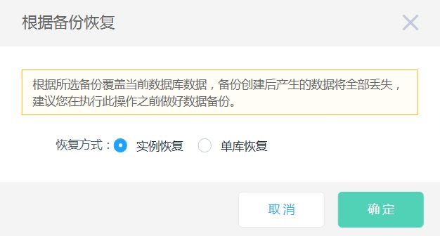
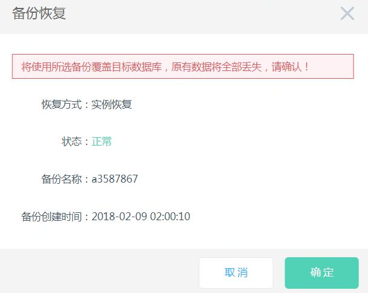

# 实例恢复
使用备份对实例进行**覆盖恢复**。 由于恢复后，实例的数据将恢复到原先备份的时间点，因此请慎重操作。

## 最佳实践
当实例发生问题需要恢复时，我们建议优先使用 **“根据备份创建”** 或者 **“根据时间点创建”** 的方式，新创建一个实例，然后进行数据校验，确认恢复的数据正确无误。 

数据校验正确无误后，再使用 **“实例恢复”** 的功能进行恢或者使用 [**域名切换**](../../Instance/Exchanged-DNS.md) 的功能，将原有实例的域名切换到新创建的实例上。

## 1. 操作入口
点击备份列表右边的【根据备份恢复】

## 2. 选择恢复方式
1. 如果该备份的备份粒度为“实例”，且备份类型为“全量”，则可以选择 **“实例恢复”** 还是 **“单库恢复”**
2. 如果备份粒度为“实例”，但备份类型为“增量”，则只能选择 **“实例恢复”**
3. 如果备份粒度为“多库”，则只能选择 **“单库恢复”**，并在下拉菜单中选择要恢复的数据库。

## 3. 恢复确认
根据选择恢复的类型不同，会弹出下对话框。点击【确认】后，开始恢复。
### SQL Server的确认对话框
**实例恢复** 

**单库恢复** 

## 5. 实例状态
能看到实例状态为“恢复中” （实例恢复）或者为“单库备份恢复中”

