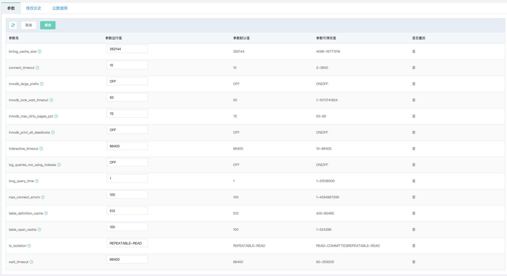

# 修改参数
参数列表中所有参数的默认值采用的京东云优化后的值，新建的参数组，参数列表中的参数运行值和默认值保持一致。默认的运行值能够满足大部分应用场景的需求，针对您自身的业务场景，您可以按需修改参数运行值。

## 注意事项
* 参数的运行值必须在参数可修改值范围内。
* 如果您修改的参数都是不需要重启的，那么参数修改后会自动应用到关联的数据库实例上。
* 参数组可以关联到多个不同的实例上。

## 操作步骤
1. 登录 [参数组控制台](https://rds-console.jdcloud.com/paramgroup/list)
2. 选择需要修改参数的目标参数组，点击目标参数组，进入参数组详情页。
3. 选择 ***参数***  Tab 页，先介绍下参数列表各个字段含义：
    * 参数名：每一个参数的参数名都是唯一的。
    * 参数运行值：当前参数生效的值。
    * 参数默认值：京东云推荐的参数值。
    * 参数可修改值：参数支持修改的范围或者列表。
    * 是否重启：标示参数运行值修改之后，是否需要重启和参数组绑定的时候才能生效
4. 点击 ***编辑参数*** 按钮，参数列表中参数运行值这一列变成可编辑状态，这个时候您就可以修改参数运行值，设置成您希望的值，但是请确保您填写的值在参数可修改范围内。
5. 完成所有参数运行值修改后，点击 保存 按钮，会出现一个参数运行值的确认修改弹出框，弹出框里面会列出您之前修改了参数运行值的参数列表。

    

6. 确认无误后，点击 ***确定*** 按钮，完成参数的修改，并返回到参数列表页。
7. 选择 ***云数据库***  Tab 页，您可以发现 ***参数组生效*** 这一列的值从原先的 ***生效*** 变成了 ***同步中***，表示您刚刚保持的参数修改，正在同步到数据库实例上；状态值从 ***同步中*** 变成 ***生效***，表示修改后的参数已经应用到数据库实例上。
