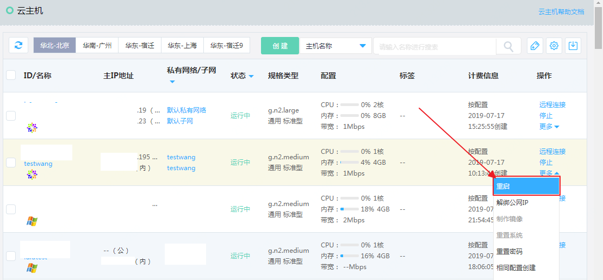

# 扩容文件系统（Linux）

在云硬盘控制台完成扩容操作并挂载此云硬盘后，需要登录云主机对文件系统进行扩容才可继续使用。在控制台对云硬盘的扩容操作可参见“[云硬盘升级容量](https://docs.jdcloud.com/cn/cloud-disk-service/disk-expand)”

**注意：扩容之前要备份好数据，避免因误操作等因素导致数据丢失**

以CentOS操作系统为例，假设需扩容的云硬盘原大小为20GB，在控制台已扩容至50GB并重新挂载。文件系统扩容操作如下（需要root权限）：

## ext2、ext3或ext4文件系统的扩容

1. 确认云硬盘已经在控制台完成扩容并再次挂载到此云主机后，从控制台重启此云主机。

   

2. 重启后登陆此云主机，输入`lsblk` 命令检查设备名称：

   `lsblk`

   

3. 使用`e2fsck`命令检查文件系统：

   `e2fsck -f /dev/vde`

   

4. 使用resize2fs命令对文件系统进行扩容，如扩容/dev/vde设备的文件系统：

   `sudo resize2fs /dev/vde`

   

5. 使用`mount`命令重新挂载此设备，已设备名称/dev/vde为例：

   `mount /dev/vde /mnt`

6. 挂在成功后可运行`df -h`命令验证挂载是否成功。

## XFS文件系统的扩容

1. 使用 `df -h` 命令验证待扩容的卷的文件系统大小。如下图示例，待扩容的/dev/vdc原始大小为20GB：

   

2. 输入`lsblk` 命令检查设备名称：

   `lsblk`

   

3. 使用`xfs_growfs` 命令扩展文件系统，如该设备当前挂载在/mnt：

   `sudo xfs_growfs -d /mnt`

   

   

4. （可选）执行完成后可以再次执行`df -h`命令验证扩容后的卷大小。

   
