#  基于京东云ALB实现客户端源IP透传

# 一、部署nginx-ingress

## 1.1 环境准备

从github下载nginx-ingress controller最新的安装部署文件,并将部署文件解压缩到本地目录:

```
wget https://github.com/nginxinc/kubernetes-ingress/archive/v1.4.5.tar.gz
tar -zxvf v1.4.5.tar.gz
cd kubernetes-ingress-1.4.5/deployments
```

## 1.2 安装nginx-ingress controller

1. 为nginx-ingress controller创建一个namespace和service account：

```
kubectl apply -f common/ns-and-sa.yaml
```

2. 为NGINX默认Server配置TLS证书和key，并将TLS证书和key保存到secret中：

```
kubectl apply -f common/default-server-secret.yaml
```

**说明:** 建议使用合适的TLS证书和key替换default-server-secret.yaml文件中自签发的证书和key。

3. 创建config map保存NGINX的自定义配置：

```
kubectl apply -f common/nginx-config.yaml
```
**说明:** 目前提供的config map中的data为空，您可以按需添加自定义配置。

4. 为第1步中创建的service account配置RBAC：
```
kubectl apply -f rbac/rbac.yaml
```

5. 为nginx-ingress controller创建NodePort类型的service:
```
# 修改Service Yaml文件

vim nginx-ingress-service.yaml
apiVersion: v1
kind: Service
metadata:
  name: nginx-ingress
  namespace: nginx-ingress
spec:
  externalTrafficPolicy: Cluster
  ports:
  - name: http
    port: 80
    protocol: TCP
    targetPort: http
  - name: https
    port: 443
    protocol: TCP
    targetPort: https
  selector:
    app: nginx-ingress
  type: NodePort
```

**说明:** 目前spec中暂不支持使用externalTrafficPolicy: Local，请先删除Service Yaml文件中对应字段后，再部署Service

6. 以Deployment的方式部署nginx-ingress controller:

```
# 修改deployment/nginx-ingress.yaml文件
cat deployment/nginx-ingress.yaml
apiVersion: extensions/v1beta1
kind: Deployment
metadata:
  name: nginx-ingress
  namespace: nginx-ingress
spec:
  replicas: 1
  selector:
    matchLabels:
      app: nginx-ingress
  template:
    metadata:
      labels:
        app: nginx-ingress
    spec:
      serviceAccountName: nginx-ingress
      containers:
      - image: nginx/nginx-ingress:1.4.5
        name: nginx-ingress
        ports:
        - name: http
          containerPort: 80
        - name: https
          containerPort: 443
        env:
        - name: POD_NAMESPACE
          valueFrom:
            fieldRef:
              fieldPath: metadata.namespace
        - name: POD_NAME
          valueFrom:
            fieldRef:
              fieldPath: metadata.name
        args:
          - -nginx-configmaps=$(POD_NAMESPACE)/nginx-config
          - -default-server-tls-secret=$(POD_NAMESPACE)/default-server-secret
          - -external-service=$(POD_NAMESPACE)/nginx-ingress
          - -v=3 # Enables extensive logging. Useful for trooublshooting.
         #- -report-ingress-status
         #- -enable-leader-election

# 部署nginx ingress
kubectl apply -f deployment/nginx-ingress.yaml

# 查看nginx-ingress是否部署成功
kubectl get deploy
NAME            DESIRED   CURRENT   UP-TO-DATE   AVAILABLE   AGE
nginx-ingress   1         1         1            1           64m
```

7. 查看部署结果:

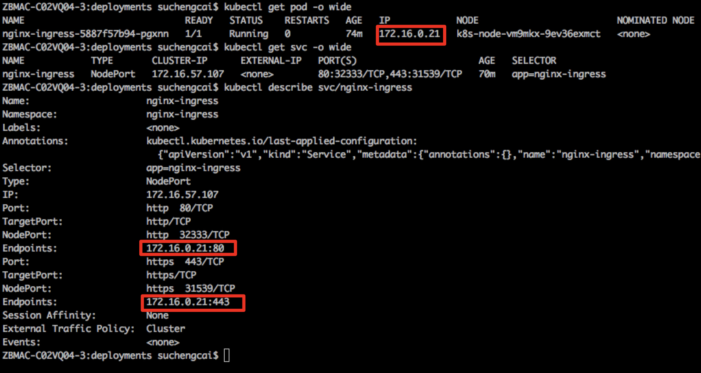

## 1.3 自建ALB

### 1.3.1 创建ALB

**部署说明:** 

- 必须与K8S集群同VPC
- 子网必须选择: k8s-xxx-nat-subnet-xxx
- 将集群工作节点组关联的AG手动添加到ALB服务组中，将外部请求转发到集群中；
- 集群工作节点组增加/删除后，请手动更新ALB服务组；

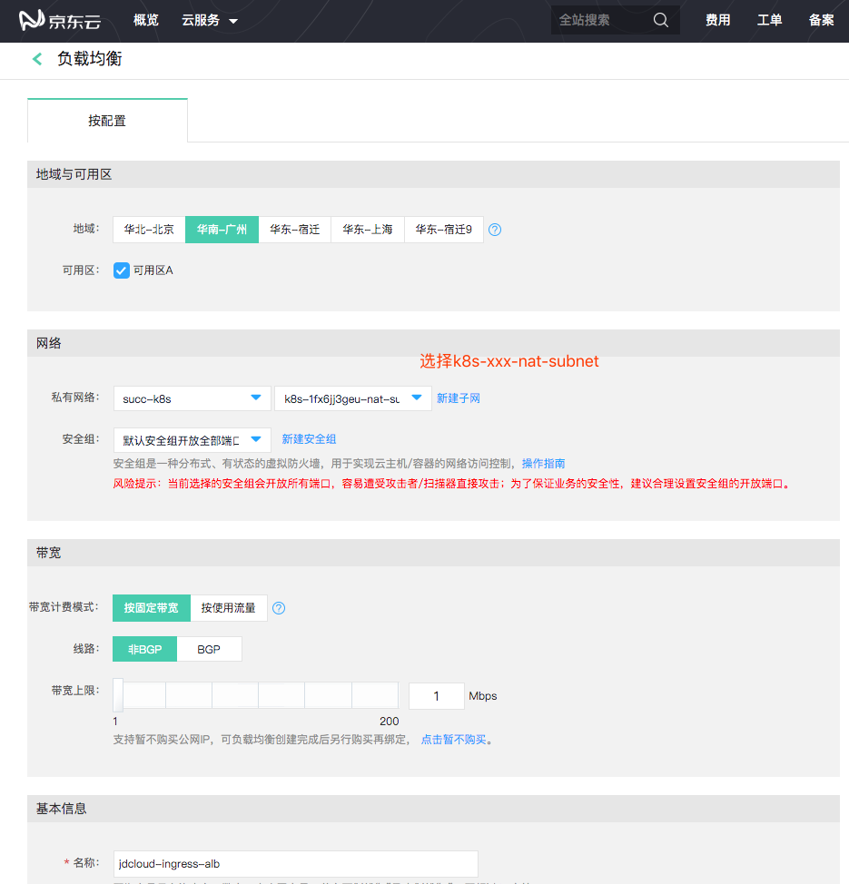

### 1.3.2 添加HTTP协议监听器

1. 前端监听配置

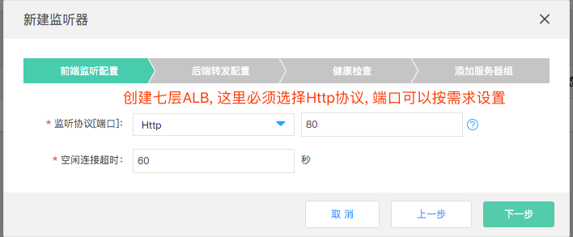

2. 后端转发配置

- 首先确认nginx-ingress service的NodePort:

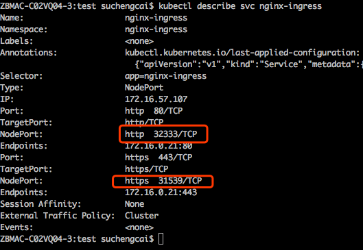

3. 创建后端转发:

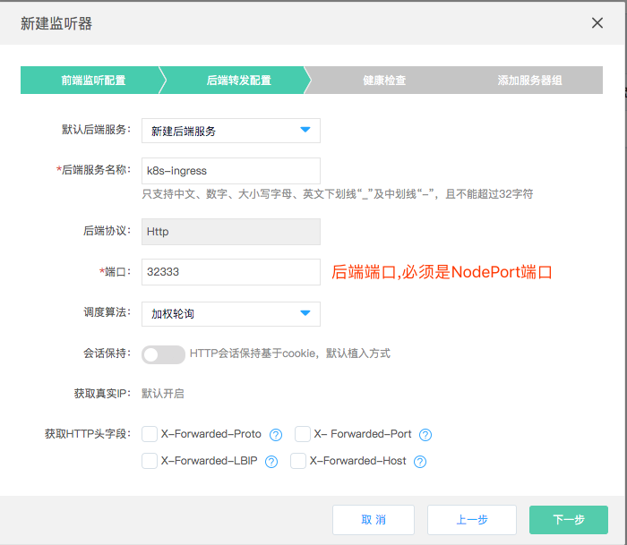

4. 添加后端健康检查

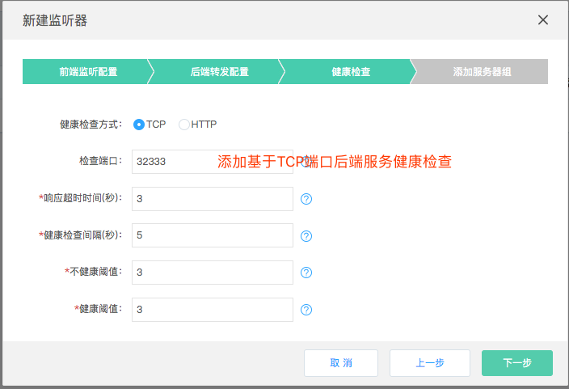

5. 添加服务组

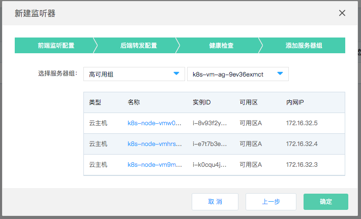

6. 检查后端服务


**备注**：更多详情参考[应用负载均衡帮助文档](https://docs.jdcloud.com/cn/application-load-balancer/features)。

# 二、验证nginx-ingress

## 2.1 部署应用服务

```
cat nginx-demo.yaml

apiVersion: v1
kind: Service
metadata:
  name: nginx-demo-svc
spec:
  ports:
  - port: 80
    protocol: TCP
    targetPort: 80
  selector:
    app: nginx-demo
  type: ClusterIP
---
apiVersion: apps/v1
kind: Deployment
metadata:
  name: nginx-demo-deployment
  labels:
    app: nginx
spec:
  replicas: 3
  selector:
    matchLabels:
      app: nginx-demo
  template:
    metadata:
      labels:
        app: nginx-demo
    spec:
      containers:
      - name: nginx
        image: nginxdemos/hello:latest
        ports:
        - containerPort: 80
        
kubectl create -f nginx-demo.yaml
service/nginx-demo-svc created
deployment.apps/nginx-demo-deployment created

kubectl describe svc nginx-demo-svc
Name:              nginx-demo-svc
Namespace:         nginx-ingress
Labels:            <none>
Annotations:       <none>
Selector:          app=nginx-demo
Type:              ClusterIP
IP:                172.16.57.227
Port:              <unset>  80/TCP
TargetPort:        80/TCP
Endpoints:         172.16.0.13:80,172.16.0.22:80,172.16.0.25:80
Session Affinity:  None
Events:            <none>

kubectl get pod -o wide
NAME                                     READY   STATUS    RESTARTS   AGE   IP            NODE                         NOMINATED NODE
nginx-demo-deployment-66b4db8457-jz862   1/1     Running   0          94s   172.16.0.25   k8s-node-vm9mkx-9ev36exmct   <none>
nginx-demo-deployment-66b4db8457-ndsww   1/1     Running   0          94s   172.16.0.13   k8s-node-vmw0tr-9ev36exmct   <none>
nginx-demo-deployment-66b4db8457-pwwgz   1/1     Running   0          94s   172.16.0.22   k8s-node-vmhrsr-9ev36exmct   <none>
```

## 2.2 配置ingress resource

```
cat ingress.yaml
apiVersion: extensions/v1beta1
kind: Ingress
metadata:
  name: myingress
  annotations:
    metadata.annotations.kubernetes.io/ingress.class: "nginx"     #指定Ingress Resource创建时使用的Ingress Controller，本例使用上述创建的Nginx Controller
spec:
  rules:
  - host: nginx-ingress-test.jdcloud
    http:
      paths:
      - path: /nginx-demo
        backend:
          serviceName: nginx-demo-svc
          servicePort: 80
```

## 2.3 通过ALB+NginxIngress访问Service

进入ALB控制台，查询自建ALB绑定的公网IP，并在本地客户端添加DNS配置。

```
# 域名映射到的IP，请使用自建ALB绑定的公网IP替换

bash-3.2# echo "157.**.**.125  nginx-ingress-test.jdcloud" >> /etc/hosts
bash-3.2# ping -c 5 nginx-ingress-test.jdcloud
PING nginx-ingress-test.jdcloud (157.255.51.125): 56 data bytes
64 bytes from 157.**.**.125: icmp_seq=0 ttl=47 time=39.891 ms
64 bytes from 157.**.**.125: icmp_seq=1 ttl=47 time=40.189 ms
64 bytes from 157.**.**.125: icmp_seq=2 ttl=47 time=40.066 ms

--- nginx-ingress-test.jdcloud ping statistics ---
5 packets transmitted, 5 packets received, 0.0% packet loss
round-trip min/avg/max/stddev = 39.727/40.446/42.359/0.969 ms
bash-3.2#
```

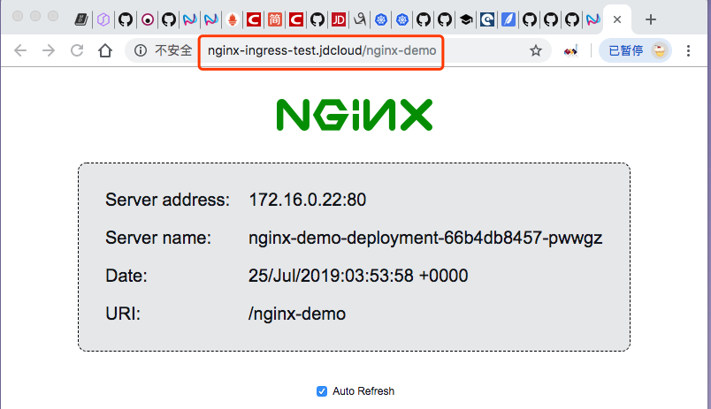

# 三、验证源IP透传

## 3.1 部署echoserver应用

1. Yaml文件说明如下：
```
cat echo-server.yaml

apiVersion: v1
kind: Service
metadata:
  labels:
    app: echo-server
  name: echo-server-svc
  namespace: nginx-ingress
spec:
  ports:
  - name: http
    port: 80
    protocol: TCP
    targetPort: 8080
  selector:
    app: echo-server
  type: ClusterIP
---
apiVersion: apps/v1
kind: Deployment
metadata:
  name: echo-server-deployment
  namespace: nginx-ingress
  labels:
    app: echo-server
spec:
  replicas: 1
  selector:
    matchLabels:
      app: echo-server
  template:
    metadata:
      labels:
        app: echo-server
    spec:
      containers:
      - image: mirrorgooglecontainers/echoserver:1.4
        imagePullPolicy: IfNotPresent
        name: echocontainer
        ports:
        - containerPort: 8080
          protocol: TCP
      restartPolicy: Always
```

2. 确认echoserver部署情况:

```
# 查看service状态
kubectl get pod -l "app=echo-server" -o wide
NAME                                      READY   STATUS    RESTARTS   AGE   IP            NODE                         NOMINATED NODE
echo-server-deployment-655f555cd4-9qxrv   1/1     Running   0          70s   172.16.0.45   k8s-node-vm9mkx-9ev36exmct   <none>

# 查看service详情
kubectl describe svc echo-server-svc
Name:              echo-server-svc
Namespace:         nginx-ingress
Labels:            app=echo-server
Annotations:       kubectl.kubernetes.io/last-applied-configuration:
                     {"apiVersion":"v1","kind":"Service","metadata":{"annotations":{},"labels":{"app":"echo-server"},"name":"echo-server-svc","namespace":"ngin...
Selector:          app=echo-server
Type:              ClusterIP
IP:                172.16.61.78
Port:              http  80/TCP
TargetPort:        8080/TCP
Endpoints:         172.16.0.45:8080
Session Affinity:  None
Events:            <none>
```

## 3.2 为echoserver配置Ingress

1. 编辑`myingress`, 增加path关联新增加的echoserver服务:

```
kubectl get ing/myingress -o yaml
apiVersion: extensions/v1beta1
kind: Ingress
metadata:
  annotations:
    kubectl.kubernetes.io/last-applied-configuration: |
      {"apiVersion":"extensions/v1beta1","kind":"Ingress","metadata":{"annotations":{"metadata.annotations.kubernetes.io/ingress.class":"nginx"},"name":"myingress","namespace":"nginx-ingress"},"spec":{"rules":[{"host":"nginx-ingress-test.jdcloud","http":{"paths":[{"backend":{"serviceName":"nginx-demo-svc","servicePort":80},"path":"/nginx-demo"}]}}]}}
    metadata.annotations.kubernetes.io/ingress.class: nginx
  creationTimestamp: "2019-07-25T03:13:49Z"
  generation: 2
  name: myingress
  namespace: nginx-ingress
  resourceVersion: "286035"
  selfLink: /apis/extensions/v1beta1/namespaces/nginx-ingress/ingresses/myingress
  uid: 38a99206-ae8a-11e9-8dde-fa163ebfb4dc
spec:
  rules:
  - host: nginx-ingress-test.jdcloud
    http:
      paths:
      - backend:
          serviceName: nginx-demo-svc
          servicePort: 80
        path: /nginx-demo
      - backend:
          serviceName: echo-server-svc
          servicePort: 80
        path: /echo-server
status:
  loadBalancer: {}
```

2. 保存Yaml文件后，Ingress将根据提交的Yaml文件内容被自动更新；

## 3.3 验证是否支持源IP透传

1. 本例客户端公网IP使用`14.ab.cd.240`验证

```
[root@succ-test ~]# curl -H "Host: nginx-ingress-test.jdcloud"
http://157.**.**.125:80/echo-server
CLIENT VALUES:
client_address=172.16.0.21
command=GET
real path=/echo-server
query=nil
request_version=1.1
request_uri=http://nginx-ingress-test.jdcloud:8080/echo-server

SERVER VALUES:
server_version=nginx: 1.10.0 - lua: 10001

HEADERS RECEIVED:
accept=*/*
connection=close
host=nginx-ingress-test.jdcloud
user-agent=curl/7.29.0
x-forwarded-for=14.ab.cd.240, 172.16.32.4
x-forwarded-host=nginx-ingress-test.jdcloud
x-forwarded-port=80
x-forwarded-proto=http
x-real-ip=172.16.32.4
BODY:
-no body in request-[root@succ-test ~]#
```

2. echoserver返回`x-forwarded-for=14.ab.cd.240, 172.16.32.4`, 第一个IP即为待验证的客户端公网IP.

3. 结论: 为NginxIngress Controller, 自建七层ALB, 可以实现整条链路ClientIP透传.

# 四、Ingress升级为HTTPS

## 4.1 准备SSL证书和CA公钥

1. 您可以使用京东云提供的[SSL数字证书](https://docs.jdcloud.com/cn/ssl-certificate/product-overview)服务；

2. 您也可以自建CA或SSL，详情参考[自建CA证书和私钥](https://docs.jdcloud.com/cn/jcs-for-kubernetes/deploy-CA-SSL)；

3. 如果您已经有CA证书和私钥，可跳过此步骤，进入4.2 创建负载均衡证书。

## 4.2 创建负载均衡证书

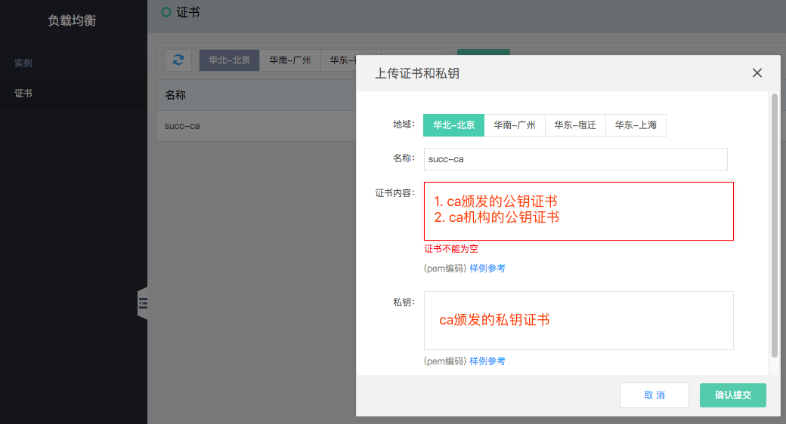

## 4.3 创建HTTPS listener

创建监听器, 协议为https, 并且选择合适的证书

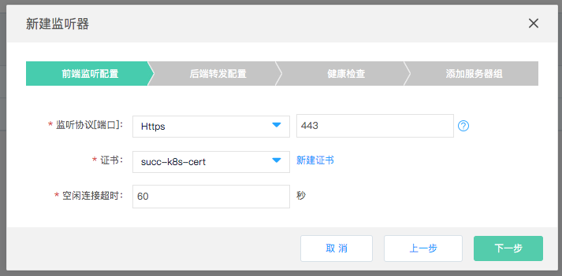

选择已有的http后端

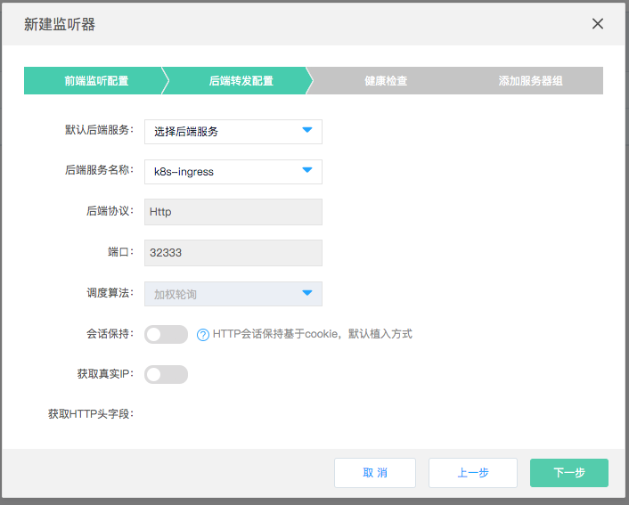

## 4.4 验证https协议ALB

### 验证浏览器访问

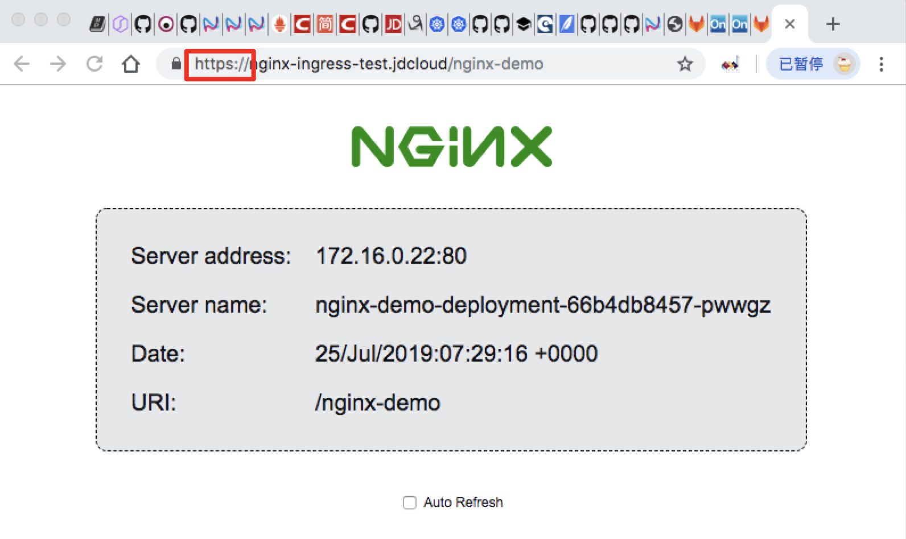

### 验证IP透传

```
[root@succ-test ~]# curl https://nginx-ingress-test.jdcloud:443/echo-server --cacert ca.pem
CLIENT VALUES:
client_address=172.16.0.21
command=GET
real path=/echo-server
query=nil
request_version=1.1
request_uri=http://nginx-ingress-test.jdcloud:8080/echo-server

SERVER VALUES:
server_version=nginx: 1.10.0 - lua: 10001

HEADERS RECEIVED:
accept=*/*
connection=close
host=nginx-ingress-test.jdcloud
user-agent=curl/7.29.0
x-forwarded-for=14.ab.cd.240, 172.16.32.3       #14.ab.cd.240即为被透传到后段服务的客户端IP
x-forwarded-host=nginx-ingress-test.jdcloud
x-forwarded-port=80
x-forwarded-proto=http
x-real-ip=172.16.32.3
BODY:
-no body in request-[root@succ-test ~]#
```

# 五、关联LoadBalancer Service 的Ingress开启IP透传功能

## 5.1 创建Service

1. 创建LoadBalancer类型的Service, 同时会在京东云平台上创建TCP类型的ALB.

```
apiVersion: v1
kind: Service
metadata:
  name: nginx-ingress-auto
  namespace: nginx-ingress
spec:
  type: LoadBalancer
  ports:
  - port: 80
    targetPort: 80
    protocol: TCP
    name: http
  - port: 443
    targetPort: 443
    protocol: TCP
    name: https
  selector:
    app: nginx-ingress
```

2. 查询Service详情获取自动创建的ALB公网IP，本文以 `117.ab.cd.209`作为ALB IP，验证源IP透传

## 5.2 京东云控制台修改ALB支持源IP透传

由Service自动创建ALB的后端服务**源IP透传功能**是关闭的, 需要登录京东云控制台手动开启:
   > 1. 编辑负载均衡`http`后端服务
   > 2. 开启`获取真实IP`

**备注**：Service在Kubernetes集群中被重新编辑后，ALB中的配置会被自动刷新；您需要在京东云控制台再次手动开启ALB后段服务的源IP透传功能。

## 5.3 修改ingress的ConfigMap

编辑nginx-ingress/nginx-config ConfigMap 增加如下信息:
```
data:
  proxy-protocol: "True"
  real-ip-header: "proxy_protocol"
  set-real-ip-from: "${k8s-xxx-node-subnet-xxx cidr}"  # set-real-ip-from: 172.16.32.0/20
```

## 5.4 验证IP透传

1. 本例客户端公网IP使用`14.ab.cd.240`验证

```
[root@succ-test ~]# curl -H "Host: nginx-ingress-test.jdcloud" http://117.48.227.209:80/echo-server
CLIENT VALUES:
client_address=172.16.0.21
command=GET
real path=/echo-server
query=nil
request_version=1.1
request_uri=http://nginx-ingress-test.jdcloud:8080/echo-server

SERVER VALUES:
server_version=nginx: 1.10.0 - lua: 10001

HEADERS RECEIVED:
accept=*/*
connection=close
host=nginx-ingress-test.jdcloud
user-agent=curl/7.29.0
x-forwarded-for=14.ab.cd.240
x-forwarded-host=nginx-ingress-test.jdcloud
x-forwarded-port=80
x-forwarded-proto=http
x-real-ip=14.119.106.240
BODY:
-no body in request-[root@succ-test ~]#
```

2. echoserver返回的信息`x-forwarded-for=14.ab.cd.240` 与客户端IP相同, 说明客户端源IP已透传到后段；

## 5.5 ingress升级https

由Service自动创建ALB的后端服务**源IP透传功能**是关闭的, 需要登录京东云控制台手动开启:
   > 1. 编辑负载均衡`https`后端服务
   > 2. 开启`获取真实IP`

**备注**：Service在Kubernetes集群中被重新编辑后，ALB中的配置会被自动刷新；您需要在京东云控制台再次手动开启ALB后段服务的源IP透传功能。

### 5.5.1 准备SSL证书和CA公钥

1. 您可以使用京东云提供的[SSL数字证书](https://docs.jdcloud.com/cn/ssl-certificate/product-overview)服务；

2. 您也可以自建CA或SSL，详情参考[自建CA证书和私钥](https://docs.jdcloud.com/cn/jcs-for-kubernetes/deploy-CA-SSL)；

3. 如果您已经有CA证书和私钥，可跳过此步骤，进入5.5.2 创建Secret资源。

### 5.5.2 创建Secret资源

1. 根据用户申请的SSL证书创建secret.

```
kubectl create secret tls ingress-ssl-secret --cert web-server.pem --key web-server-key.pem
```

2. 查看创建成功的secret
```
kubectl describe secret/ingress-ssl-secret
Name:         ingress-ssl-secret
Namespace:    nginx-ingress
Labels:       <none>
Annotations:  <none>

Type:  kubernetes.io/tls

Data
====
tls.crt:  1448 bytes
tls.key:  1675 bytes
```

### 5.5.3 重新ingress资源增加tls字段

`kubectl edit ingress myingress`

```
kubectl get ingress myingress -o yaml

apiVersion: extensions/v1beta1
kind: Ingress
metadata:
  annotations:
    kubectl.kubernetes.io/last-applied-configuration: |
      {"apiVersion":"extensions/v1beta1","kind":"Ingress","metadata":{"annotations":{"metadata.annotations.kubernetes.io/ingress.class":"nginx"},"name":"myingress","namespace":"nginx-ingress"},"spec":{"rules":[{"host":"nginx-ingress-test.jdcloud","http":{"paths":[{"backend":{"serviceName":"nginx-demo-svc","servicePort":80},"path":"/nginx-demo"}]}}]}}
    metadata.annotations.kubernetes.io/ingress.class: nginx
  creationTimestamp: "2019-07-25T03:13:49Z"
  generation: 4
  name: myingress
  namespace: nginx-ingress
  resourceVersion: "309938"
  selfLink: /apis/extensions/v1beta1/namespaces/nginx-ingress/ingresses/myingress
  uid: 38a99206-ae8a-11e9-8dde-fa163ebfb4dc
spec:
  rules:
  - host: nginx-ingress-test.jdcloud
    http:
      paths:
      - backend:
          serviceName: nginx-demo-svc
          servicePort: 80
        path: /nginx-demo
      - backend:
          serviceName: echo-server-svc
          servicePort: 80
        path: /echo-server
  tls:
  - hosts:
    - nginx-ingress-test.jdcloud
    secretName: ingress-ssl-secret
status:
  loadBalancer: {}
```

### 5.5.4 浏览器访问验证

1. 进入ALB控制台，查询自建ALB绑定的公网IP；

2. 在本地服务器的/etc/hosts中增加DNS配置：IP为上一步操作中查询到的ALB绑定的公网IP，域名为ingress resource rule中配置的虚拟主机名：nginx-ingress-test.jdcloud；

3. 在浏览器中输入nginx-ingress-test.jdcloud/echo-server即可验证输出结果。

**备注**： 使用自定义CA证书时，浏览器会提示证书不备信任，您可以将自建CA的ca.pem文件导入到操作系统并设置永久信任。

