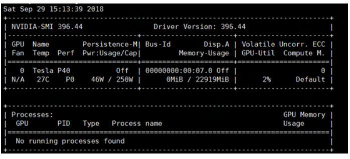

# 添加GPU工作节点组

## **创建工作节点组步骤：**

 1. 打开控制台，进入创建工作节点组页面。

 2. 选择GPU节点规格
    
    * 实例规格类型：在下拉列表中选择GPU型；
    * 实例规格：当前提供GPU标准型，每一个vCPU都对应一个Intel Xeon处理器的超线程核。详情参考[GPU标准型](https://docs.jdcloud.com/cn/virtual-machines/instance-type-family#user-content-6)说明

 3. 更多详情参考[创建工作节点组](https://docs.jdcloud.com/cn/jcs-for-kubernetes/create-nodegroup)帮助文档。

 **注**：GPU型当前仅在华北-北京单可用区公测提供；

## **安装GPU节点驱动：**

工作节点组创建完成并且工作节点组处于运行状态后，您需要在GPU节点安装 NVIDIA device plugin和NVIDIA GPU驱动。

### **一、部署k8s-device-plugin插件**

NVIDIA device plugin以daemonset的方式在Kubernetes节点上运行，与kubelet通过gRPC的方式通信，将节点上GPU的数量上报给kubelet，同时对GPU进行健康检查，保证集群中使用GPU的container正常运行。NVIDIA device plugin的安装步骤参考如下说明：

1. NVIDIA device plugin的yaml文件内容如下：

```
apiVersion: extensions/v1beta1
kind: DaemonSet
metadata:
  name: nvidia-device-plugin-daemonset
  namespace: kube-system
spec:
  updateStrategy:
    type: RollingUpdate
  template:
    metadata:
      # Mark this pod as a critical add-on; when enabled, the critical add-on scheduler
      # reserves resources for critical add-on pods so that they can be rescheduled after
      # a failure.  This annotation works in tandem with the toleration below.
      annotations:
        scheduler.alpha.kubernetes.io/critical-pod: ""
      labels:
        name: nvidia-device-plugin-ds
    spec:
      tolerations:
      # Allow this pod to be rescheduled while the node is in "critical add-ons only" mode.
      # This, along with the annotation above marks this pod as a critical add-on.
      - key: CriticalAddonsOnly
        operator: Exists
      - key: nvidia.com/gpu
        operator: Exists
        effect: NoSchedule
      containers:
      - image: jdcloud-cn-north-1.jcr.service.jdcloud.com/k8s-device-plugin:1.11                # NVIDIA device plugin的镜像名称
        name: nvidia-device-plugin-ctr
        securityContext:
          allowPrivilegeEscalation: false
          capabilities:
            drop: ["ALL"]
        volumeMounts:
          - name: device-plugin
            mountPath: /var/lib/kubelet/device-plugins
      volumes:
        - name: device-plugin
          hostPath:
            path: /var/lib/kubelet/device-plugins
```
2. 以daemonset的方式部署NVIDIA device plugin：

`
kubectl create -f https://jke-component-cn-north-1.s3.cn-north-1.jdcloud-oss.com/apps/gpu/spec/nvidia-device-plugin.yml
`

3. 执行如下命令，确定NVIDIA device plugin的deamonset已正常运行：

```
kubectl get daemonset -n kube-system

NAME                             DESIRED   CURRENT   READY   UP-TO-DATE   AVAILABLE   NODE SELECTOR   AGE
nvidia-device-plugin-daemonset   5         5         5       5            5           <none>          34m
```

### **二、部署指定版本的NVIDIA GPU驱动**

您需要为GPU节点安装NVDIA GPU驱动，在Kubernetes集群中驱动以Daemonset的方式运行在GPU节点。

京东云为Tesla P40和Tesla V100两种型号的NVIDIA提供了GPU驱动镜像文件，镜像文件基于NVIDIA-Linux-x86_64-410.104.run构建，如需使用该版本的NVIDIA GPU驱动，请将image名称设置为 jdcloud-cn-north-1.jcr.service.jdcloud.com/nvidia-gpu-driver-installer:v1。

本例将以上述NVIDIA GPU驱动镜像为例，说明在京东云Nvidia Tesla P40类型的GPU节点上安装NVIDIA GPU的步骤。

1. NVDIA GPU驱动文件的Yaml文件内容如下：

```
apiVersion: apps/v1
kind: DaemonSet
metadata:
  name: nvidia-driver-installer
  namespace: kube-system
  labels:
    k8s-app: nvidia-driver-installer
spec:
  selector:
    matchLabels:
      k8s-app: nvidia-driver-installer
  updateStrategy:
    type: RollingUpdate
  template:
    metadata:
      labels:
        name: nvidia-driver-installer
        k8s-app: nvidia-driver-installer
    spec:
      affinity:
        nodeAffinity:               # 描述约束pod调度的node affinity规则
          requiredDuringSchedulingIgnoredDuringExecution:
            nodeSelectorTerms: 
            - matchExpressions:             #描述node label必须满足的node selector规则，京东云为GPU Node默认添加了一组label，内容如下：jdcloud.com/jke-accelerator=nvidia-tesla-p40
              - key: jdcloud.com/jke-accelerator                #京东云为GPU Node节点默认添加的label key
                operator: In
                values: 
                - nvidia-tesla-p40              # 京东云为GPU Node节点默认添加的label value，Value值根据GPU型号确定
      tolerations:
      - operator: "Exists"              # key为空，operator为Exists时表示匹配所有的key、value和effects
      hostNetwork: true
      hostPID: true
      volumes:
      - name: dev
        hostPath:
          path: /dev
      - name: nvidia-install-dir-host
        hostPath:
          path: /home/kubernetes/bin/nvidia
      - name: root-mount
        hostPath:
          path: /
      initContainers:
      - image: jdcloud-cn-north-1.jcr.service.jdcloud.com/nvidia-gpu-driver-installer:v1                #京东云基于NVIDIA-Linux-x86_64-410.104.run构建的GPU驱动镜像名称 
        name: nvidia-driver-installer
        securityContext:
          privileged: true
        env:
          - name: NVIDIA_INSTALL_DIR_HOST
            value: /home/kubernetes/bin/nvidia
          - name: NVIDIA_INSTALL_DIR_CONTAINER
            value: /usr/local/nvidia
          - name: ROOT_MOUNT_DIR
            value: /root
        volumeMounts:
        - name: nvidia-install-dir-host
          mountPath: /usr/local/nvidia
        - name: dev
          mountPath: /dev
        - name: root-mount
          mountPath: /root
      containers:
      - image: "jdcloud.com/pause-amd64:3.0"
        name: pause
```

2. 以daemonset的方式部署NVIDIA GPU驱动：

`
kubectl create -f https://jke-component-cn-north-1.s3.cn-north-1.jdcloud-oss.com/apps/gpu/spec/nvidia-driver-installer-daemonset.yaml
`

3. 执行如下命令，确定NVIDIA GPU驱动的deamonset已正常运行：

```
kubectl get daemonset -n kube-system

NAME                             DESIRED   CURRENT   READY   UP-TO-DATE   AVAILABLE   NODE SELECTOR   AGE
nvidia-driver-installer   5         5         5       5            5           <none>          13s
```

4. 上述步骤完成后，您可以参考如下yaml文件示例创建一个pod，验证NVIDIA GPU驱动的正确性。

```
apiVersion: v1
kind: Pod
metadata:
  name: gpu-pod
spec:
  containers:
  - name: cuda-container
    image: nvidia/cuda:9.0-base
    resources:
      limits:
        nvidia.com/gpu: 0
    command:
      - /bin/sh
      - -c
      - "while true; do nvidia-smi;sleep 1 ; done"

```

等待一段时间后，执行kubectl logs gpu-pod，并参考下图验证输出结果。



### **三、部署自定义版本的NVIDIA GPU驱动**

您也可以根据NVIDIA GPU型号及NVIDIA官方提供的最新版本驱动构建自定义镜像，完成NVIDIA驱动的安装，详情参考[部署自定义版本的NVIDIA GPU驱动](https://docs.jdcloud.com/cn/jcs-for-kubernetes/custom-gpu-driver)。