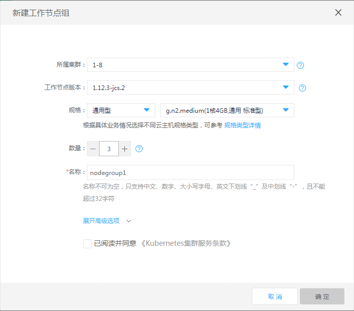

# 创建工作节点组

**创建工作节点组步骤：**

 1. 打开控制台，选择[弹性计算>>Kubernetes集群>>集群服务>>工作节点组](https://cns-console.jdcloud.com/host/nodeGroup/list)，点击创建按钮。  

  

 2. 选择集群，下拉列表中将列出当前地域下的所有处于运行状态的集群。

 3. 选择工作节点组版本：推荐选择与当前管理节点版本匹配的默认工作节点组版本；点击下拉列表显示当前管理节点版本支持的所有工作节点组版本。

 4. 规格：根据具体业务情况选择不同云主机规格类型，支持云主机第二代规格和GPU型实例规格。可参考[实例规格类型](https://docs.jdcloud.com/cn/virtual-machines/instance-type-family)。

 5. 数量：默认数量为3，可根据需求，点击增加、减少按键或者直接输入预期节点数量；工作节点最大数量受当前地域云主机配额、工作节点CIDR可分配的内网IP数量限制。

 6. 名称：默认名称为nodegroup1，名称不可为空，只支持中文、数字、大小写字母、英文下划线“_”及中划线“-”，且不能超过32字符。同一集群下的工作节点组不可重名。

 7. 以下为高级选项，非必填项：  
    * 描述：描述不能超过256个字符；
    * 系统盘：本地盘，容量默认为100G，不可修改；
    * 自动修复：开启后将对非running或ready状态的工作节点进行自动修复。更多详情参考[自动修复说明](https://docs.jdcloud.com/cn/jcs-for-kubernetes/auto-repair)；  
    * 标签：设置添加到工作节点上标签的键、值；键由前缀和名称组成；前缀不超过253字符，由DNS子域名组成，每个子域名不超过63字符，且必须以小写字母数字起止，可包含“-”“.”、大小写字母和数字；名称和值均不能超过63字符，必须以大小写字母或数字起止，可包含“-”“ _ ”“.”、大小写字母和数字；最多可添加五组标签。

 8. 完成相关设置后，点击确定，即可进入弹性计算>>Kubernetes集群>>集群服务>>工作节点组，查看创建的工作节点组。
