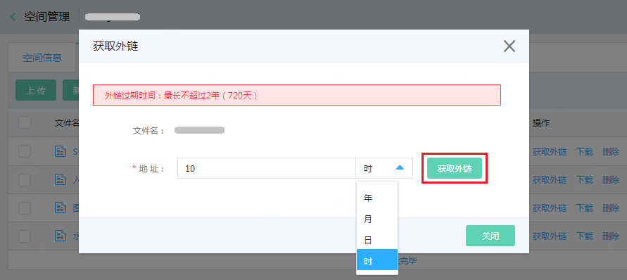

# 私有镜像导入
## 功能概述

私有镜像导入是指，将您在本地或其他云环境下所用服务器的系统盘以镜像的形式保存并导入到京东云环境，以便快速实现京东云上的业务部署。 
导入镜像使用说明： 
* 导入镜像当前仅支持导入系统盘镜像；
* 导入后的镜像将以“云硬盘系统盘镜像”格式作为私有镜像使用，同时会自动生成一个与导入镜像关联的快照；
* 导入镜像在使用方式上与通过“制作镜像”创建的私有镜像无异，但某些功能（诸如设置密码密钥、主机安全监控等）由于依赖镜像中的官方组件，因此是否支持取决于您在导入镜像之前是否进行了对应组件的安装。关于官方组件的介绍请参见 [官方镜像系统组件](https://docs.jdcloud.com/cn/virtual-machines/default-agent-in-public-image)；
* “云硬盘系统盘”镜像可用来创建系统盘是云硬盘的主机，无法将镜像转换为“本地盘系统盘”镜像。关于“本地盘系统盘”镜像和“云硬盘系统盘”镜像的区别请参见 [镜像类型](https://docs.jdcloud.com/cn/virtual-machines/image-type)。

## 镜像基本要求 
### Linux系统基本要求 
| 镜像属性                  | 要求                | 
| :------------------- |  :------------------- |
|操作系统|* 支持CentOS、Ubuntu、Debian、SUSE Linux Enterprise、OpenSUSE  * 支持64位  |
|镜像格式|* 支持RAW、VHD、QCOW2、VMDK|
|镜像大小|* 实际大小（disk size）和虚拟大小（virtual size）均不超过500G|
|文件系统|* xfs、ext3、ext4|
|分区|* MBR分区|
|虚拟化驱动|* 仅支持KVM虚拟化，需要安装virtio驱动|
|网络|* 暂不支持Ipv6地址|
|系统基本环境 |* 关闭防火墙，放行TCP 22端口 * 开启DHCP服务 * 确保系统盘有剩余空间 * 确保文件系统完整|
|系统配置|* /etc/fstab 如有配置自动挂载，请删除 * /etc/udev/rules.d如有70-persistent-net.rules配置，请删除 * 请勿修改 /etc/shadow为 只读 * 请勿修改 /etc/selinux/config 开启 SELinux * 请勿修改/etc/grub/grub.cfg * 请勿修改 /boot/grub/menu.lst
|系统组件|* 安装JCS-agent|
|冲突组件|* 确保卸载qemu-ga * 确保卸载cloud-init|

### Windows系统基本要求 
| 镜像属性                  | 要求                | 
| :------------------- |  :------------------- |
|操作系统|* 支持Windows Server 2016、2012 R2、2008 R2  * 支持64位  |
|镜像格式|* 支持RAW、VHD、QCOW2、VMDK|
|镜像大小|* 实际大小（disk size）和虚拟大小（virtual size）均不超过500G|
|文件系统|* NTFS|
|分区|* MBR分区|
|虚拟化驱动|* 仅支持KVM虚拟化，需要安装virtio驱动|
|网络|* 暂不支持Ipv6地址|
|系统基本环境 |* 关闭防火墙，放行RDP 3389端口 * 确保系统盘有剩余空间 * 确保文件系统完整|
|系统配置|* 请勿修改关键系统文件|
|系统组件|* 安装JCS-agent|
|冲突组件|* 确保卸载qemu-ga * 确保卸载cloudbase-init|

## 导入步骤

 
### 1、准备镜像文件
为保证导入镜像的可用性，请务必在导入前参照上述京东云镜像制作要求进行镜像配置检测，确认导入镜像符合京东云规范后再行操作导入。 
同时为了保证导入镜像在京东云环境下可以获得修改密码、获得监控数据、安全扫描检测等功能，建议您在导出镜像之前进行重要系统组件的安装。系统组件功能及安装方法请参见：[官方镜像系统组件](https://docs.jdcloud.com/cn/virtual-machines/default-agent-in-public-image)  
Linux镜像可使用我们提供的镜像自检工具完成重要系统配置的自检，使用方法请参见：[镜像自检工具](Image-Check-Tool.md)

### 2、准备镜像文件
支持RAW、VHD、QCOW2、VMDK四种格式的镜像文件导入，请在生成镜像文件时指定正确的文件格式。 
不支持iso镜像格式，请通过使用VirtualBox、virt-manager 等工具制作成指定格式的镜像再行导入。操作指导请参见：[镜像格式转换](Convert-Image-File-Format.md) [ISO格式转换](Convert-Image-File-Format-From-ISO.md)

### 3、上传镜像文件
操作导入镜像之前，需要确保已 [开通对象存储服务](https://docs.jdcloud.com/cn/object-storage-service/sign-up-service-2) 、[创建存储空间（Bucket）](https://docs.jdcloud.com/cn/object-storage-service/create-bucket-2)，然后将镜像文件上传至与期望导入镜像同地域的存储空间中，并获取文件下载链接。 
如果存储空间访问权限为“公有读写”或者“公有读私有写”，可直接点击“复制”图标获取外链。 

如果存储空间访问权限为“私有读写”或者“自定义权限”，在获取外链时需要指定链接有效期，由于导入镜像耗时与文件大小和系统处理队列中的任务数量有关，为保证导入过程顺利，建议您设置不少于1天的有效时间。 

### 4、导入镜像
由于目前导入镜像功能未提供控制台操作入口，因此，完成以上几步操作后，请参照openAPI文档，使用CLI或SDK完成导入。接口文档见：[镜像导入](https://docs.jdcloud.com/cn/virtual-machines/api/importimage?content=API) 
导入接口参数说明如下：

| 参数                  | 类型      |是否必填     | 说明 |
| :------------------- |  :------------------- | :------------------- |:------------------- |
| architecture   |  string    |是  |操作系统架构，当前仅支持“x86_64”
| osType   | string    |是   |镜像操作系统分类，请根据实际情况填写“linux”或“windows”
| platform   | string    |是   |镜像操作系统发行版本，如版本为“CentOS”、“Ubuntu”、“Windows Server”中的一种请如实填写，否则请根据osType，对应填写“Other Linux”或“Other Windows”
| osVersion   |  string    |否  |具体的操作系统发行版本号，如7.4（CentOS）、18.04（Ubuntu），仅用于标识以作区分，可根据需要填写
| diskFormat	 | string    |是   | 镜像文件格式，支持“vhd”、“vmdk”、“qcow2”、“raw”，请如实填写，否则校验阶段会报错影响导入
| systemDiskSizeGB   |  int   |是  |  指定使用镜像创建系统盘的容量，范围[40,500]，请确保该参数不小于镜像的virtual size，否则校验阶段会报错影响导入
| imageUrl   | string    |是   |和导入镜像同地区的镜像文件地址（OSS object外链地址），如文件所属地域与接口region不一致会影响导入
| imageName   |  string    |是  |自定义的镜像名称
| imageDescription   |  string    |否  |自定义的镜像描述
| forceImport | string |否  |  是否不做镜像检测强制导入镜像，为避免导入后镜像不可用建议保持默认默认值。默认值：false。
| clientToken |  string    |否  |用于保证请求的幂等性。由客户端生成，长度不能超过64个字符

## 查看及测试镜像
成功提交导入镜像请求后，即可在控制台私有镜像列表页/详情页中通过“状态”属性中的百分比了解具体进度。

如果查询时发现镜像长时间处于“创建中 0%“，可能是由于导入镜像请求过多，您的请求整处于排队状态，此时可通过openAPI调用[镜像导入任务查询](https://docs.jdcloud.com/cn/virtual-machines/api/describeTasks?content=API)接口来获知更详细的任务进展。

镜像导入完成后，请使用镜像创建云主机测试是否可以成功创建，以及基本功能是否正常，如有异常可核对是否符合镜像制作基本要求 ，若仍无法解决请提交工单或联系客服又技术支持协助解决。

导入成功后，如需配置京东云内网yum源或ntp服务，可参考 [Linux系统配置yum源和ntpd服务](https://docs.jdcloud.com/cn/virtual-machines/linux-yum-ntpd)。

