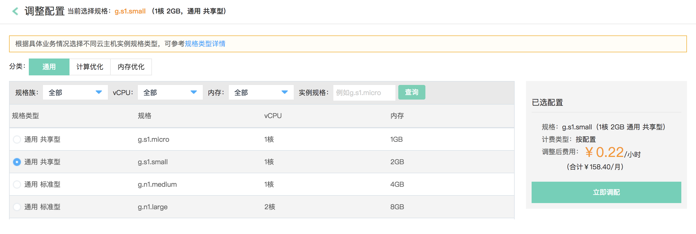

# 调整配置

您在应用初期，请求量较小时可以选用较低的规格，而在应用快速增长、服务请求量剧增时可以快速调整规格，从而提高服务的处理速度，更好地满足您的需求。

## 前提条件

* 实例必须处于“已停止”状态。若实例处于“运行中”状态，请先操作[停止实例](Stop-Instance.md)；若实例处于其他非稳定状态，还请等待前序操作执行完成后再操作调整配置。
	
		请注意：：
		* 若系统盘为本地盘，则不允许跨代调配，如第一代云主机不允许与第二代云主机互相调配；
		* 对于按配置计费云主机，调整配置后将按照新规格计费，调整前规格会立即出账结算（即对上次整点结算时间至当前时间产生的费用进行结算）；
		* 若当前实例带有本地数据盘，需清除本地盘内数据才可调整配置，还请谨慎操作；
		* 若当前实例在高可用组内，可调配规格受限于高可用组支持的规格情况；
		* 若当前实例挂载了加密盘，可调配规格受限于支持加密盘的规格情况；
		* 对于包年包月计费云主机：
			* 若调配后规格价格低于调配前规格价格，则将延长云主机到期时间；
			* 若调配后规格价格高于调配前规格价格，需要支付到期前的差价。
		

## 操作步骤
1. 访问[云主机控制台](https://cns-console.jdcloud.com/host/compute/list)，即进入实例列表页面。或访问[京东云控制台](https://console.jdcloud.com)点击左侧导航栏【弹性计算】-【云主机】进入实例列表页。
2. 选择地域。
3. 在实例列表中选择需要调整配置的实例，确认其状态为“停止”。
4. 点击【操作】-【更多】-【调整配置】按钮，或点击实例名称进入详情页后点击【操作】-【调整配置】按钮，进入调整配置页面。
 
5. 选择新实例规格，点击【立即调配】。对于按配置计费实例触发调整配置；对于包年包月计费实例且需要支付差价则需要进行支付，支付完成后则触发调整配置。

之后实例将进入“调整配置中”状态，调配完成后将恢复成“已停止”状态，操作“启动”实例后即可正常使用实例。
## 相关参考

[停止实例](Stop-Instance.md)
