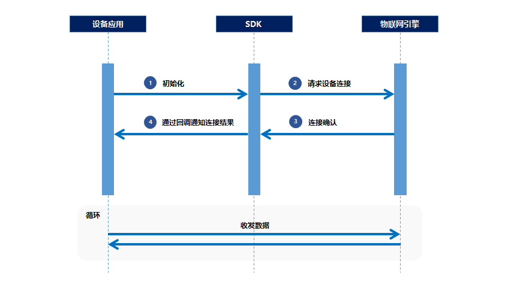
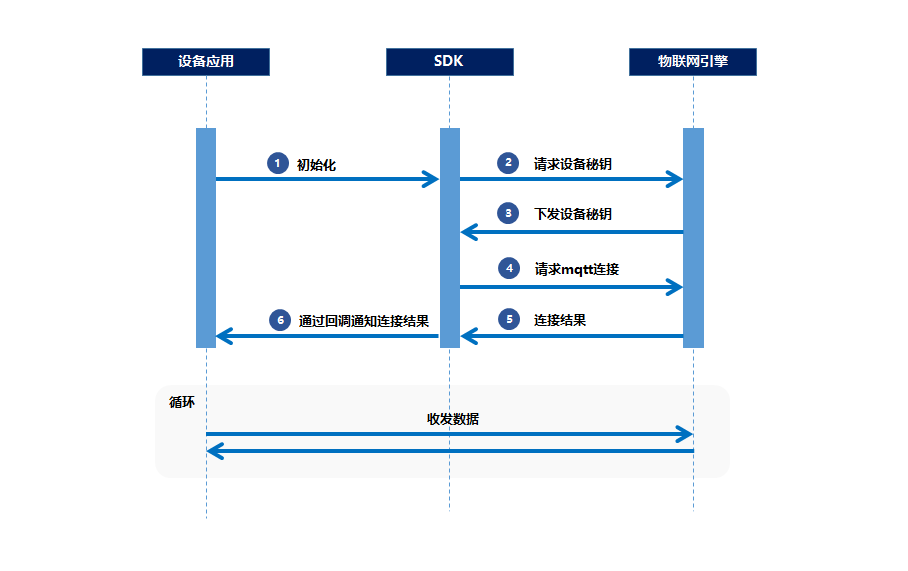

# 设备鉴权

鉴权分一机一密和一型一密，SDK中两种模型通过iot_config.h 中的DYNAMIC_REGISTER 宏来控制。创建产品后默认是一机一密鉴权，开启设备动态注册后，变为一型一密鉴权。

   

## 一机一密

将服务端生成的productkey、identifier、devicesecret烧录设备。用户需要实现 hal_get_identifier、hal_get_device_name、hal_get_device_secret、hal_get_product_key等接口获取对应信息。

Sdk文件hal_os_linux.c中的 _product_key、_ identifier、 _device_secret是用于运行例子的验证信息。

   

## 一型一密

云端根据product_key、product_secert动态生成identifier、device_secert。

   

启用 DYNAMIC_REGISTER 宏后

 iot_mqtt_construct(iot_mqtt_param_t *pInitParams) 会自动去做一型一密认证，用户需要额外实现几个hal层函数

| 函数名                                               | 函数主要功能                           |
| ---------------------------------------------------- | -------------------------------------- |
| int hal_get_product_secret(char *   product_secret); | 获取产品密码，产品密码需要用户提前预置 |
| int hal_set_device_secret(char *   device_secret);   | 用于存储设备密码获取到设备密码后       |
| int hal_set_identifier(char * device_id);            | 用于存储设备密码获取到设备identifier   |

 

具体实现可以参照 platform/linux/hal_os_linux.c 的参考实现。

## 相关参考

- [快速接入设备](../Developer-Guide-Device/DeviceEasyLink.md)
- [建立连接](../Developer-Guide-Device/EstablishConnection.md)
- [订阅发布消息](../Developer-Guide-Device/SubPub.md)
- [心跳及重连](../Developer-Guide-Device/HeartBeat-Reconnection.md)
- [相关API](../Developer-Guide-Device/API.md)
- [术语表](../Developer-Guide-Device/Glossary.md)
