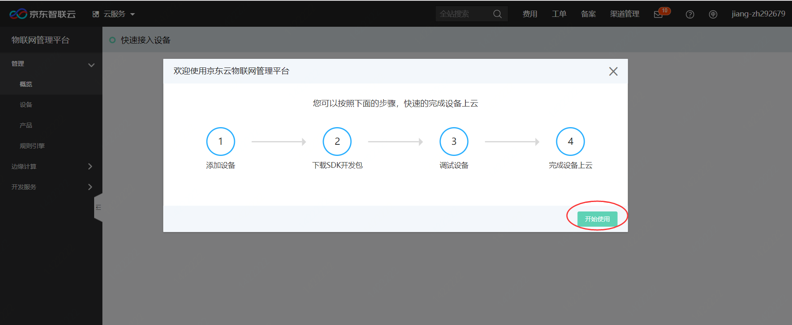

# 快速接入设备

用户首次开通服务后，即可进入快速接入设备页面。（您之后也可在左侧菜单栏点击【快速计入设备】菜单，再次进入快速接入设备）

   

1. 新建产品和设备

   填入产品名称和设备名称，默认系统会自动为产品添加switch和message这两条属性，稍后，您可以在产品详情中，修改编辑产品物模型定义。

      

2. 记录设备的配置信息及接入域名，并下载SDK开发包。

   

3. 根据页面提示，在开发机上运行SDK开发包中的Demo程序，之后查看设备连接情况。

   

4. 完成快速接入设备，您可以直接点击下发链接，进入其他相关页面。

   

## SDK目录结构

SDK 路径结构如下列表，每个路径是一个模块，在其下可以单独编译生成以路径为名的静态库和动态库，以及用于测试模块的测试程序。生成的所有库文件都会存放在build/lib，生成的可执行文件存放在build/bin，顶层的ReadMe 是基本的编译规则说明

 

├── build                        --  生成编译的目录	

│   ├── lib                      --  生成的库文件

│   └── bin                      --  生成的可执行文件

├── include                    -- 生明的头文件

│   

├── samples                   -- App 

├── platform                  -- HAL相关文件

├── src        

│   ├── auth                   -- 设备认证

│   ├── certs                   -- ca证书

│   ├── cjson           

│   ├── mqtt                   -- mqtt协议

│   └── tls                     -- tls认证

│   ├── utils                   -- 工具

├── toolchain                 -- 交叉编译工具

├─ ReadMe                    -- 编译说明     

​                                                  
