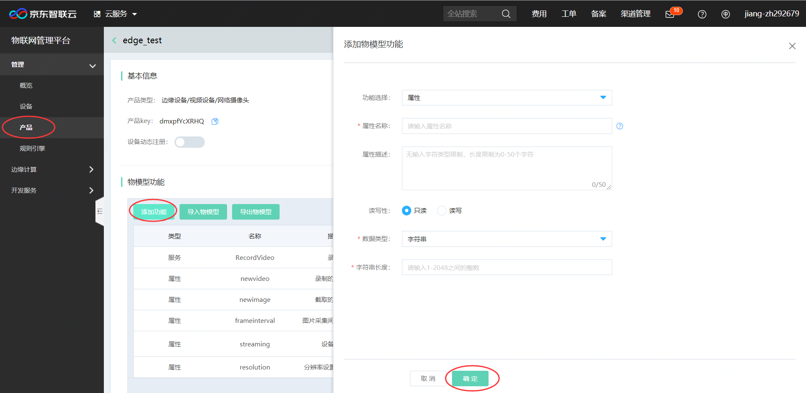

# 新增物模型

新增物模型，即定义产品功能（包括属性、事件和服务）。本文介绍如何在控制台定义物模型。

**操作步骤**

1. 登录[物联网引擎控制台](https://iot-console.jdcloud.com/core)
2. 左侧到导航选择 **管理** -> **产品**
3. 在产品列表中，点击 **产品名称** ，进入产品详情页面
4. 点击 物模型功能 -> **添加功能** 按钮
5. 在弹出对话框中，定义适合该产品的功能信息。您可为产品自定义属性、服务和事件。

6. 设置参数完成后，单击 **确认**，完成单条功能的添加。
7. 您也可以通过**导入物模型**按钮，上传您编辑好的物模型，批量导入物模型功能。 点击获取[物模型模板](https://pubilc-tm-template.s3.cn-north-1.jdcloud-oss.com/TM-Sample.json)。

## 属性参数设置如下：

| 参数                  | 描述                 |
| :-------------------: | :------------------- |
|属性名称  | 定义属性的名称，支持英文字母、数字、下划线“_”及中划线“-”，必须英文字母及数字开头结尾，1-30个字符。必填！产品下唯一。不可修改。 | 
|属性描述 | 用于进行属性功能的说明。无输入字符类型限制，长度限制为0-50个字符。非必填！ | 
|读写性 | 定义属性值本身的读写性，可读写属性自动生成物影子。必填项。	值：只读(read_only) / 读写(read_write)  | 
|数据类型 | 定义该属性的数据类型，目前支持下面几种类型，必填项。     - **字符串（string）** :长度（length）:允许传入字符串的最大长度（输入值为1 - 256范围内的整数），不可为空，不可为0。可更改；   - **布尔值（bool）** :数值（value）：True / False, 数值名称（name）：定义对应的数值名称，用于识别及展示。不可为空，支持汉字、英文字母、数字。长度为1-10个字符。可更改;    - **枚举值（enum）** :数值（value）：定义枚举的数值，取值范围：0~99。总数大于等于2个（数值支持类型：string），输入“0”时，仅支持1位。其他数字不支持以0开头。不可重复！可更改。数值名称（name）：定义对应的数值名称，用于识别及展示。不可为空，支持汉字、英文字母、数字。长度为1-10个字符。可更改。   - **单精度浮点（float）** ，需定义取值范围、步长和单位符号。，小数有效位数7位。      - **双精度浮点（double）** ，需定义取值范围、步长和单位符号。小数有效位数14位。     - **整型（int32）** ，需定义取值范围、步长和单位符号。无小数。    **注意** ：最大/最小值以及步长的范围应在该数据类型的标准范围内。   最大值（max）：该数值允许的最大值 可更改；	   最小值（min）：该数值允许的最小值 可更改；	   步长(step)：数值变化的最小粒度 可更改；  单位（unit）：该数值对应的单位，长度限制为0-10个字符。可更改 非必填项；  单位名称（unitname）：该数值对应的单位名称，长度限制为0-10个字符。可更改 非必填项。  |
|步长| 步长使用场景如下：  1. 根据步长值判断设备上报数据精度是否正常，进而产生报警或故障的event。   2. 对于读写属性，在进行属性更新时，对用户填入的更新值做精度校验，不符合要求的不能更新。  |
|单位| 该数值对应的单位，长度限制为0-10个字符。可更改 非必填项； |
|单位名称| 该数值对应的单位名称，长度限制为0-10个字符。可更改 非必填项。 |

## 服务参数设置如下：

| 参数                  | 描述                 |
| :-------------------: | :------------------- |
|服务名称  | 定义服务的名称，支持英文字母、数字、下划线“_”及中划线“-”，必须英文字母及数字开头结尾，1-30个字符。必填！产品下唯一。不可修改。 | 
|服务描述 | 用于进行服务功能的说明。无输入字符类型限制，长度限制为0-50个字符。非必填！ | 
|输入参数 | 定义调用该服务时，需要提供的输入参数。可新增、删除参数。 点击 **添加参数**，在弹出的对话框中添加服务输入参数  1. 参数名称：定义参数名。1-30个字符，支持英文字母、数字、下划线“_”及中划线“-”，必须英文字母及数字开头结尾。不可更改。该服务下唯一，远程应用调用服务时使用。   2. 参数描述：定义参数说明，0-50个字符，可更改。   3. 数据类型：参数的数据类型，参考属性定义里的数据类型。   4. 数据定义：参数的数值定义，参考属性定义里的属性值定义。| 
|输出参数 | 定义调用该服务后，服务输出的数据。可新增、删除参数。 点击 **添加参数**，在弹出的对话框中添加服务输出参数  1. 参数名称：定义参数名。1-30个字符，支持英文字母、数字、下划线“_”及中划线“-”，必须英文字母及数字开头结尾。不可更改。该服务下唯一，远程应用调用服务时使用。   2. 参数描述：定义参数说明，0-50个字符，可更改。   3. 数据类型：参数的数据类型，参考属性定义里的数据类型。   4. 数据定义：参数的数值定义，参考属性定义里的属性值定义。| 

## 事件参数设置如下：

| 参数                  | 描述                 |
| :-------------------: | :------------------- |
|事件名称  | 定义事件的名称，支持英文字母、数字、下划线“_”及中划线“-”，必须英文字母及数字开头结尾，1-30个字符。必填！产品下唯一。不可修改。 | 
|事件类型 | 定义事件类型。固定类型：  1. 报警：告警类信息。  2. 故障：故障类信息。| 
|事件描述 | 用于进行事件功能的说明。无输入字符类型限制，长度限制为0-50个字符。非必填！ | 
|输出参数 | 一个事件最多支持定义20个输出参数。可新增、删除参数。 点击 **添加参数**，在弹出的对话框中添加服务输出参数  1. 参数名称：定义参数名。1-30个字符，支持英文字母、数字、下划线“_”及中划线“-”，必须英文字母及数字开头结尾。不可更改。该事件下唯一    2. 参数描述：定义参数说明，0-50个字符，可更改。   3. 数据类型：参数的数据类型，参考属性定义里的数据类型。   4. 数据定义：参数的数值定义，参考属性定义里的属性值定义。| 

