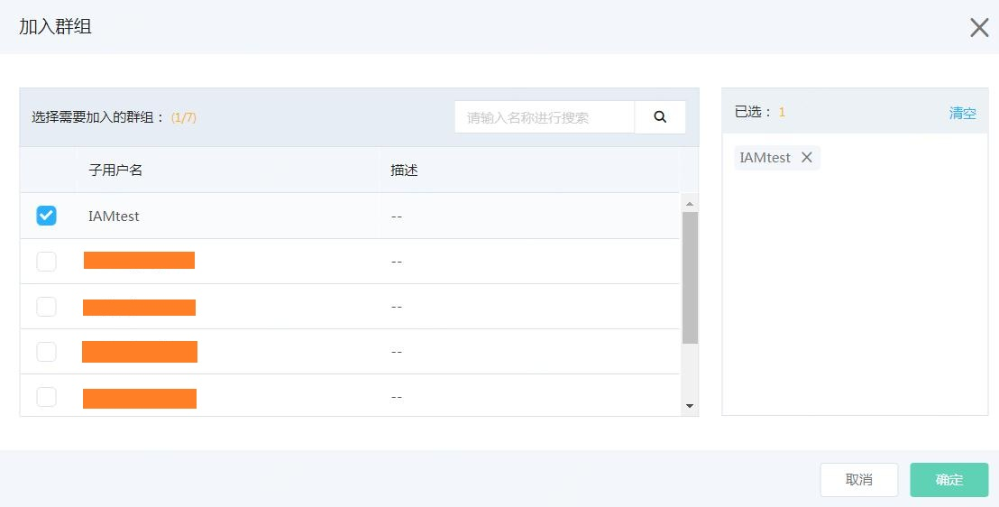
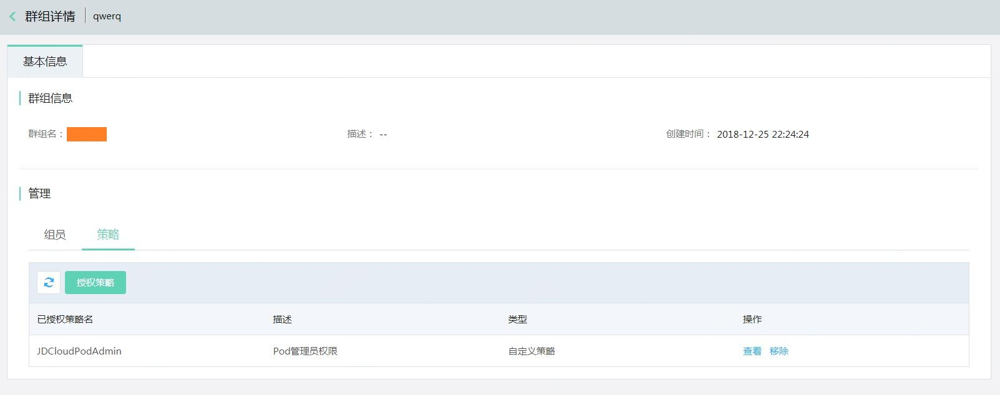

# 角色
## 什么是角色
角色分为用户角色和服务角色，他是一种虚拟身份类型，它没有确定的身份凭证，它必须关联到某个实体身份上才能使用。与子用户的差别主要在使用方法上，角色需要被一个授信的实体用户扮演，扮演成功后实体用户将获得角色的临时安全凭证，使用这个临时安全令牌就能以角色身份访问被授权的资源。

根据角色信任类型的不同，主要有下面两种类型：

- 用户角色必须被当前主账号下的子用户扮演，或者跨账号下的子用户扮演后才能生效。此类角色主要用来解决跨主账号访问和临时授权的场景。
- 服务角色需要授予某个云服务（如云主机，数据库）来扮演，通过服务角色,授权云服务您对您的京东云资源进行管理和操作。

## 如何使用角色
1.创建角色

## 信任关系，也叫角色扮演者（Principal）
京东云中可以扮演角色的实体用户或者服务，在IAM角色中，在角色中的信任策略中使用“Principal”元素来指定角色的信任关系，“principal”中可以指定京东云账户，子用户、京东云服务。

- 京东云账户:
  - "Principal": { "JDCLOUD": "jrn:iam::*accountID*:root" }
  - "Principal": { "JDCLOUD": "*accountID*" }
- 子用户：
  - "Principal": { "JDCLOUD": "jrn:iam::*accountID*:user/user-name" }
- 京东云服务：具体支持服务角色的产品线，请参考[支持IAM的云服务](https://docs.jdcloud.com/cn/iam/support-services)
  - "Principal": { "Service": "*ServiceName*.jdcloud.com" }

## 角色扮演和切换
- 从登录身份切换到用户角色身份（SwitchRole）：
  子用户登录到控制台后，可以选择切换角色，前提是这个子用户已经被授予了扮演该用户角色的权限。子用户每次只能扮演一个用户角色，当子用户从登录身份进入用户角色身份时，用户只能使用用户角色身份上所授予的权限，子用户登录身份上绑定的权限会被屏蔽。如果需要使用登录身份的权限，那么需要从角色身份返回登录身份。
- 从实体身份通过程序调用方式扮演角色（AssumeRole）：
  如果一个子用户被授予了扮演某个用户角色的权限，那么该子用户可以使用访问密钥（AccessKey）来调用 STS 服务的 AssumeRole 接口来获得这个用户角色的临时访问密钥。子用户可以自行设置临时凭证的过期时间，临时凭证访问时的权限也将受限于用户角色被授予的访问权限，通常用于解决临时授权问题和跨账号访问的授权问题。

## 创建角色

登录京东云控制台，进入访问控制 > 群组管理，点击【创建】按钮，在创建群组窗口填写群组信息：

## 编辑群组

访问群组列表，点击【编辑】按钮，可快捷的编辑群组的描述信息。

## 删除群组

访问群组列表，点击【删除】按钮，删除群组的信息及其子用户和策略的关联关系。

## 给群组添加子用户

访问群组列表，点击【添加组员】按钮，可快捷的为群组添加相应的子用户

## 给群组移除子用户

点击群组名称，进入相应的群组详情页面，选择 【组员】，选定对应子用户后，点击【移除】即可把子用户移除相应的群组。

## 给群组授予策略

访问群组列表，点击【授权】按钮，可快捷的授予群组相应的策略。

## 给群组解绑策略

点击群组名称，进入相应的群组详情页面，选择 【关联策略】，选定对应策略后，点击【解除】即可为群组解绑策略。

