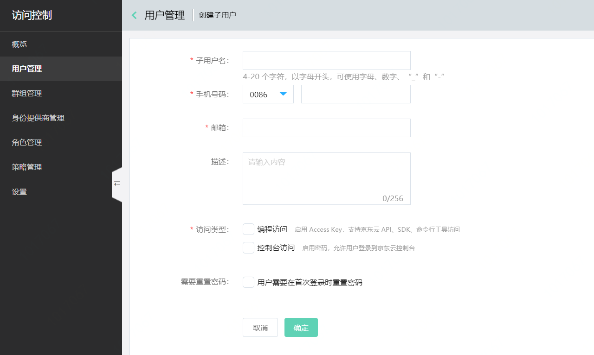
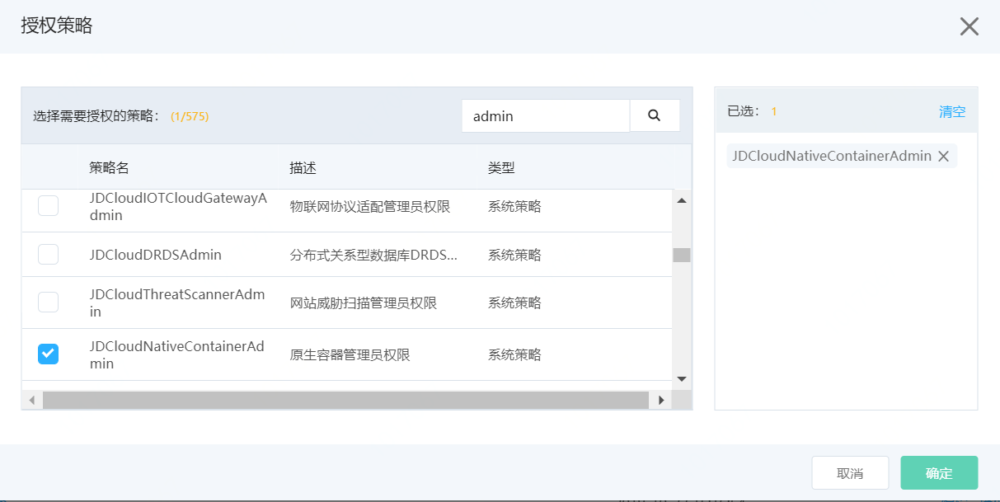
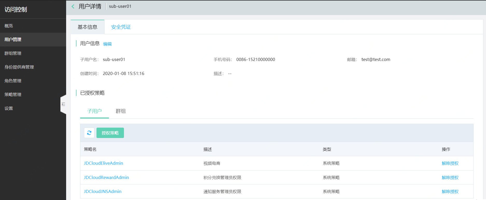

本页介绍子用户的概念、如何创建子用户，以及如何为子用户授权。

- 创建子用户
- 编辑子用户
- 删除子用户
- 为子用户授权策略
- 为子用户解绑策略
- 设置子用户安全凭证

子用户是只在主账号空间下可见的实体身份，有确定的用户名、密码和 AK/SK。

子用户的用户名由主账号创建。子用户不是独立的京东云账号，只在主账号的空间下可见。子用户只有资源的使用权，没有资源的所有权。子用户没有独立的计量计费，子用户对资源的使用费用将统一计入主账号的账单。子用户必须得到主账号的授权，才能登录控制台或使用Open API操作主账号授权的资源。

## 创建子用户

主账号登录京东云控制台，进入访问控制 > 用户管理，点击“创建子用户”。在子用户创建页面定义子用户信息和访问限制等：

子账号创建成功后，您可以选择下载或者邮件的方式下载子用户的密码和访问秘钥信息。

## 编辑子用户

访问子用户列表，点击【编辑】按钮，可快捷的编辑子用户的描述信息，联系电话和邮箱。

## 删除子用户

访问子用户列表，点击【删除】按钮，删除子用户的信息及其群组和策略的关联关系。

## 给子用户授予策略

访问子用户列表，点击【授权】按钮，可快捷的授予子用户相应的策略。

## 给子用户解绑策略

点击子用户名称，进入相应的子用户详情页面，选择 【关联策略】，选定对应策略后，点击【解除】即可为子用户解绑策略。

## 子用户安全凭证设置

- 为子用户重置密码。
- 为子用户开启MFA。
- 要求子用户必须开启MFA，而不是直接帮子用户完成MFA的绑定。子用户将在下次登录时，跳转到MFA的绑定页面，绑定成功后才能进入控制台。
- 为子用户开启操作保护，当子用户的虚拟MFA启用后，主账号可以为子用户开启操作保护。这样子用户在操作主账号授予的敏感操作时将需要进行虚拟MFA验证。
- 为子用户启用访问秘钥。

 

