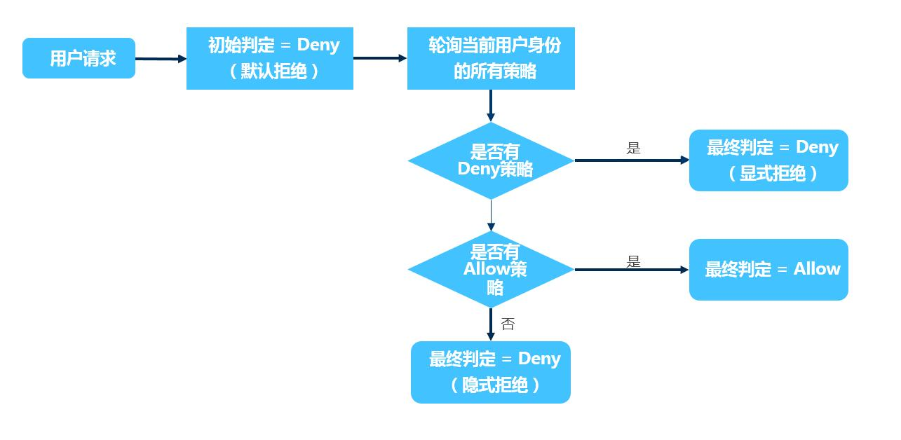

# IAM权限判断规则

访问京东云资源的身份分为以下几种类型
 - 主账号身份访问
 - 子用户身份访问
 - 用户角色身份访问
 - 服务角色身份访问

根据身份类型的不同，IAM的权限判断规则如下：

|  身份类型 | 权限判断规则 |
| :----------: | :----------------- |
|  以主账号身份访问   |     主账号是京东云资源的所有者，默认可以访问京东云上的所有操作和所有资源      |
|  以子用户 身份访问  |     子用户创建后，默认没有任何的访问权限 需要主账号对子用户进行授权后才允许访问京东云上的操作和资源|
|  以用户角色身份访问   |   用户角色是一种虚拟的用户身份 用户角色需要添加信任的主账号，由被信任主账号的子用户扮演后权限才能够生效 需要主账号对用户角色进行授权后才允许访问京东云上的操作和资源  |
|  以服务角色身份访问 |     服务角色是一种虚拟的用户身份 服务角色需要添加信任的云服务，由被信任的云服务扮演后权限才能够生效 需要主账号对服务角色进行授权后才允许访问京东云上的操作和资源  |

## 权限判断规则

#### Effect 包括 allow(允许)和deny(显式拒绝)两种情况

> 当同一操作在策略中既有允许（Allow）又有拒绝（Deny）的时，遵循 Deny 优先的原则，操作将被拒绝。

