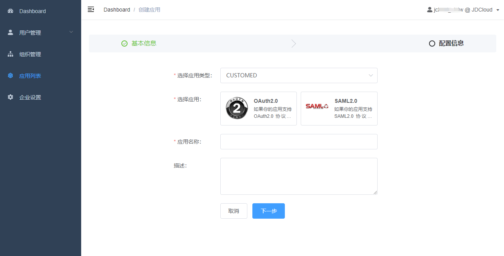
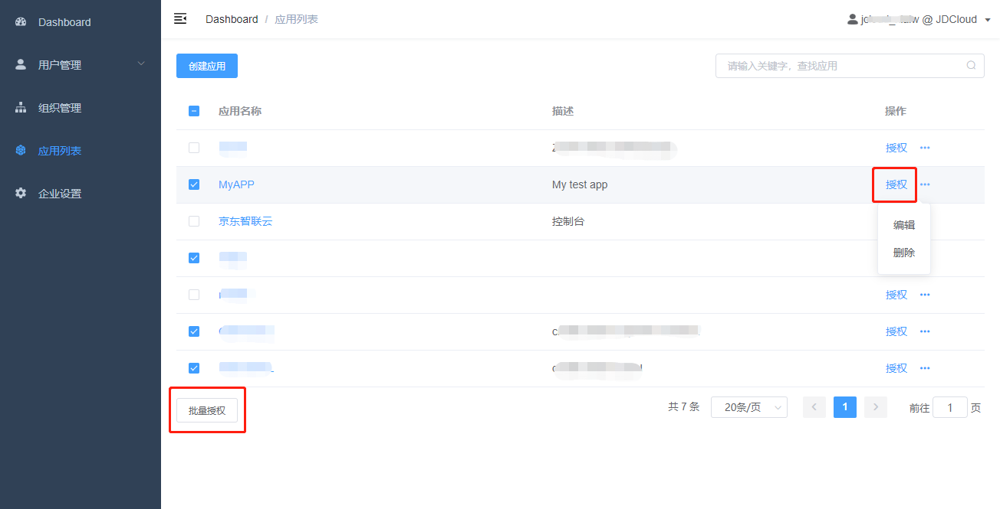
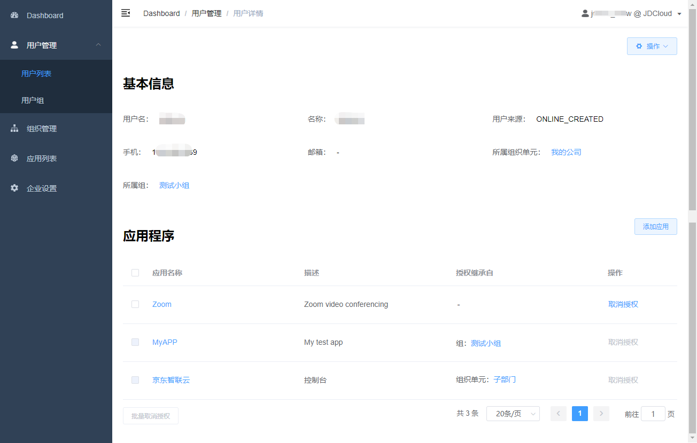
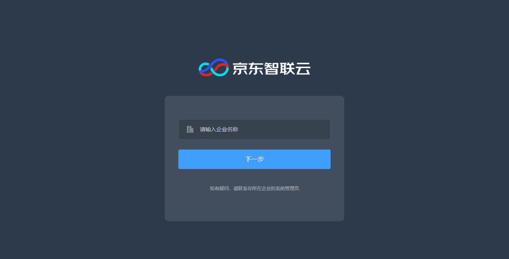

# 添加应用并授权

身份通支持OAuth2.0和SAML2.0类型的应用。OAuth2.0支持[授权码模式](https://tools.ietf.org/html/rfc6749#page-24)（Authorization Code Grant）和[隐式模式](https://tools.ietf.org/html/rfc6749#page-31)（Implicit Grant），SAML2.0通过HTTP-POST Bindings支持[SSO Profile](https://docs.oasis-open.org/security/saml/v2.0/saml-profiles-2.0-os.pdf)。

## 创建应用

进入应用管理页面，点击 “创建应用” 并选择要创建的应用类型 - OAuth2.0应用或SAML2.0应用。填写应用名称和描述后，点击 “下一步” 按钮，应用即创建成功。应用创建后，应用类型不能更改。

## 配置应用

应用 “配置信息” 页面分为两部分。

第一部分 “身份服务提供商信息” 为身份通作为IdP的元数据信息，被添加的应用程序将需要这些信息。OAuth2.0 IdP元数据信息可以在 https://idaas-idp-oauth2.jdcloud.com 查看，SAML2.0 IdP元数据可以在 https://idaas-idp-saml.jdcloud.com/{appID}/metadata 查看

第二部分是 “应用信息配置”，这部分需要填写SP信任信息，请向应用服务提供商确认这些信息。

## 授权应用

在 “应用管理” 列表中，可以批量选择应用并授权给用户；也可以在列表右侧选择 “授权” 操作，按用户、用户组或组织进行授权。对用户组授权时，组成员会继承该授权；对组织单元授权时，组织成员会继承该授权。

在某个用户的详情页，可以查看、添加、或解除该用户的授权应用。只有直接授权给该用户的应用可以与用户解除授权，继承自用户组和组织单元的应用无法对用户单独解除授权。

## 使用应用

用户在企业门户URL进行登录后，进入 “我的应用” 视图，即可查看和访问所有已授权的应用。如果未获得任何应用授权，则页面没有应用展示。

用户也可以从应用侧发起单点登录请求，由应用程序将用户跳转至身份通进行登录认证。

首选，用户要先指定所在企业的企业名，该信息由管理员在 “企业设置” 指定；进入企业门户登录页后，用户进行登录。如果发起单点登录请求的应用已向用户授权，则用户可以完成应用登录；否则未经授权的应用访问将被身份通拦截。

