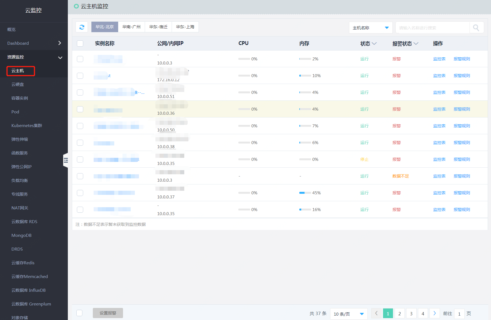
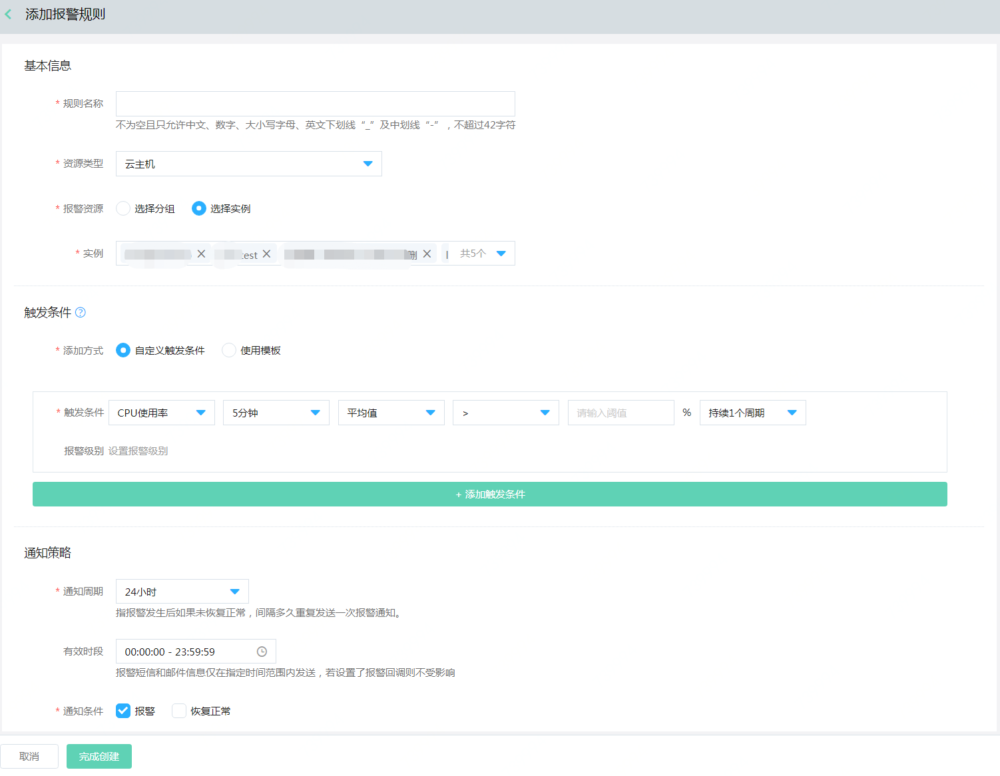
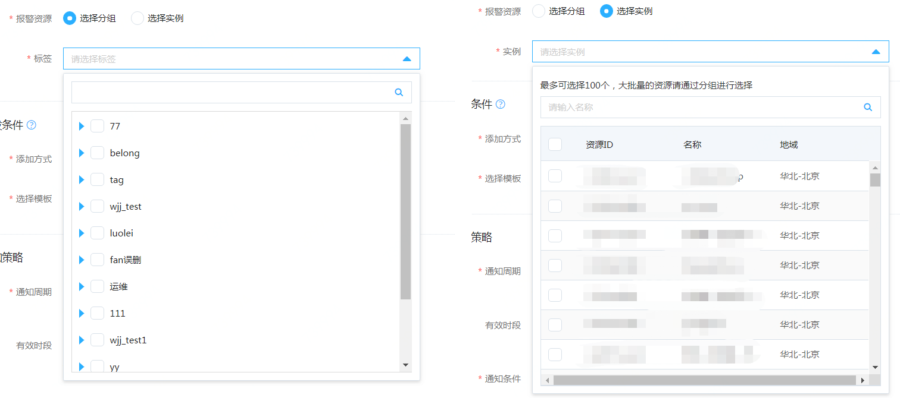
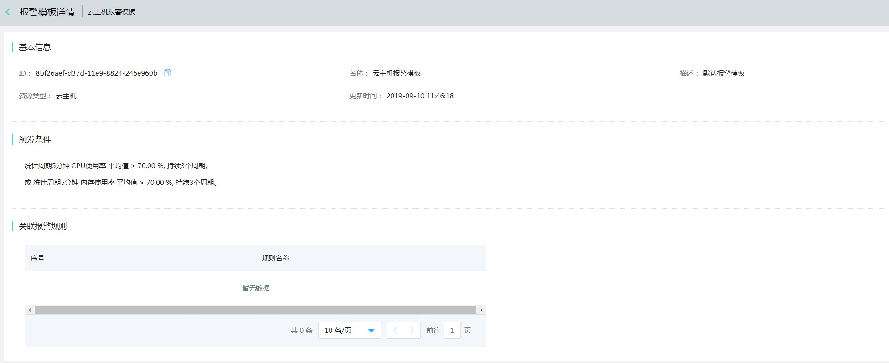

## 添加报警规则  
1.	登录京东云控制台，点击管理->云监控->报警管理->全部报警规则，进入全部报警规则列表页面。  
  

2. 点击“添加报警规则”，进入添加报警规则页面。  
  

3. 按照以下步骤配置规则信息  
   1）	基本信息：设置规则名称，选择资源类型，报警资源支持“选择分组”和“选择实例”两种方式添加。  
   - 选择分组： 报警资源支持添加标签组，支持标签的云产品才有该选项，若标签下新增加资源，则自动关联该规则无需手动添加。  
   - 选择实例： 可以指定配置报警的单个或多个实例。  
     
   
   2）触发条件：支持自定义添加，也支持绑定已有的模板信息。  
   - 自定义添加：选择监控项、统计周期、统计方法、计算方式、阈值、持续周期，同时可根据需求配置报警级别。 若需配置多个触发条件，点击“添加触发条件”按钮即可配置。  
     
   - 使用模板：切换至“使用模板”选项，点击下拉框，选择需要使用的模板，若需详细了解模板的详情信息，可点击“查看模板”字样，打开模板详情。  
     
       
   
   3）通知策略信息配置如下：  
   - 通知周期：表示如果资源一直处于告警状态，未恢复正常，间隔多久发送下一次通知。提供5分钟、10分钟、15分钟、30分钟、1小时、3小时、6小时、12小时和24小时几种选项。  
   - 有效时段：报警短信和邮件信息仅在指定时间范围内发送，默认是全天都发送。  
   - 通知条件：提供“报警”和“恢复正常”两种场景，默认仅报警状态发送，必须要指定通知条件。  
   - 接收渠道：提供“短信”和“邮件”两种选型，默认都发送，可根据需要选择。  
   - 通知对象：支持选择联系人或联系组。添加联系人和联系组击选择框底部的“账户管理-联系人管理”进入用户中心进行配置。  
   - 报警回调：当资源发生告警时，京东云主动回调您配置的URL信息和POST参数信息。  
     
     
 4.	点击页面底部的“完成创建”，完成本次添加报警规则操作。
 
 
  
