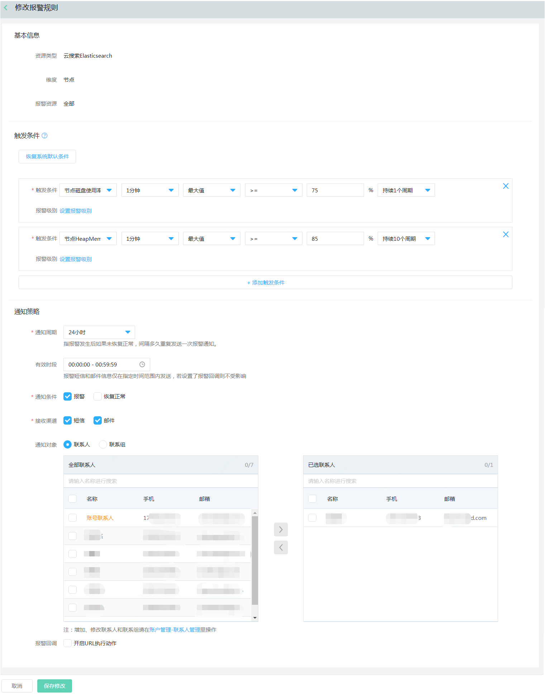

# 一键报警
一键报警服务是为了帮助用户快速建立报警体系，用户您只需要打开一键报警开关，对应云服务下的全部资源快速开启监控。

## 支持云服务及默认报警策略
|云服务|描述|默认配置策略|
|---|----|----|
| 云主机| 提供实例、硬盘、网卡等监控维度，默认配置了CPU使用率、内存使用率和硬盘使用指标。| CPU使用率 1分钟内平均值＞80%，连续5次 或 内存使用率 1分钟内平均值 > 90 %, 连续5次，或 硬盘使用率 1分钟内平均值 > 80 % 连续5次； 通知周期为3小时， 短信、邮件通知。|
|云数据库RDS|默认监控CPU使用率、硬盘使用率、内存使用率指标数据。开启一键报警后，全部MySQL、SQL Sever、MariaDB、PostgreSQL 和Percona 实例都生效。|CPU使用率 5分钟内平均值>= 80%，连续3次 或 内存使用率 5分钟内平均值 = 80%, 连续5次，或 硬盘使用率 5分钟内平均值 > 80.00 % 连续3次； 通知周期为3小时， 短信、邮件通知.|
| 云搜索 Elasticsearch| 监控 Elasticsearch 实例和节点两个维度的监控数据，包含集群状态、节点硬盘使用率、节点HeapMemory使用率相关指标数据。|  集群状态 1分钟内最大值 >= 2.00 , 出现1次 或 集群状态 1分钟内最大值 == 1.00 , 出现1次  或 节点硬盘使用率 1分钟内 最大值 >= 75.00 %, 1次 或  节点HeapMemory使用率 1分钟内最大值 >= 85.00 %, 连续10次；通知周期为3小时， 短信、邮件通知。|

## 使用一键报警服务

**使用说明**
- 开启一键报警之后，对应云服务下的全部资源包括后续新购买创建的资源均可进行了监控。
- 一键报警默认仅启用了一些常用的核心指标，若有其他指标需求可以通过修改操作进行添加。若某些实例有特殊化监控报警需求，可使用报警规则服务，自定义添加。

**操作步骤**

【开启一键报警】
1.  访问[云监控控制台](http://cms-console-stag.jdcloud.com/alarm/oneclick/)，即进入实例列表页面。或访问[京东智联云控制台](https://console.jdcloud.com)点击顶部导航“云服务” 搜索“云监控” ，根据搜索结果，点击进入云监控控制台。
2. 选中要启用一键报警的云服务，打开启用开关即可。

【修改策略】  
若内置默认策略无法满足需求，则可以根据需要修改和添加触发条件、通知策略等信息。以云搜索Elasticsearch 为例。具体操作步骤如下：  
1. 选中云搜索Elasticsearch云服务，点击展开按钮打开一键报警策略列表。点击操作了下的“修改”按钮。打开修改报警规则页面。  

 

2. 可以根据需要修改触发条件，比如默认的监控周期、报警阈值、持续周期等等，同时也可以增加或删除触发条件；通知策略中通知周期、有效时间、通知条件等信息是内置了常用选项，通知联系人默认为账号联系人，您可以根据需要进行修改。
