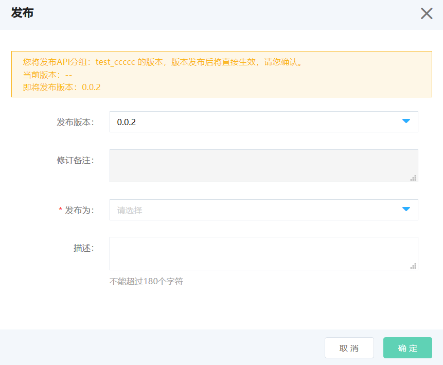
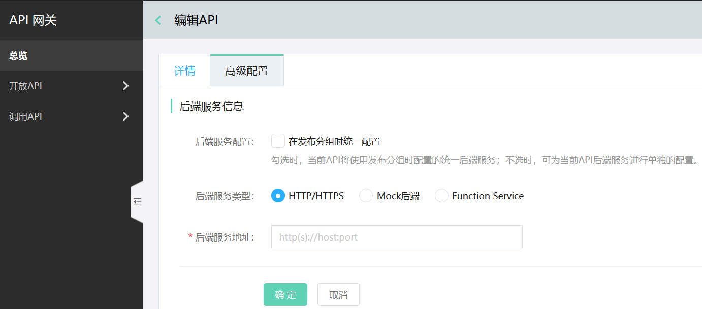
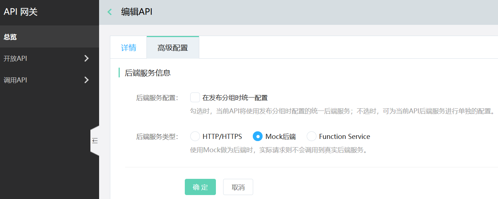
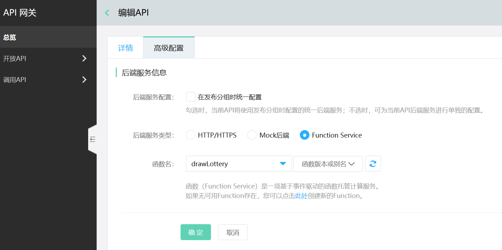

# API高级配置

在发布API分组过程中，高级配置功能提供了对API的真实服务的配置功能，该项内容对发布来说非必填。具体来说，该配置提供了如下功能：

- 调用API时，API 网关会将前端请求传入的参数，根据高级配置进行转换到对应的后端服务上。

- API网关是基于分组发布API的，即所有API将都使用API分组上定义的后端服务，而高级配置功能可对分组里的API单独进行后端服务的配置。例如，同一个分组里有5个API，其中API1使用了高级配置并单独配置了后端服务；当API分组发布后，API1使用其配置的后端服务，而其余4个使用分组上配置的统一后端服务。

#### 入口
互联网中间件>API网关>API分组管理>管理API，选择API并点击操作中的高级配置功能。

####   说明：

目前后端服务类型支持以下方式：

- HTTP/HTTPS。

- Mock后端。

- 函数（Function Service）。目前仅支持对单个API配置函数类型后端，不支持对API分组配置函数类型后端。

##  操作步骤：
###  第1步：进入API管理页
首先选择API分组，点击管理API菜单，进入API列表页。
 
说明：
如果当前API分组是部署中的版本，不能直接操作。如需操作请先下线，或新增版本进行修订。

###  第2步：进入高级配置页进行操作
####  第1种： 默认情况：使用API分组上配置的后端
当选择此类型配置时，该API在实际调用时，将使用发布分组时配置的地址内容。

 
 
 
当选择此配置时，该API在实际调用时所使用的后端地址，将是发布API分组时，配置的统一地址。即下图中配置的后端服务地址。

####   第2种：自定义独立后端。
当选择此配置时，即取消选择“在发布分组时统一配置”，则该API在实际调用时，将使用此处单独配置的后端地址为真实请求地址。

##### 1、HTTP/HTTPS

 
 
 使用该类型做后端时，需要填入API调用的真实后端服务地址。
 

##### 2、Mock

 
 
使用Mock做为后端时，实际请求则不会调用到真实后端服务。

##### 3、Function

 
 
使用该类型做后端时，需先在函数中创建函数，然后在下拉框中找到并选择函数。
######  特殊说明：目前仅支持对单个API配置函数类型后端，不支持对API分组配置函数类型后端。
