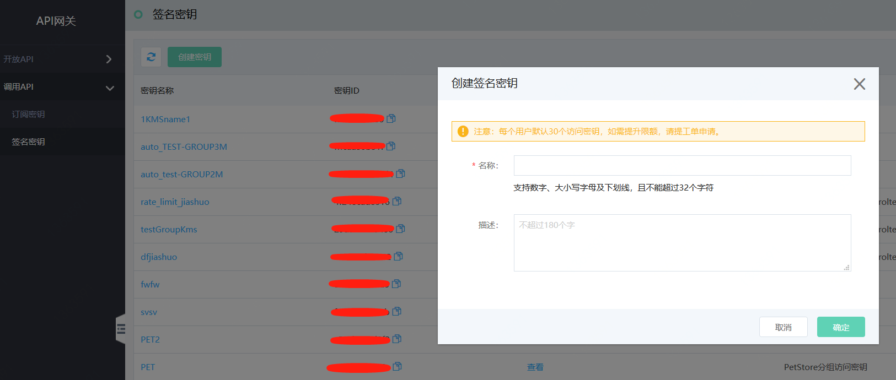
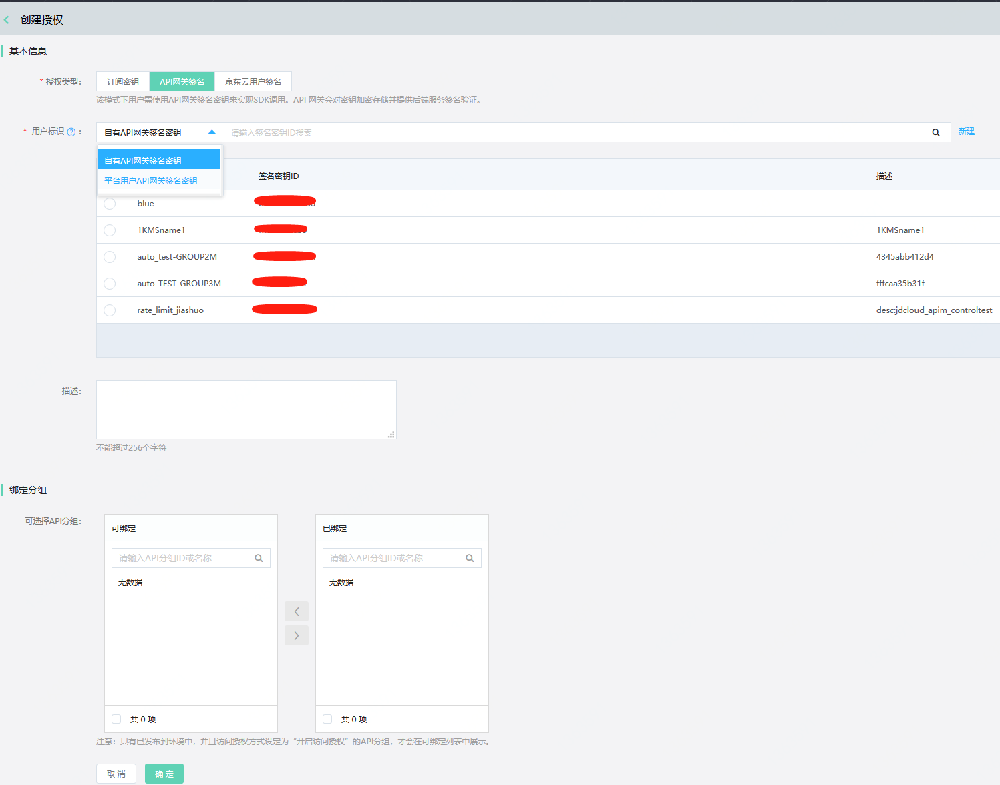

# 签名密钥

京东云API网关支持签名密钥的授权类型，API网关针对此授权类型采用了特殊的签名算法，因此具有极高的安全性，授权完成后用户可使用SDK对API进行调用。

#### 入口：

互联网中间件>API网关>调用API >签名密钥

## 操作步骤：
### （1）API调用者创建和提供签名密钥 

- 点击左侧菜单，进入签名密钥列表页。
- 在签名密钥页面，点击“创建密钥”按钮，填写名称（必填）和描述（非必填）。

  
  
- 密钥创建成功后，系统会自动生成密钥ID和API Key。
- API调用者需要将签名密钥ID告知API提供者，由API提供者进行访问授权。

### （2）	API提供者将API分组授权给API调用者，供其使用

- 进入“开放API”部分的“访问授权”列表页，点击“创建授权”。

  
  
- 在“基本信息”部分选择授权类型“API网关签名”。用户标识部分可选择“自有API网关签名密钥”或“平台用户API网关签名密钥”，用户需要从对应的密钥列表中选择当前用户所创建的签名密钥或输入其他用户的签名密钥ID进行密钥的搜索选择。
- API网关签名密钥选择完成后，在“绑定分组”部分选择对应的可绑定分组进行绑定，点击“确定”。至此，API网关签名密钥与API分组之间的授权过程已经完成。

  注意：只有已发布到环境中，并且访问授权方式设定为“开启访问授权”的API分组，才会在可绑定列表中展示。

  
  
- 接下来用户可以使用SDK的方法实现对API分组内API的访问。
