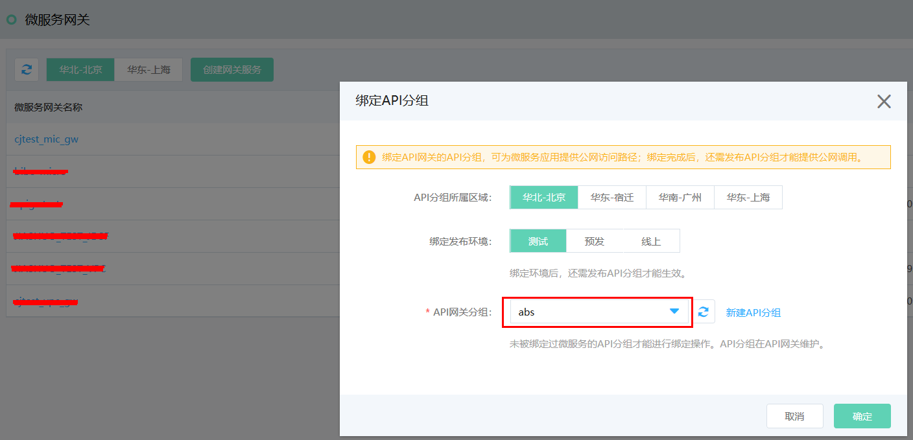
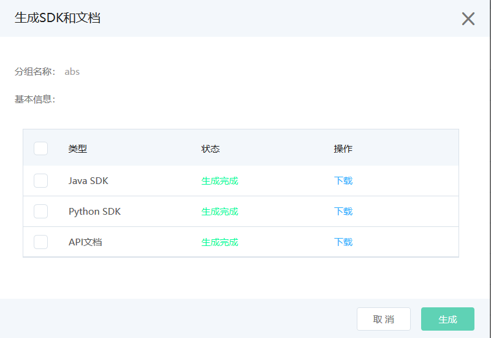

# 微服务网关

当您在京东云上通过微服务平台创建了自有微服务应用后，可以通过京东云API网关将其发布到公网供客户调用，在此过程中就需要微服务网关来发挥作用。

以下过程将指导您完成在API网关控制台中使用微服务网关作为后端服务，进行微服务API分组调用的过程。


## 操作步骤：

#### 1. 登录API网关控制台，打开[API分组管理](https://apigateway-console.jdcloud.com/apiGroupList)。

#### 2. 点击“创建分组”按钮。


#### 3. 在新建API分组页面，填写API分组信息。API分组类型选择“微服务API分组”。可选择“开启访问授权”或“免鉴权”模式。


   
   
#### 4. 点击确定，提示创建成功，在API分组列表页中点击“绑定”按钮。若还未创建微服务网关服务，则需要先在“微服务平台”创建微服务网关服务（详情请见[微服务网关](https://jdsf-console.jdcloud.com/gateway?regionId=cn-north-1)）。若已创建微服务网关服务，则可选择一个微服务网关，对目标API分组及其所属区域、发布环境进行绑定。





#### 5. 绑定成功后，可以在API网关对微服务API分组进行发布，后端服务即为微服务网关服务。


#### 6. 发布成功后，可以在该API分组的发布列表中查看发布详情。


#### 7. 接下来进行访问授权过程。用户需要先获取自己或其他用户的[订阅密钥](https://apigateway-console.jdcloud.com/subscriptionKey)、[签名密钥](https://apigateway-console.jdcloud.com/accessSecretKey)或[京东云用户Access Key](https://uc.jdcloud.com/account/accesskey)相关信息，再在API网关的[访问授权](https://apigateway-console.jdcloud.com/authorizationList)模块中绑定对应的微服务API分组。


#### 8. 针对该微服务API分组，在“更多“中选择“生成SDK和文档”，进行SDK和文档生成及下载。





#### 9. 接下来即可使用SDK对微服务API分组进行访问。
(1)通过Java SDK调用，Java SDK示例如下：

 ```Java
 import com.google.api.client.http.HttpResponse;
import com.google.api.client.http.HttpResponseException;
import com.google.api.client.util.Maps;
import com.jdcloud.sdk.http.Protocol;
import com.jdcloud.sdk.utils.BinaryUtils;
import net.jdcloud.Abs.client.JdcloudSDKClient;


/**
* Demo
*/
public class Main {

public static void main(String[] args) throws UnsupportedEncodingException, HttpResponseException {
String assessKey = "ak";//免鉴权时传空
String secretKey = "sk";//免鉴权时传空
String host = "w22bzgeav4by.cn-north-1.jdcloud-api.net";// 域名：不要添加http://或https://
// String host = "w22bzgeav4by-test.cn-north-1.jdcloud-api.net"; // 测试环境地址
// String host = "w22bzgeav4by-preview.cn-north-1.jdcloud-api.net"; // 预发环境地址
String path = "/v1/test";// 请求路径：不要包含query参数，例如 /test?queryParam1=value1&queryParam2=value2，只传/test
String method = "POST";// 请求方式，大写
Map<String, String> headers = Maps.newHashMap();// header
headers.put("header1", "headerValue1");
Map
```

(2)通过Python SDK调用，Python SDK示例如下：

```Python

# coding: utf-8

from jdcloud_apim_sdk.core.credential import Credential
from jdcloud_apim_sdk.core.config import Config
from jdcloud_apim_sdk.core.logger import Logger
from jdcloud_apim_sdk.core.const import SCHEME_HTTPS
from jdcloud_apim_sdk.simpleclient import SimpleClient
from jdcloud_apim_sdk.simplerequest import SimpleRequest

if __name__=="__main__":
    access_key = 'ak' # 免鉴权时传空
    secret_key = 'sk' # 免鉴权时传空
    credential = Credential(access_key, secret_key)
    # config = Config('w5f70cfq9ili-test.cn-north-1.jdcloud-api.net', scheme=SCHEME_HTTPS, timeout=60) # 测试环境地址
    # config = Config('w5f70cfq9ili-preview.cn-north-1.jdcloud-api.net', scheme=SCHEME_HTTPS, timeout=60) # 预发环境地址
    config = Config('w5f07gqcm7ri.cn-north-1.jdcloud-api.net', scheme=SCHEME_HTTPS, timeout=60) # 线上环境地址,不要添加http://或https://
    logger = Logger(3)
    client = SimpleClient(config, credential, logger)

    url = '/todo/api/v1/tasks/createTask/json' # 请求路径：不要包含query参数，例如 /test?queryParam1=value1&queryParam2=value2，只传/test
    method = 'POST' # 请求方式，大写
    header = dict()
    header['jdcloud-apim-subscription-key'] = "aaa"
    parameter = dict()
    parameter['queryParam'] = 'this is query param'
    body = {"description": "1234567890", "title": "title"}
    request = SimpleRequest(url, method, parameter, body, header)

    resp = client.send(request)
    print(resp.status_code)
```

