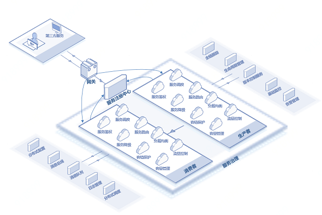

# 基础架构
京东云分布式服务框架每个地域采用跨可用区部署。每个用户的每个服务都是独立部署在用户的VPC中，与其他用户的数据完全隔离。服务部署后，用户可以通过RESTful API对所有功能进行调用。除了目前已支持的注册中心、配置中心、调用链分析，京东云分布式框架将在未来打通消息队列、API Gateway 等服务，满足用户多样化的需求。

## 业务架构

## 产品功能名词

| 概念 | 解释 |
| :- | :- |
|  服务注册  |  提供“注册中心”及“服务管理”功能模块入口。 |
|  注册中心 | 提供创建京东云分布式服务框架中服务注册中心的创建、已创建服务注册中心查看、管理等功能。 |
|  服务管理  | 提供运行服务实例信息查看功能，服务注册数据，源数据等信息查看功能。  |
|  地域（region）  | 不同的地域即不同的地理区域。目前京东云有四个地域，分别为华北-北京、华南-广州、华东-宿迁、华东-上海。 |
|  集群网络  | 自定义的虚拟网络空间，实现资源间的逻辑隔离。 |
|  调用链分析服务   |  调用链分析服务能够跟踪分布式服务每一次请求的调用路径，帮助用户了解、分析请求处理各个阶段的耗时情况和状态，从而全面掌握服务调用关系、精准发现系统的瓶颈和隐患的服务。 |
|  服务依赖图谱  | 根据调用链数据分析出服务间的调用角色和流程，帮助用户了解服务间的调用路径、服务的性能和状态统计，为用户进行问题的定位、排查以及优化提供数据支持。 |

## 相关参考

- [产品优势](../Introduction/Benefits.md)
- [产品功能](../Introduction/Features.md)
- [购买流程](../Pricing/Purchase-Process.md)
- [计费方式](../Pricing/Billing-Overview.md)

