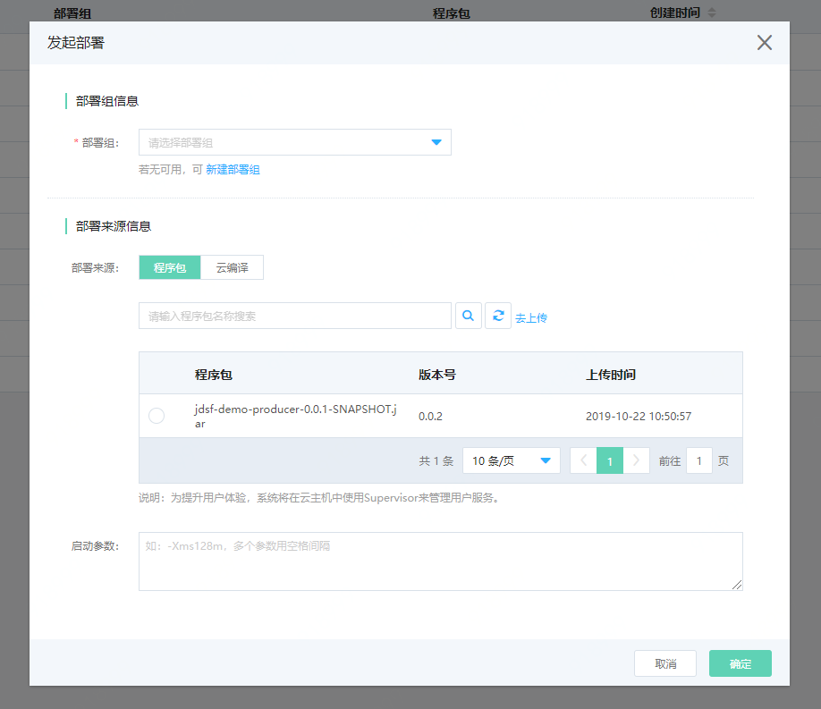
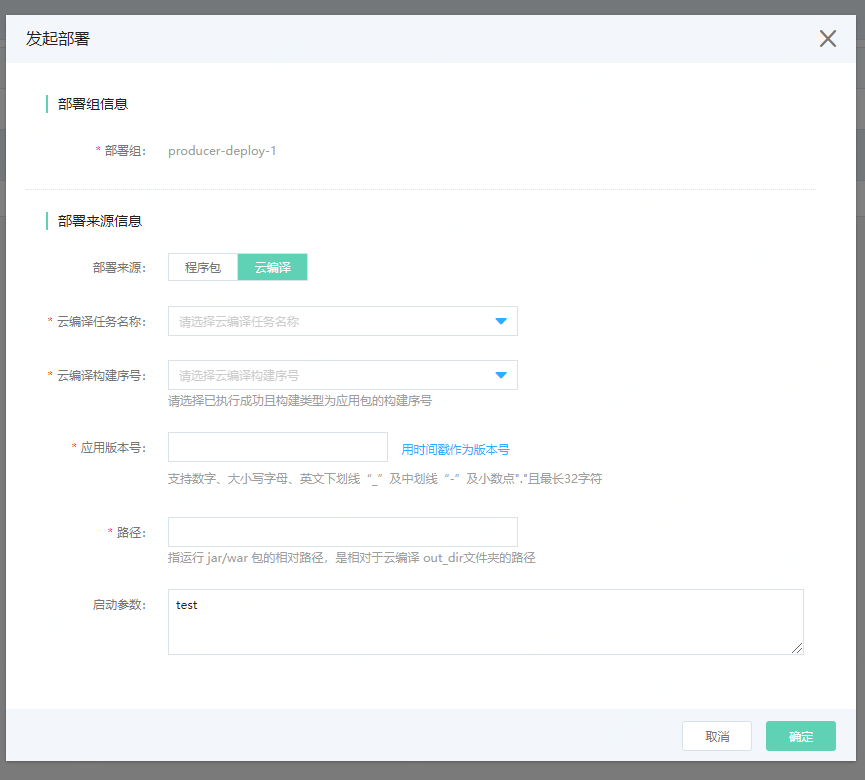

#  应用部署

在微服务平台上，应用可以通过部署组来实现部署，目前已提供支持在云主机执行部署。

## 操作场景

当新建完应用，需要通过部署程序包来实施应用在实例上的注册和发现。

## 操作步骤

1、登录微服务平台控制台。	在左侧导航栏点击应用管理，进入应用列表页，选择要进行部署的应用。

若尚未创建应用，则需先新建。新建过程参考： [应用管理](APPList.md)  

2、点击应用名称，进入部署组列表页，配置好将执行的部署组信息。

若尚未创建部署组，则需先新建。新建过程参考： [部署组](Deploy-Group.md)   

3、配置关于发起部署的相关信息。

目前支持两种部署来源：程序包、云编译。下面将分别介绍。

###  程序包部署

- 为提升用户体验，**系统将在云主机中使用Supervisor来管理用户服务。**

- 选择要部署的程序包。如无则需先上传。

- 配置启动参数。

###  云编译

如果您已经使用云编译进行了构建，可直接通过云编译内容来部署。

注意：

- 请使用已执行成功且构建类型为应用包的构建序号。

- “应用版本号”将注册于注册中心 tag 中的 appVersion 里。您可在注册中心的服务实例详细信息中查看到该参数。

服务实例详细信息位置：注册中心>服务管理>实例详情>实例详细信息 

- 路径，指运行jar/war包的相对路径，是相对于云编译 out_dir文件夹的路径。

4、实施部署。

**说明：**

- 部署完成后，可进行回滚、重新部署等操作。

- 用户还可查看每个实例的部署信息。

- 删除应用时，用户可以选择，是否同时删除程序包。默认勾选同时删除。
