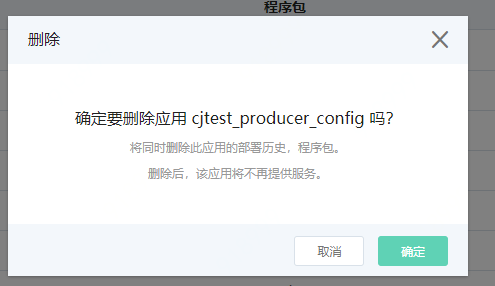

#  应用管理概述
应用，是一组具有特定功能组成的集合。当前平台提供虚拟机应用的部署，用户可通过虚拟机部署方式，部署应用程序包到云主机上。

- 1台云主机上只能部署1个应用；
- 支持WAR包、JAR包部署。

## 操作场景

例如，用户在命名空间（如预发环境、线上环境）中，部署程序包、创建应用、删除应用等。

## 应用的基本操作

应用的操作流程如下：

### 创建应用

1、	登录微服务平台控制台。在左侧导航栏点击应用管理，进入应用列表页。

2、	在列表上方，点击新建应用，进入创建页。

3、	设置基本信息，单击确定，完成创建。

**说明：**

-  Java运行环境目前支持JDK1.7、OpenJDK1.8、OpenJDK11。

### 删除应用

1、登录微服务平台控制台。	在左侧导航栏点击应用管理，进入应用列表页。

2、对于需要删除的应用，点击操作列的删除。

**说明：**

- 如果有部署组，需要先删除部署组，才能删除应用；否则无法删除。

- 删除应用时，将同时删除程序包和部署历史。

- 用户需在删除数据前，自行做好数据备份工作。

### 应用部署

该内容，请参考 ：

 -  [云主机中部署应用](APPDeloy.md)  
 -  [K8S中部署应用](K8SAPPDeloy.md)   

**说明：**

1. 在资源池中重新导入云主机，可以把安全组的50001端口打开。

2. 重做新操作系统，不会改动安全组。部署成功就可以正常停止/启动应用。

3.如果用户手动改动安全组或者云主机里面的防火墙设置，可能会影响停止/启动应用的功能。

### 实例部署信息

1、 用户可查看当前应用，通过哪些部署组，被部署至哪些实例上；并可对每个实例上的应用，进行启动应用、停止应用等操作。

2、 当需要从部署组中移除实例时，可至部署组详情页中选择并删除。删除实时生效。 

### 程序包管理

1、程序包管理中上传的是当前应用在部署中所使用的程序包。

2、在删除应用的同时，将删除应用下的所有程序包；删除前用户需自行备份。

3、目前，程序包支持JAR, WAR两种类型，最大支持256兆。

### 部署历史

该节内容，可查看部署组章节。在删除部署组的同时，用户可选择是否同步删除部署历史；删除前用户需自行备份。

### 部署组

云主机方式部署应用时，需要通过部署组来实施部署，相关内容请参考： [部署组](Deploy-Group.md)  章节。

