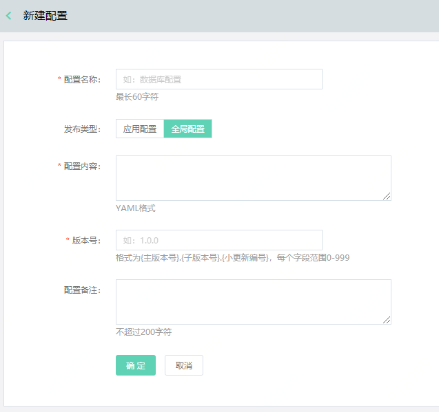
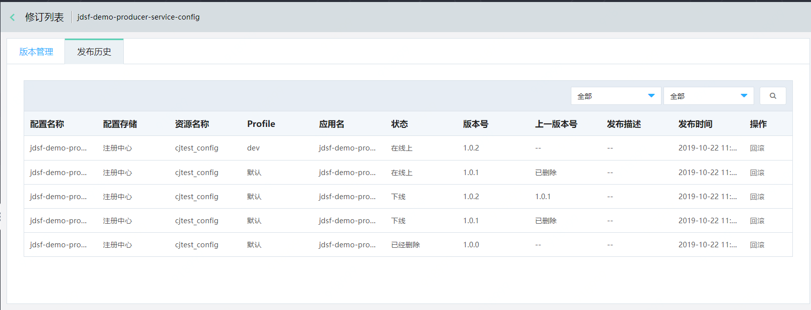
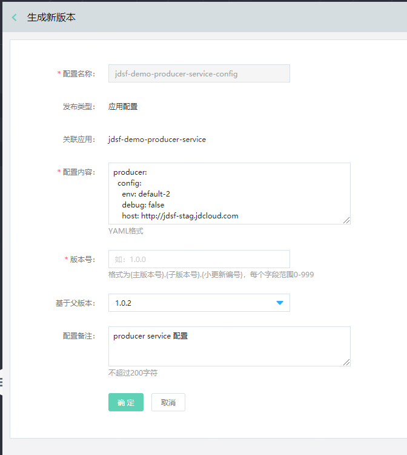

# 配置管理
配置管理，提供给用户对应用进行配置的服务。

每个配置中，可以存在多个版本，并且每个版本可发布在同一应用所在的不同部署组中。配置的类型包含：

| 类型	| 说明	| 
| :- | :- | 
|  应用配置	|  对具体的某一个应用生效。 在优先级上，应用配置优先于全局配置。	|  
|  全局配置	|  对命名空间生效。 	|  
 

## 操作步骤

### 配置管理列表

 
 

### 创建配置

#### 创建应用配置

第1步：先选择可用区region，再点击新建配置。
 
第2步：填写信息。

1、注意同一服务上，不能创建同名配置。

2、类型选择 创建应用配置。

  
  
第3步：发布配置  

选择要发布的配置，并点击发布。

  
部分字段内容说明：

| 字段	| 说明	| 
| :- | :- | 
|  Profile	|   若无特殊要求，可选择默认值；若有，则可自定义内容。  	|  
|  配置存储	|  。。。。。	|
|  资源名称	|   。 	|  

####  创建全局配置

第1步：先选择可用区region，再点击新建配置。
 
第2步：填写信息。

1、注意同一服务上，不能创建同名配置。

2、类型选择 创建全局配置。

  
  
第3步：发布配置  

选择要发布的配置，并点击发布。

  
  
### 查看配置项的版本信息

点击配置项的名称。进入版本列表页，可查看该配置发布的所有版本。

   
   
点击版本号名称可查看版本详情。

### 查看配置的发布历史
选择配置管理列表中某条配置，可查看该条配置的发布历史记录。

### 生成新版本
第1步： 进入配置管理列表，点击配置项的名称，进入该配置的版本管理页。

 

第2步：点击操作中的生成新版本，进入版本编辑页。保存后生成新版本。

- 这里默认的父版本号为您上一步中选择的版本的版本号。

- 默认展示父版本内容。

- 新版本号需要大于所有老版本号。

  

第3步： 发布新版本。

- 发布后，新版本会替代原有版本作为线上版本。

- 在版本修订列表中，需至少保留1条版本记录。如您需要删除所有记录，请在上一级“配置管理”中删除整条配置记录。

