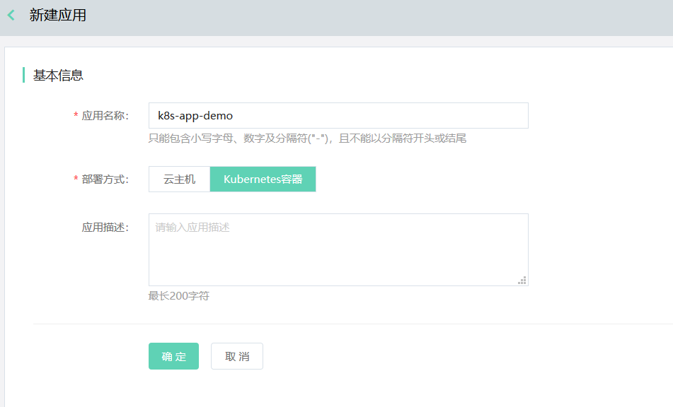
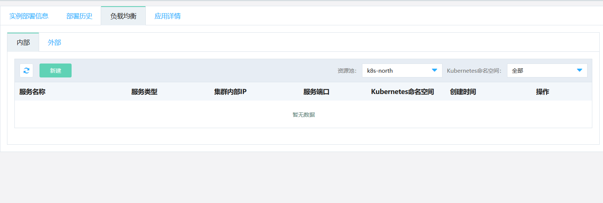
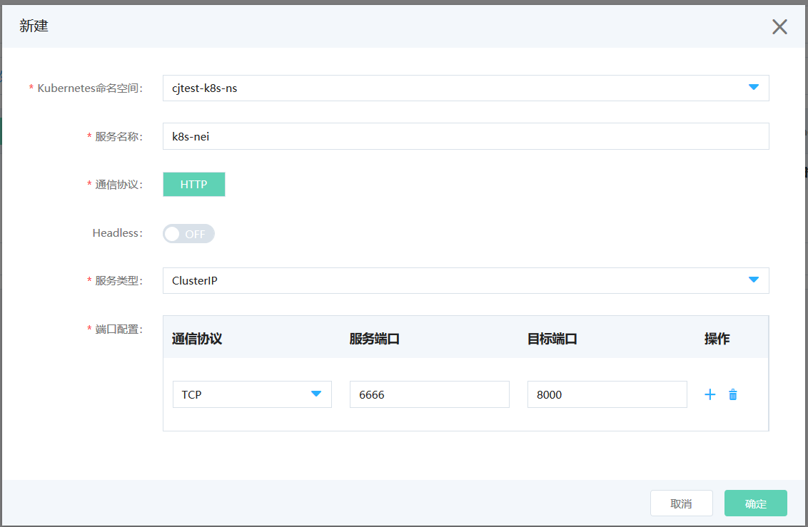
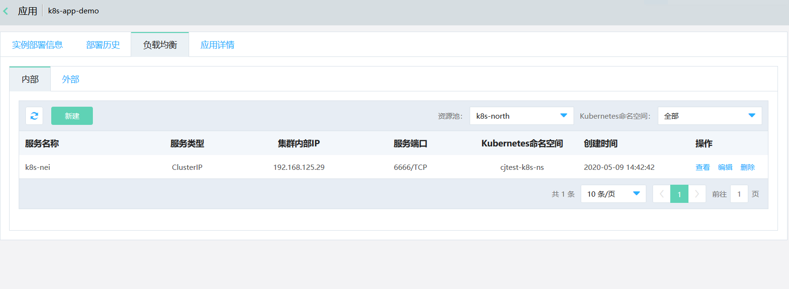
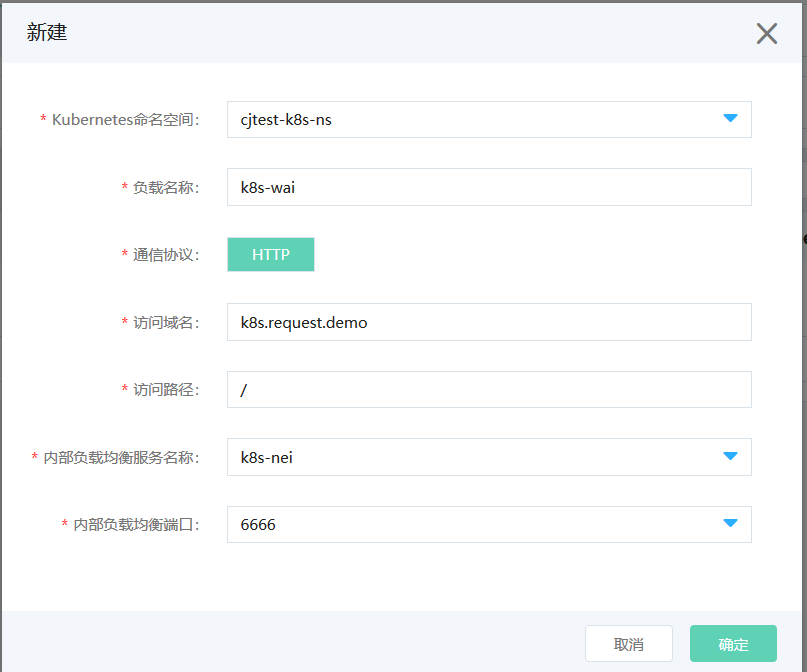
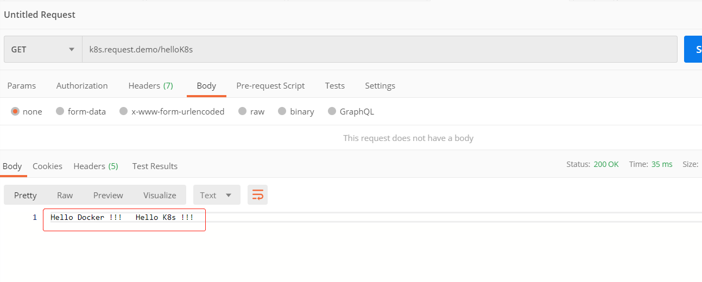

#  负载均衡

在微服务平台上，对于Kubernetes应用，用户可以给它配置负载均衡，来实现应用从内网或者公网能够被访问到所有实例上。

## 操作场景

同 Kubernetes集群内的应用能够被访问，可使用“内部”负载均衡进行配置。如果通过公网访问，可使用“外部”负载均衡进行配置。

## 环境准备

已经开通了云上Kubernetes产品，并通过微服务平台创建了Kubernetes应用。

## 操作步骤

### 配置内部负载均衡

创建完成后，进入应用详情，可在“负载均衡”tab签中，对该应用进行负载均衡配置.比如：

首先配置内部负载均衡。点击新建，配置端口信息.比如：

新建完成后，可在列表中看见新增的信息。比如：

### 配置外部负载均衡

如需配置外部负载均衡，则需先配置一条内部负载均衡信息。然后进入“外部”tab页，点击新建，进行信息配置。比如：

创建成功后，将在列表中看见新增的信息。比如：

接下来，做域名解析，并绑定host。比如：

最后进行测试，确认是否配置成功。比如：

说明：

- 负载均衡支持创建多条。但每条不能重名。

