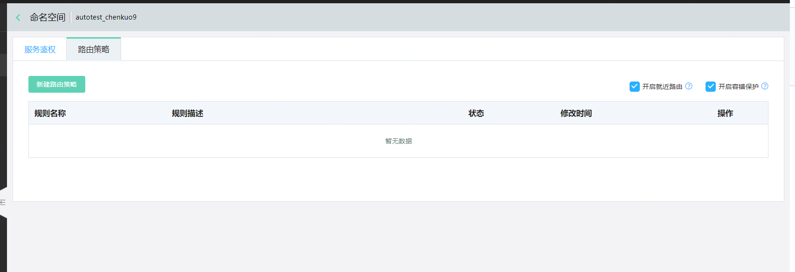

# 服务路由

使用微服务平台用户，在应用的业务版本迭代过程中，可通过服务路由功能，按照所需在不同的实例上定制化分配流量。其中，就近路由和容错保护，对整个命名空间生效。

## 路由原理简介

要实现服务路由需要完成三部分操作：

-  在服务启动的时候为服务设置一些元数据，保障这些元数据在选取服务的时候能够获取到这些元数据，目前这些元数据使用微服务平台部署的时候回自动的注入。

-  控制台上面给服务的客户端（消费者）设置路由规则

-  当服务启动后客户端获取到路由规则的时候会根据流量来源方规则进行匹配判断当前规则是否对自己生效

以常见的在线商店下单为例，现在有 order->goods->user调用模式，当用户下单的时候，会先去获取商品的信息，商品会去调用用户服务获取当前用户是否可以购买当前商品，可以购买当前商品的数量限制。最后确认用户是否可以购买当前商品。

-  order: Spring Cloud 应用，使用路由 sdk

-  goods: Spring Cloud 应用 ，使用路由 sdk ，有 v1 和 v2-beta两个版本

-  user: Spring Cloud 应用，有 v1 和 v2-beta两个版本

服务调用和路由情况如下图所示。用户需要在控制台创建如下路由规则：

-  order 服务详情页中配置路由规则：90%的流量分配到 goods v1 版本，10%的流量分配到goods v2-beta 版本。

-  goods 服务详情页中配置路由规则：如果当前服务的版本为 v1时，当请求 user 服务的时候100%分配到 user v1 版本，如果当前服务的版本为 v2-beta 时，当请求user服务的时候 100% 请求到user 的 v2-beta 版本。

## 环境准备

如需使用本功能，必须引用JDSF提供的插件。目前我们已提供springcloud插件，dubbo插件即将提供。

配置环境依赖项引用插件，请参考： [微服务平台 spring cloud 插件说明](../../Getting-Started/JDSF-Plugin.md)

## 操作步骤
### 新建路由规则
1、登录微服务平台控制台。	在左侧导航栏点击应用管理，进入服务治理列表。在列表中的应用，即用户可进行服务治理的应用。

2、点击操作中的路由策略，对应用进行路由策略配置。

3、点击新建路由策略。每条策略最多支持15条规则。

| 概念 | 说明 |
| :- | :- |
| 流量来源方信息 | 流量的请求发起方信息表达式。 |
| 流量目的方信息 | 流量的接收方信息表达式。注意需要确保权重加总为100。 |
| 策略优先级 | 数值越大，策略越优先。 |

若请求样本过少可能会产生偏差，如需达到预期配置请求比例效果，需配置至少1000条以上才可达到。

4、默认开启就近路由和容错保护。用户可自行关闭。

### 启用路由规则

在路由策略列表页的路由策略状态列中，可直接操作开启或关闭路由策略。

1、配置后默认10s后生效，如需修改生效时间可在SDK中进行配置。

2、开启容错保护后，会实现兜底策略，若配置规则无匹配实例，将返回默认可用实例。

例如假设服务设置了如下路由规则， 并且v1.0 版本的实例全部不可用：

-  20%的流量分配到 v1.0 版本。

-  30%的流量分配到 v2.0 版本。

-  50%的流量请求分配到 v3.0 版本。

请求结果：

- 流量会直接请求到v2.0和v3.0版本，最终结果将大约按照40%和60%的比例分别请求到v2.0和v3.0版本。

- 如果配置的流量来源方规则是匹配的，但流量目的方规则无匹配值，则会随机选择目的服务可用实例，并走默认轮询策略返回。

### 编辑路由规则

1、登录微服务平台控制台。	在左侧导航栏点击应用管理，进入服务治理列表。

2、点击操作中的编辑，即可对已存在路由规则进行编辑操作。

### 删除路由规则

1、登录微服务平台控制台。	在左侧导航栏点击应用管理，进入服务治理列表。

2、点击操作中的删除。删除后默认10s后生效，如需修改可在SDK中进行配置。

