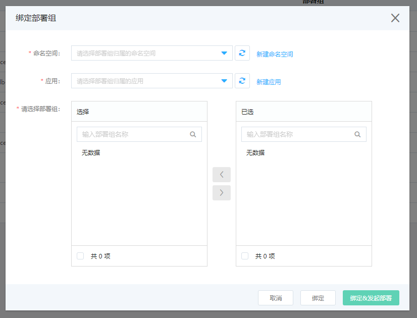

#  日志配置服务

日志服务，为用户提供了对于应用的日志采集、存储、搜索等功能。微服务平台通过ES管理日志；用户可通过部署组，来给应用配置日志的采集规则等信息。

用户在JDSF平台上使用日志配置服务的流程如下。

## 操作场景

应用部署成功后，用户可使用日志记录应用运行中的数据信息，定位业务问题。

## 环境准备

需要先开通ES服务。

## 操作步骤

###  给应用配置日志

### 第1步：创建ES

创建可参考：[创建ES](../../../JCS-for-Elasticsearch/Introduction/Product-Overview.md)  

**注意：ES需要使用6.5.4版本，且与用户应用在同一VPC内。** 

### 第2步：创建日志配置

1、登录微服务平台控制台。在左侧导航栏点击日志管理，进入应用列表页。

2、 在列表上方，点击新建应用，进入创建页。

以下为主要字段说明：

| 字段	|  说明  |
| :- | :- | 
|  地域	|  所属地域。注意日志需要与应用同属一个VPC内。 |
|   名称 |  日志配置的名称。该名称将用于与部署组的关联操作。    	|  
|   ES |   平台将使用ES存储应用运行中产生的日志。**注意：ES需要与用户应用在同一个VPC内**  。    	| 
|   日志类型 |   目前支持两种类型：自定义 Logback  、自定义 Log4j  。 	| 
|   日志格式 |   日志配置格式需要和应用中的日志配置一致  。 	| 
|   日志路径 |   这里需要填写日志的绝对路径地址。   	| 

3、 设置基本信息，单击确定，完成创建。

### 第3步：绑定部署组

每条日志配置，均可被绑定于多个部署组。绑定操作仅是绑定日志配置和部署组的关系，绑定完成后，还需执行部署，该日志配置才能生效。

目前可从两个入口完成日志与部署组的绑定。

1、在日志列表页，点击操作中的“绑定”。

2、在部署组的新建/编辑页中。

### 第4步：发起部署，使日志配置生效。

发起部署的过程将重新部署应用，请注意操作。目前可从两个入口可执行部署。

1、在日志列表页，点击操作中的“发起部署”。

2、在应用的部署组中，直接发起部署。

### 第5步：查看日志。

1、定义索引模式，选择Index Patterns，索引名称是“日志配置名称”。

2、为上一步骤中的样本数据集Shakespeare定义索引“shakes*”，然后点击“Create”；

3、如果需要了解如何使用Kibana，请参考： [使用Kibana](../../../JCS-for-Elasticsearch/Best-Practices/using_kibana.md)  

