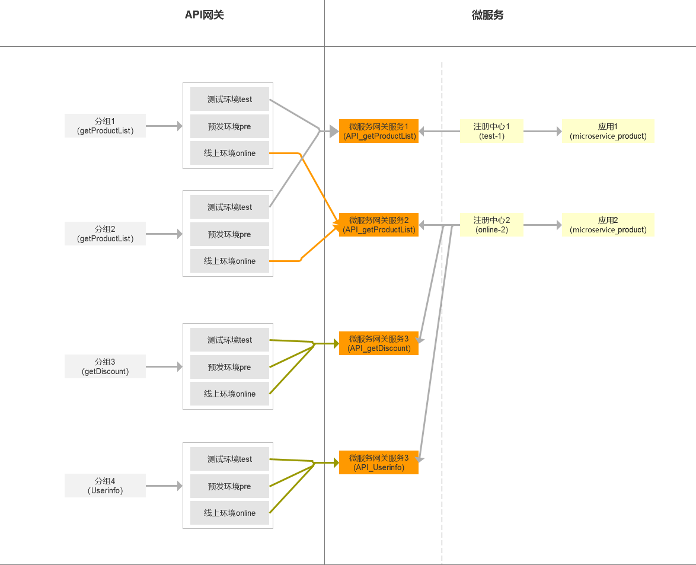

# 概述

京东云微服务网关，提供了外部请求与各个微服务之间的调用服务，以及内部应用之间的转发服务，从而保证了整个调用过程中微服务体系本身的安全性、严谨性。当发生请求调用时，请求只需跟微服务网关进行交互，由微服务网关进行各个微服务的调用。微服务网关是微服务应用集中的入口，帮助用户避免直接暴露服务，是实现前后分离的介于客户端和服务端之间的中间层。
使用京东云微服务网关具有如下好处：

- 微服务网关封装了微服务应用程序的内部结构，为客户端提供了统一调用的入口。当发生请求调用时，请求会经由微服务网关再转发到各个微服务上。

- 京东云微服务网关已经与京东云API网关实现打通，您可直接通过API网关将您的微服务应用发布到公网调用，避免了服务提供方直接暴露服务。

- 基于API网关可提供API的流控策略、访问授权等功能，帮助业务开发者更加专注自身业务开发。 

- 简化了客户端的开发工作量。客户端只须跟网关交互，而无须直接调用复杂的微服务的接口。例如发生迭代重构时需要将微服务进行分拆或合并，若通过微服务网关可避免让客户端与微服务直接通信，将有效简化实施。

## 应用场景

京东云微服务网关，帮助用户不必暴露服务，即可实现微服务应用的外部调用。目前已提供以下两种调用方式：

- 通过API网关，将微服务应用发布到公网并提供调用。

可以将微服务网关服务，做为API网关API分组的后端服务；当API分组在部署环境中发布成功后，用户即可通过API网关调用微服务网关，进而调用VPC内应用服务。

- VPC代理模式。

可将微服务网关看作为VPC代理，通过ip+端口的方式访问VPC内服务。具体调用方式，请参考用例：使用API网关开放VPC内的接口

 
 
## 概念之间关系

API网关的API分组、微服务网关服务、注册中心、应用之间的关系如下：

 
API分组，API 提供方管理 API 的单元，一个API分组包含多个API； API的发布、调用、授权、流控，均以API分组为单元。更多详情可参考：API网关说明  。
API分组的部署环境，API的运行环境，目前京东云API网关提供测试、预发、线上三组环境。API分组需要部署到环境（测试、预发、线上）中，才可以提供调用。更多详情可参考：API网关说明  。
微服务网关服务，微服务网关提供服务的基础单元；微服务应用在提供对外服务过程中，需要通过一个具体的微服务网关服务实例来进行通信。
当用户需要将某个API分组发布到不同部署环境中时，可以选择多个微服务网关服务做为其业务后端服务；1个微服务网关服务，也可以同时做为多个API分组在不同环境下的后端服务；1个微服务网关服务，只能绑定1个注册中心。

## 计费规则
	微服务网关采用后付费模式，根据QPS规格计费，公测期间QPS在3000以下可免费使用。
  
- 说明：
当客户端通过API网关调用时，API网关将按照API调用次数收取费用。详细收费规则可参考API网关产品计费内容。

