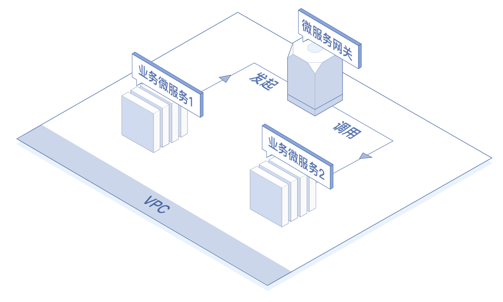
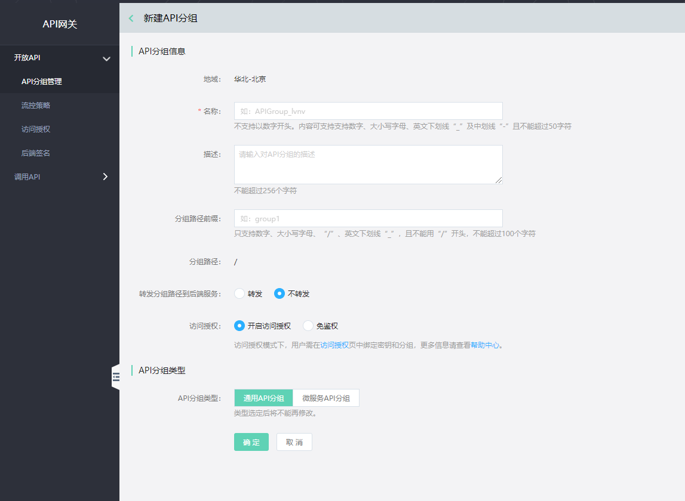
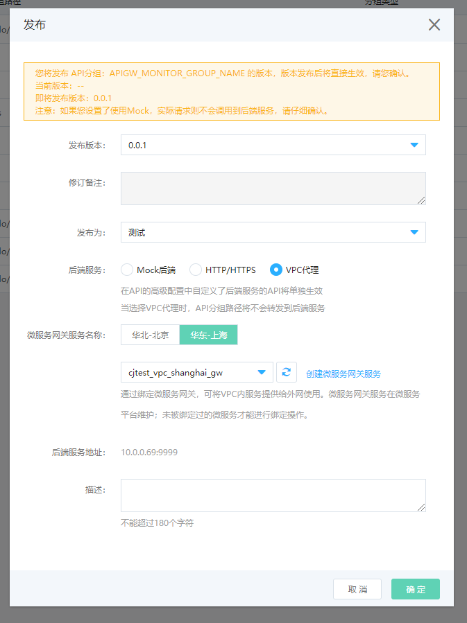
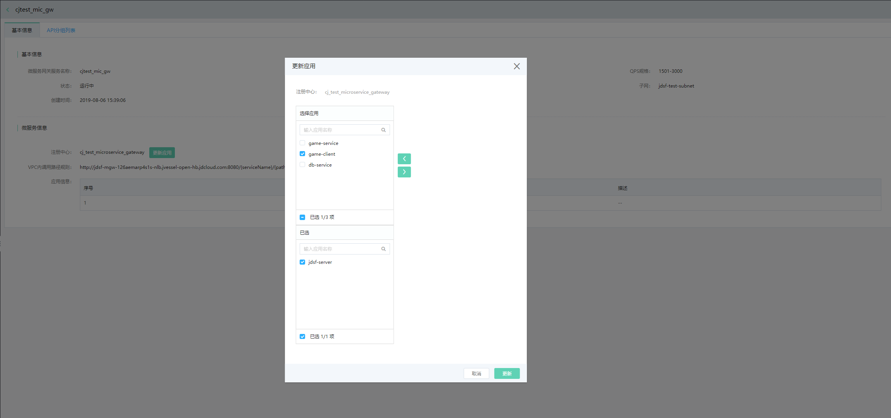
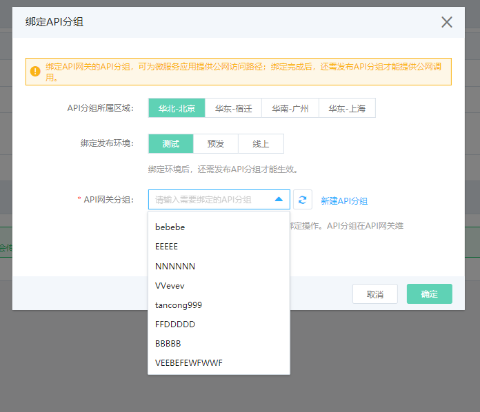
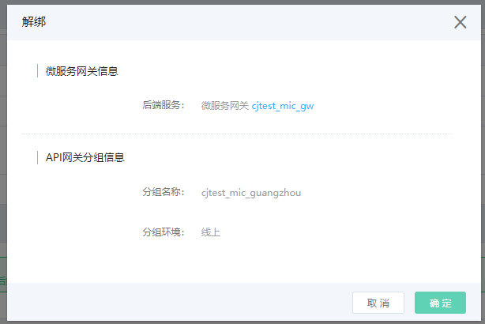

# 微服务网关

京东云微服务网关用于服务的对外开放。使用京东云微服务网关，既可以将服务开放给内网的其他服务，也可以配合API网关开放给公网访问。如果使用了微服务平台的注册中心服务，微服务网关可以在调用时自动完成服务发现、负载均衡，无需再使用其他负载均衡或网关服务。如果服务已经通过其他方式在内网发布到了负载均衡服务上，也可以通过微服务网关实现与API网关的无缝对接，避免公网暴露，不再需要申请公网IP和产生公网流量费用。

京东云微服务网关具有如下优势：

- 微服务网关封装了微服务应用程序的内部结构，为客户端提供了统一调用的入口。当发生请求调用时，请求会经由微服务网关再转发到授权发布的微服务实例上。

- 京东云微服务网关与京东云API网关无缝整合，您可直接通过API网关将您的微服务应用发布到公网调用，避免了服务提供方直接暴露服务，不再需要申请公网IP和产生公网流量费用。

- 基于API网关可提供API的流控策略、访问授权等功能，帮助业务开发者更加专注自身业务开发。 

- 简化了客户端的开发工作量。客户端只须跟网关交互，而无须关注服务的位置和服务实例伸缩等内部细节。


## 应用场景

京东云微服务网关，帮助用户不必暴露服务，即可实现微服务应用的外部调用。目前已提供以下两种调用方式：


- 微服务网关模式：

可以将微服务网关服务，做为API网关API分组的后端服务；当API分组在部署环境中发布成功后，用户即可通过API网关调用微服务网关，进而调用VPC内微服务应用实例。微服务网关完成服务发现、负载均衡（随机模式）。


- VPC代理模式：

可将微服务网关看作为VPC代理，将部署在vpc内的任何服务通过ip+端口的方式直接通过API网关暴露给公网，无需公网IP和公网直接暴露。具体调用方式，请参考用例：使用API网关开放VPC内的接口


 
 
## 概念之间关系

API网关的API分组、微服务网关服务、注册中心、应用之间的关系如下：


|名词|说明|
|---|---|
| API分组  |  API 提供方管理 API 的单元，一个API分组包含多个API； API的发布、调用、授权、流控，均以API分组为单元。更多详情可参考： [API网关分组说明](../../../API-Gateway/Operation-Guide/Create-APIGroup/Create-APIGroup.md)   。 |
| API分组的部署环境 | API的运行环境，目前京东云API网关提供测试、预发、线上三组环境。API分组需要部署到环境（测试、预发、线上）中，才可以提供调用。更多详情可参考：[API网关发布环境说明](../../../API-Gateway/Operation-Guide/Create-APIGroup/Create-Publish.md)     。 |
| 微服务网关服务  |  微服务网关提供服务的基础单元；微服务应用在提供对外服务过程中，需要通过一个具体的微服务网关服务实例来进行通信。 |

说明：

- 当用户需要将某个API分组发布到不同部署环境中时，可以选择多个微服务网关服务做为其业务后端服务；

- 1个微服务网关服务，也可以同时做为多个API分组在不同环境下的后端服务；

- 1个微服务网关服务，只能绑定1个注册中心。


## 准备工作

假设用户已经在京东云平台上，创建了自己的VPC，开通了微服务平台产品并且创建了注册中心，同时微服务应用也已部署到了该注册中心里。


## 操作步骤


###   创建服务
使用京东云微服务网关，既可以将服务开放给内网的其他服务，也可以配合API网关开放给公网访问。如果使用了微服务平台的注册中心服务，微服务网关可以在调用时自动完成服务发现、负载均衡，无需再使用其他负载均衡或网关服务。如果服务已经通过其他方式在内网发布到了负载均衡服务上，也可以通过微服务网关实现与API网关的无缝对接，避免公网暴露，不再需要申请公网IP和产生公网流量费用。

目前，微服务网关服务支持两种调用方式：通过API网关提供外部调用、通过VPC代理模式提供应用间的调用。本文将介绍如何基于   [京东云API网关](../../../API-Gateway/Introduction/Product-Overview.md)  和 京东云微服务平台的微服务网关， 搭建应用的微服务网关。


1、	登录微服务平台控制台。在左侧导航栏点击微服务网关，进入服务列表页。

2、	在服务列表上方，点击创建微服务网关服务，进入创建页。

3、	设置服务信息，单击立即购买按钮，完成创建。创建完成后，系统将创建一个微服务网关服务实例。如需提供外网访问，推荐通过API网关提供服务。


| 信息项 |说明 |
|---|---|
| 地域和可用区 | 推荐使用系统分配方式，可最大程度保障系统高可用。创建时请注意，不同地域资源内网不互通且创建后不可更改。  |
| 微服务网关服务名称 |  该服务的名称，将做为API网关和微服务网关的桥梁，且创建后不可修改。   |
| 创建方式-微服务网关通用方式 | 用于进行各个微服务的调用，为微服务网关通用方式。若选择此种方式搭配API网关使用，需要在API网关创建API分组过程中选择API分组类型时，选择“微服务API分组”。    |
| 创建方式-VPC代理 | 可以在服务不开通外网访IP和端口的情况下通过 API 网关在外网进行调用，可以进一步的保障用户对外开放服务的安全性。若选择此种方式搭配API网关使用时，需要在API网关创建API分组过程中选择API分组类型时，选择”通用API分组”。 |
| 注册中心&应用列表  | 1个微服务网关服务只能归属于1个注册中心，同时还需选择指明该注册中心下的哪些应用可以被该微服务网关服务所调用，未被勾选的应用将不能被网关服务发现。应用可在微服务网关服务创建成功后再按需增加或删除。
|  QPS规格  | 目前产品按照规格提供计费依据 。 |


####  结合API网关的操作流程

接下来将介绍结合API网关的操作流程，分为两个部分：通过API网关发布微服务网关服务的通用步骤、通过API网关发布VPC代理服务的步骤。

在介绍前，默认用户已经做好如下准备工作：

-  用户已经开通API网关产品、微服务平台产品。

-  用户已经在微服务平台上创建完注册中心、部署完应用。

-  用户已知API网关产品的常用信息和流程。


#####    通过API网关发布微服务网关服务的通用步骤

######  STEP 1：创建微服务网关服务。其中创建方式选择“微服务网关”。

-  选择该方式时，需要指定网关所属的注册中心。

-  注册中心下有哪些应用会通过微服务网关提供服务，也需要进行指定选择。在创建服务时可先不填；在创建服务成功后，可随时按照需要进行应用更新。


######  STEP2:创建API分组。其中API分组类型选择“微服务API分组”。

-  第1步和第2步之间创建时无强制要求先后关系。用户可先创建API分组，也可先创建微服务网关服务。

-  微服务API分组类型，在API网关转发请求到微服务网关过程中，暂不支持转发分组路径前缀内容到微服务网关。

-  为方便演示，访问授权方式 选择“免鉴权”模式 。


创建完成的API分组信息如下：


 
 


######  STEP3：互相绑定。

-  有两处入口提供绑定：

       -  1、在API网关产品里进行绑定。可在API分组列表页中分组信息中点击“绑定“操作。

       -  2、在微服务网关产品里进行绑定。

-  绑定操作信息如下：


注意：

	-  API分组的每个发布环境里只能绑定唯一一个后端服务。
	    
	   比如，当在该分组的“预发“环境里尚未绑定过任何微服务时，“预发”环境下的该分组才可以被绑定到新的微服务网关服务上；
	
	-  如果API分组已经被绑定过其它微服务网关服务，将不能再进行绑定。
	
	-  这里的API分组信息，为过滤后的可绑定的API分组列表信息。该环境中已绑定过的API分组，将不会出现在列表中。


-  绑定完成后信息中，将展示所绑定的API分组信息、API分组的环境信息等内容。并提供API分组的发布、下线、解绑等操作入口。

 


######   STEP4：发布API分组。

发布完成后，用户即可通过API网关进行公网调用。发布API分组有两个入口：

1、可在微服务网关服务的API分组列表页中，直接点击发布。这里发布时，API分组相关的环境信息、版本信息不提供修改。


2、可在API网关产品中，点击发布。

-  这里发布时，可选择将该API分组发布到不同的环境里（测试、预发、线上）。

-  每一个环境可以使用相同或者不同的微服务网关服务，做为后端服务。


######   STEP5：调用。
调用方式分为两种：VPC内调用、 通过API网关的调用方式，分别介绍如下：

######   VPC内调用方式

1、打开微服务网关服务的API分组基本信息tab签页，可见VPC内调用路径规则。例如：


2、根据规则拼写路径，通过调用语句，调用服务。例如：


```
curl -X GET http://jdsf-mgw-126aemarp4s1s-nlb.jvessel-open-hb.jdcloud.com:8080/jdsf-server/server/get
```    

路径说明：

| 内容	| 说明	|  
| :- | :- | 
|  http://jdsf-mgw-126aemarp4s1s-nlb.jvessel-open-hb.jdcloud.com:8080/  	|   为微服务平台生成的调用路径	|
| jdsf-server  | 即{serviceName}内容，为您的注册中心中已经存在且能被正常访问的应用  | 
| server/get   | 即{path}内容，为应用的路径  | 


######   公网调用方式

1、首先保证API分组已经被发布到环境中。那么即可从API分组的部署环境中得到外网调用路径。

查询外网调用路径有两个入口：


-  在微服务网关中，查看微服务网关服务的API分组列表tab标签，点击分组环境查看调用地址.如下图


-  在API网关中，到分组详情的发布环境tab签中查看调用地址


2、调用服务。

1）您可以直接浏览器录入调用地址。例如：

```
    http://w27vqwu8gkzy-preview.cn-north-1.jdcloud-api.net/jdsf-server/server/get
```    


2）通过调用语句。例如：


```
curl -X GET http://w27vqwu8gkzy-preview.cn-north-1.jdcloud-api.net/jdsf-server/server/get
```    

路径说明：

| 内容	| 说明	|  
| :- | :- | 
|  http://w27vqwu8gkzy-preview.cn-north-1.jdcloud-api.net/ 	|   为API网关生成的调用地址，可进行公网调用。	|
| jdsf-server  | 即{serviceName}内容，为您的注册中心中已经存在且能被正常访问的应用  | 
| server/get   | 即{path}内容，为应用的路径  | 


#####    通过API网关发布VPC代理服务步骤

######   STEP 1：创建微服务网关服务。其中创建方式选择“VPC代理”

-  注意IP转发地址为：内网IP+端口方式，注意端口是必填项。

-  需要指定VPC的网络信息。在调用时需要注意同一VPC内才可相互调用。

-  目前暂不支持代理后端是私有证书的 https  web 服务

例如：

创建如下内容：


 
创建完成后：
 


 
 

######   STEP2:创建API分组。API分组类型选择“通用API分组”。

-  VPC代理方式，是API网关提供的通用方式之一，因此这里做为标准功能放在了通用API分组的功能中。

   注意：目前，如果不选择“通用API分组”进行发布，将无法使用VPC代理方式。

-  因此，通用API分组在部署发布过程中，将可选择VPC代理方式做为其后端服务。也可选择其它方式（http/https、mock等）做为其后端服务。

- 为方便演示，本次分组信息设置为 不转发分组路径到后端，免鉴权访问模式。

例如：创建分组名称vpctest的API分组




######   STEP3：发布。有两处入口：

1、在API网关产品里进行发布。



2、在微服务网关产品里进行发布。


	


######   STEP4：调用。
调用方式分为两种：VPC内调用、 通过API网关的调用方式，分别介绍如下：

######  VPC内调用方式

1、打开微服务网关服务的API分组基本信息tab签页，可见VPC内调用路径规则。

2、根据规则拼写路径，通过调用语句，调用服务。例如：

```
curl -X GET http://jdsf-mgw-l6mnhdd1zpc-nlb.jvessel-open-sh.jdcloud.com:8080/10.0.0.69:9999/server/get
```    


路径说明：

| 内容	| 说明	|  
| :- | :- | 
|  http://jdsf-mgw-l6mnhdd1zpc-nlb.jvessel-open-sh.jdcloud.com:8080/ 	|   为微服务平台生成的调用路径	|
| 10.0.0.69:9999 | 为内网IP+端口 | 
| jdsf-server  | 即{serviceName}内容，为您的注册中心中已经存在且能被正常访问的应用  | 
| server/get   | 即{path}内容，为应用的路径  | 


######   通过API网关的调用方式

1、首先保证API分组已经被发布到环境中。那么即可从API分组的部署环境中得到外网调用路径。

查询外网调用路径有两个入口：


-  在微服务网关中，查看微服务网关服务的API分组列表tab标签，点击分组环境查看调用地址.如下图


-  在API网关中，到分组详情的发布环境tab签中查看调用地址


2、调用服务。

1）您可以直接浏览器录入调用地址。例如：

```
    http://w2xmjqwbx62p-test.cn-north-1.jdcloud-api.net/server/get
```    


2）通过调用语句。例如：


```
curl -X GET http://w2xmjqwbx62p-test.cn-north-1.jdcloud-api.net/server/get
```    
 
-   以上内容还可参考DEMO范例： [最佳实践](../../Getting-Started/GW_VPC.md)  


###  查看微服务网关服务详情

1、	登录微服务平台控制台

2、	在左侧导航栏点击微服务网关，进入服务列表页

3、	在服务列表中，点击要查看的服务名称，即可进入详情页查看信息。一个微服务网关服务的信息包含两部分：基本信息、API分组列表信息。

 
 


####  在基本信息tab页中，包含两部分信息：

1、	微服务网关服务自身的基本信息。

2、	微服务网关所服务的注册中心的相关信息。

-  这里用户可随时更新注册中心下的应用信息列表。并且只有被选择的应用，才可被微服务网关服务发现。

-  当用户进行应用调用时，需按照VPC内调用路径规则进行访问。

 
 
  

####   在API分组列表tab页中，展示了该微服务网关服务通过API网关方式发布后，所关联选择的API分组的信息汇总。

 
 
1、	一个微服务网关服务可以通过多个API分组提供访问。

2、	API分组可以和微服务网关不在同一区域。

3、	在客户端请求API网关，API网关将用户请求转换到后端微服务过程中注意：

-  客户端请求API网关时，请求路径规则：http(s)://host/分组路径前缀/{发布的微服务名称}/{用户服务里定义的接口路径} 。

-  API网关目前暂不支持把API分组的分组路径前缀信息传给后端微服务网关服务。


4、	绑定API分组操作：绑定微服务网关服务与API分组的过程。绑定时，需要精确到API分组的发布环境。注意：

-  只有API分组类型为“微服务API分组” 的API分组，才会出现在可选绑定的列表中。

-  API分组的每个发布环境里只能绑定唯一一个后端服务，因此绑定环境信息时，只有在该环境下未被绑定过的API分组名才会出现在可绑定列表中。且系统会自动过滤掉不能绑定的API分组信息。

例如：名为abs的API分组，在测试环境中已经选择了微服务网关服务cjtest_mic_gw做为后端服务，那么接下来只能在预发、线上环境里，可以绑定API分组abs。


下图中，因为API分组abs尚未在预发环境中绑定过任何信息，所以可以在预发环境进行绑定。

 

 

下图中，API分组abs将不再出现在测试环境下的可绑定的API分组列表中。因为该API分组的测试环境已经绑定了其它微服务网关服务。
 
 

 
5、	发布操作：API分组发布生效后才能提供微服务应用的访问。

 

 

6、	下线操作：分组在某一环境下线后（如在预发环境下线），该环境将不再提供服务访问。

 

 
 
7、	解绑操作：解除API网关分组与微服务网关服务的关系。

- 在API分组的发布环境中，若为已发布状态，则不能直接解绑，需要先下线分组再进行解绑操作。
 
 

 


###  查看微服务网关服务列表

1、	登录微服务平台控制台

2、	在左侧导航栏点击微服务网关，进入服务列表页
 
 


用户在服务列表页中可进行的操作包含：

1、 创建网关服务：创建1个新的微服务网关服务。

2、 查看详情：查看已创建的微服务网关服务的详细信息。

3、 绑定：如果当前创建的微服务网关服务，希望通过API网关方式对外提供服务，则需要进行绑定API分组来提供客户端调用。

4、 更新应用：更新可访问的应用信息。

-  当创建时选择了通用微服务网关服务，则在创建成功后，用户可根据业务情况更新注册中心下的应用，以供微服务网关进行调用；

-  对于使用VPC代理模式的微服务网关服务，没有此项功能。


5、 调整配置：升级当前规格。

-  为了保证服务稳定性，目前调整配置不允许降低QPS规格。

 


6、 删除：删除微服务网关服务。

-  可删除的前提条件是，该服务未关联绑定任何处于已发布状态的API分组。

-  若API分组在任何部署环境中（测试、预发、线上）处于已发布状态，需要先下线，再进行删除。

 


