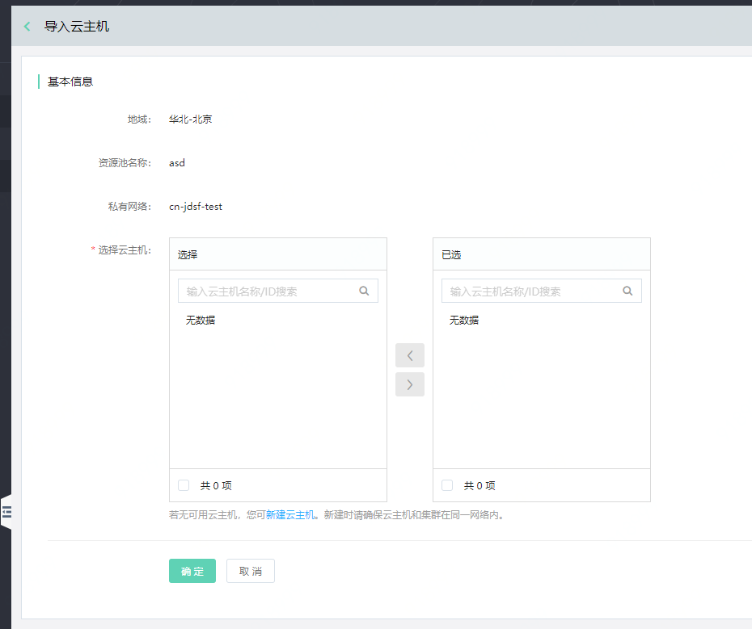

# 资源池管理

资源池，是一组资源集合的概念，通过资源池，可管理命名空间下的云主机、容器等资源。

**说明：**

-   1个资源池只能服务于1个命名空间；而1个命名空间下，可以同时存在多个资源池。
-   用户在资源池中，可进行新建/删除资源池、导入云主机、导出云主机等操作。

## 准备工作

在创建资源池前，默认用户已经购买完云主机等资源。

## 操作步骤

### 创建资源池

1、	登录微服务平台控制台。在左侧导航栏点击资源管理，进入资源池管理列表页。

2、	在列表上方，点击新建资源池，进入创建页。

3、	设置资源池信息，单击确定完成创建。

**注意：**

-   资源池需要与其将所服务的命名空间，属于同一VPC内。
-   用户在资源池中，可进行新建/删除资源池、导入云主机、移除云主机等操作。

### 删除资源池

1、	登录微服务平台控制台。在左侧导航栏点击资源管理，进入资源池列表页。

2、	对于需要删除的资源，点击操作列的删除。

**说明：**

1、在删除前，需要先清理资源池中的所有云主机。

2、用户需在删除数据前，自行做好数据备份工作。

### 导入云主机

1、	登录微服务平台控制台。在左侧导航栏点击资源管理，进入资源池列表页。

2、	对于需要进行操作的资源池，点击操作列的导入云主机操作。

**说明：**

1、当前仅支持绑定同VPC下的、且未被绑定过的云主机，才可导入。

2、一个云主机只能绑定1个资源池。

### 移除云主机
1、登录微服务平台控制台。	在左侧导航栏点击资源管理，进入资源池列表页。

2、点击ID进入云主机列表页，选择需要移除的云主机，进行删除。用户需在删除数据前，自行做好数据备份工作。

