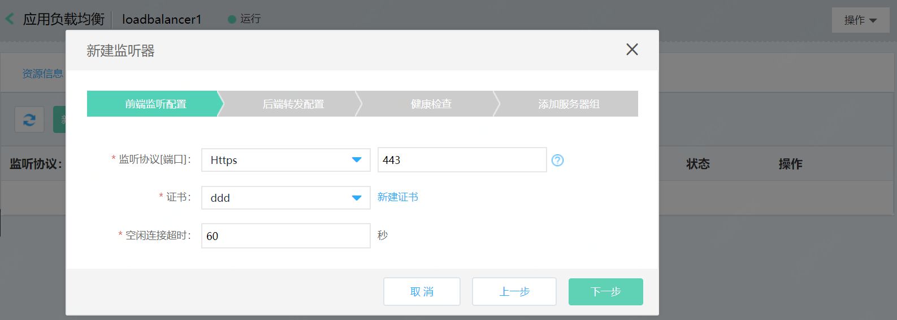
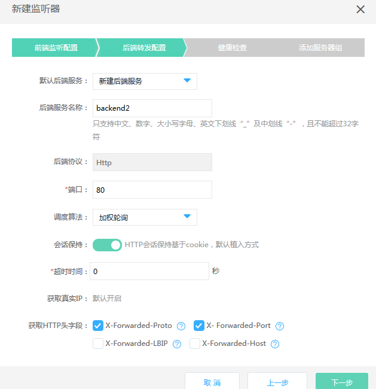
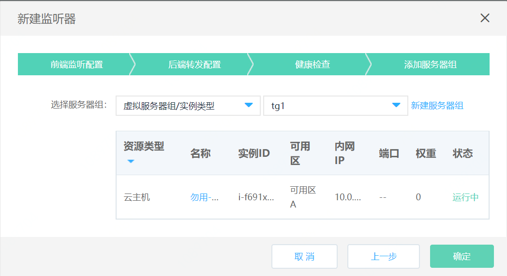
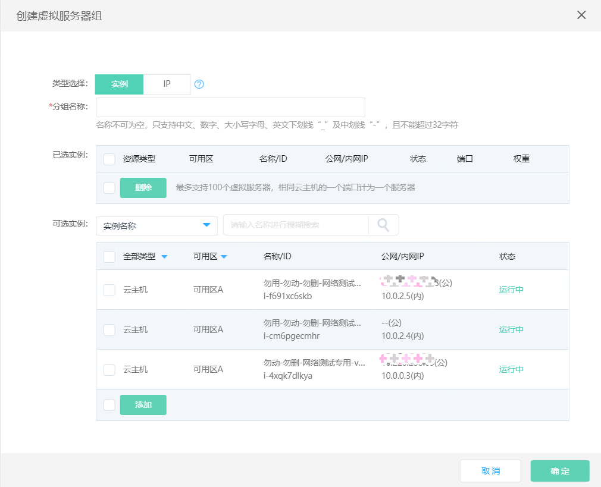

# 利用负载均衡部署HTTPS服务

## 准备与规划

- 网络准备

	根据业务部署需要，提前规划应用负载均衡和作为后端服务器的云主机、容器的地域、可用区、私有网络等。
	
	注意：作为后端服务器的云主机、容器需要与应用负载均衡同一地域、私有网络。

- 服务器准备

	需提前创建承载业务流量的云主机、容器，并确保打开监听所需的端口，合理配置安全组、ACL策略。

- 应用负载均衡实例

	创建一个应用负载均衡实例，并设置地域、可用区、网络、安全组等配置。

## 创建一个HTTPS监听器

- 前端监听配置：
	
	点击 **添加** 创建一个监听器：选择HTTPS协议，配置监听端口、证书、空闲连接超时。

	

- 点击 **新建证书** 跳转到**云安全-SSL数字证书**页面申购/上传一个证书。

	

- 后端转发配置：可以新建或者选择已有的后端服务，注意只能选择后端协议为HTTP类型的后端服务。
	
	这里新建一个后端服务：配置后端服务名称、协议（HTTP）、端口为80、调度算法选择加权轮询、开启会话保持、配置会话保持超时时间、开启获取真实IP，配置获取HTTP头字段。

	

- 配置健康检查：设置健康检查相关参数，这里使用HTTP方式。

	

- 添加服务器组：根据业务需要选择虚拟服务器组、高可用组。

	

- 如没有可用的虚拟服务器组，点击 **新建虚拟服务器组** 创建一个新的虚拟服务器组，可选云主机、容器，定义实例的端口、权重
	
	注：只能选择与应用负载均衡同私有网络下的云主机、容器资源。

	

- 至此，已创建完成基于HTTP协议的监听器，可在监听器列表查看。

	
