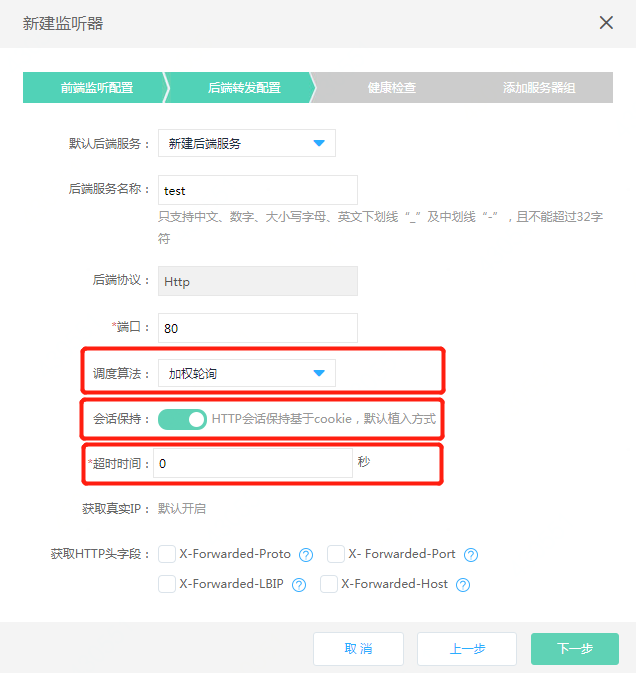
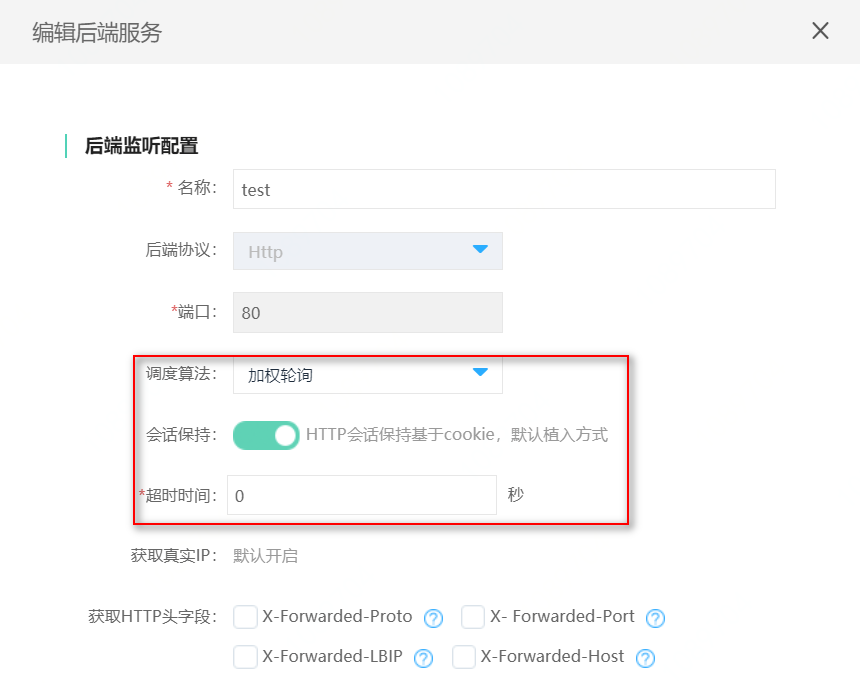

# HTTP监听器提供基于cookie的会话保持服务

## 准备与规划

- 网络准备

	根据业务部署需要，提前规划应用负载均衡和作为后端服务器的云主机、容器的地域、可用区、私有网络等。
	
	注意：作为后端服务器的云主机、容器需要与应用负载均衡同一地域、私有网络。

- 服务器准备

	需提前创建承载业务流量的云主机、容器，并确保打开监听所需的端口，合理配置安全组、ACL策略。

- 应用负载均衡实例

	创建一个应用负载均衡实例，并设置地域、可用区、网络、安全组等配置。

## 创建一个HTTP监听器

- 前端监听配置：

  点击 **添加** 创建一个监听器：选择HTTP协议，配置监听端口、空闲连接超时。

  

- 后端转发配置：可以新建或者选择已有的后端服务，注意可以选择后端协议为HTTP（或者HTTPs）类型的后端服务。

  新建一个后端服务：配置后端服务名称、协议（HTTP）、端口为80、调度算法选择加权轮询、打开关闭会话保持开关、会话保持超时时间设置。

    **请注意：只有HTTP（或者HTTPs）监听支持后端服务为HTTP类型，此场景才支持基于cookie的会话保持；会话保持功能与调度算法、会话保持开关、超时时间三个配置项相关，会话保持功能缺省关闭，目前只有调度算法是加权轮询时，才支持打开基于cookie的会话保持，调度算法为加权源IP和加权最小连接时，不支持会话保持功能；会话保持超时时间配置范围是0到86400s，缺省超时时间为0s，此时会话保持的cookie与浏览器同生命周期，浏览器关闭cookie被删除，浏览器被重新打开时需要重新建立会话。**

  

- 配置健康检查：设置健康检查相关参数，这里使用HTTP方式。

- 添加服务器组：根据业务需要选择虚拟服务器组、高可用组。

  根据业务需要选择虚拟服务器组、高可用组。

  

- 如没有可用的虚拟服务器组，点击 **新建虚拟服务器组** 创建一个新的虚拟服务器组，可选云主机、容器，定义实例的端口、权重。

  注：只能选择与应用负载均衡同私有网络下的云主机、容器资源。

  

- 至此，已创建完成基于HTTP协议的监听器，可在监听器列表查看。

  

# 修改配置支持会话保持的HTTP监听器策略

## 修改后端服务支持会话保持

- 进入应用负载均衡实例的后端服务

	从应用负载均衡实例->具体实例名称->后端服务->编辑
  
     

- 修改后端服务配置

	在后端服务找到特定后端服务名称，从 **操作** 点击  **编辑**  进行会话保持功能开启使能。只有后端服务为HTTP类型时才支持基于cookie的会话保持。会话保持功能与调度算法、会话保持开关、超时时间三个配置项相关：目前只有调度算法是加权轮询时，才支持基于cookie的会话保持，调度算法为源IP和加权最小连接时，不支持会话保持功能。会话保持超时时间配置范围是0到86400s，缺省超时时间为0s，此时会话保持的cookie与浏览器同生命周期，浏览器关闭时cookie被删除，浏览器被重新打开时需要重新建立会话。

   

