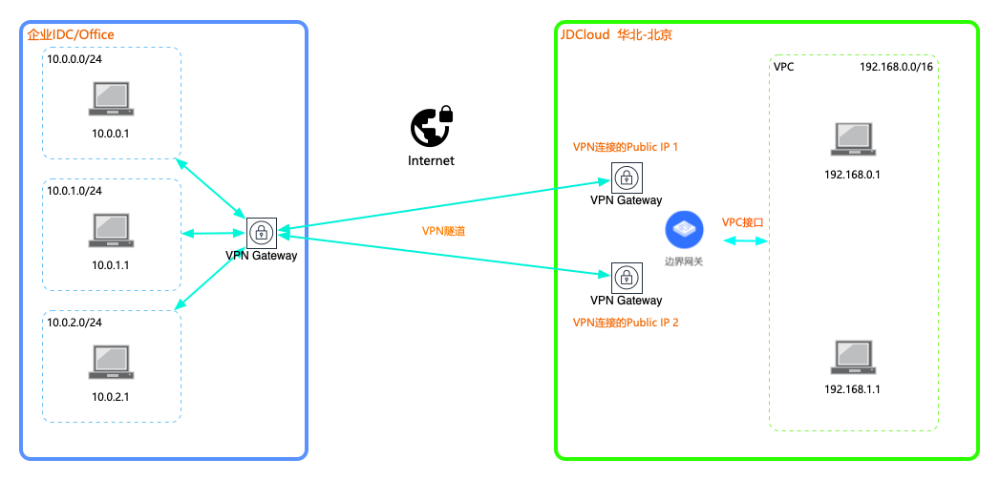

## 企业IDC连接公有云
本教程将为您介绍如何通过京东云专线连接，建立企业IDC到公有云VPC的私有连接。

### 业务场景
客户将核心/非适宜上云的业务部署在自建IDC内，非核心业务/扩展业务部署在京东云VPC内，需要打通IDC和公有云VPC的网络环境，实现内网通信。 

### 前置条件
使用专线连接前，请先阅读相关[使用限制](../Introduction/Restrictions.md)

### 配置步骤

### 详细步骤
###### 步骤1.创建物理连接
a)登录[京东云物理连接控制台](https://cns-console.jdcloud.com/host/physicalConnection/list)；   
b)选择地域，点击“创建”； 
c)输入连接的名称、描述、接入方式、客户IDC地址、合作伙伴/运营商(合作伙伴接入)、接入点(自助接入)，可选输入客户联系人、联系方式，创建物理连接； 
d)物理连接创建后进入待审核状态，京东云收到您提交的物理连接申请后，会在1~2个工作日以内完成审核操作，您也可主动联系京东云进行确认；
e)审核通过并支付完成后，京东云将配合您的线路提供商完成物理线路铺设，并

###### 步骤2.创建边界网关

a)登录[京东云边界网关控制台](https://cns-console.jdcloud.com/host/borderGateway/list)；   
b)选择使用VPN的地域，点击创建边界网关； 
c)边界网关支持运行BGP路由协议，当前京东云边界网关的BGP ASN固定为65000，后续会开放修改； 
更多内容，详见[边界网关管理](../Operation-Guide/Border-Gateway-Management/Border-Gateway-Configuration.md)。

###### 步骤3.创建VPC接口
a)登录[京东云VPC接口控制台](https://cns-console.jdcloud.com/host/vpcAttachment/list)；   
b)选择使用VPN的地域，点击创建VPC接口； 
c)选择步骤1中创建的边界网关，选择要通过该边界网关路由流量的VPC，选择要传播到该边界网关中的VPC网段，创建VPC接口后，被选择的网段将自动添加到该边界网关的传播路由表中，下一跳指向此步骤创建的VPC接口； 

更多内容，详见[VPC接口管理](../Operation-Guide/Border-Gateway-Management/VPC-Attachment-Configuration.md)。

###### 步骤4.创建专线通道
a)登录[京东云VPN连接控制台](https://cns-console.jdcloud.com/host/vpnConnection/list)；   
b)选择使用VPN的地域，点击创建VPN连接； 
c)选择用于实现云端VPN网关功能的边界网关； 
d)选择表示客户端VPN设备的客户网关； 
e)选择连接类型，当前仅支持隧道内外层地址均为IPv4地址簇，未来会支持IPv6地址簇； 
f)选择是否启用BGP路由，基于业务高可用的考虑，默认启用BGP路由，此时将基于边界网关和客户网关建立BGP会话； 
g)创建VPN连接后，会自动分配两个云端公网地址，用于和客户端公网地址间建立VPN隧道； 

更多内容，详见[VPN连接管理](../Operation-Guide/VPN-Connection-Management/VPN-Connection-Configuration.md)。

###### 步骤6.配置专线客户端
a)当前[京东云VPN连接控制台](https://cns-console.jdcloud.com/host/vpnConnection/list)尚不提供VPN隧道客户端配置下载功能，配置客户端设备时请参考客户端配置示例，如[思科客户端配置](../Operation-Guide/Client-Site-Configuration/Cisco-Configuration.md)； 
b)已测试支持的客户端路由器/防火墙设备列表，详见[使用限制](../Introduction/Restrictions.md)，相同厂商的不同平台、软件版本间的VPN配置项差异性基本不大，可按相同系列已通过测试的客户端推荐配置进行设置，若有问题，请咨询您的设备提供商； 
c)未在b中列出的设备厂商型号，可参考设备厂商给出的配置手册进行标准的IPsec配置； 
d)``完成客户端VPN设备配置后，云端默认会主动发起协商建立隧道``，此时可在[京东云控制台](https://console.jdcloud.com/overview)中查看隧道的运行状态是否更新为“UP”，若为“UP”，则表示隧道协商成功，若为“DOWN”，请参考[FAQ](../FAQ/FAQ.md)进行故障处理； 

###### 步骤7.配置BGP(可选)
a)京东云支持与VPN客户端设备之间运行EBGP路由协议，客户端设备需使用与京东云边界网关不同的BGP ASN，京东云使用的BGP ASN见[边界网关的ASN](../Operation-Guide/Border-Gateway-Management/Border-Gateway-Configuration.md)； 
b)建立BGP使用的互联地址为隧道的内层地址，详见[隧道内层IP](../Operation-Guide/VPN-Connection-Management/VPN-Tunnel-Configuration.md)； 
c)云端BGP的其它配置使用默认配置，可在客户端设备上进行修改； 
d)``无论是否配置BGP路由，客户都可以在边界网关上配置静态路由实现数据转发``，一般情况下，静态路由优先级高于BGP路由，例外情况参见[边界网关路由管理](https://docs.jdcloud.com/cn/direct-connection/border-gateway-features)。 

###### 步骤8.配置路由
a)京东云VPN连接支持在云端和客户端之间使用静态路由/BGP动态路由，建议使用BGP动态路由实现路由自动更新； 
b)不同路由的配置方式： 
  * 配置静态路由，在边界网关的静态路由表中配置去往客户端的静态路由，目的端为客户端网段，下一跳为VPN连接。在客户端VPN设备上配置去往云端的静态路由，目的端为云端网段，下一跳为VPN隧道的接口； 
  * 配置BGP动态路由，边界网关和客户端VPN设备建立BGP会话后，边界网关会自动将已配置的所有路由全部发布到Peer客户端，客户端需发布客户端网段路由到Peer云端。 
c)无论边界网关和客户端VPN设备间运行何种路由协议，由于边界网关和VPC间创建了VPC接口并设置了路由传播，故去往客户端网段的路由也会自动传播到VPC路由表，参见[VPC接口路由传播](https://docs.jdcloud.com/cn/direct-connection/vpc-interface-features)； 

更多内容，详见[配置边界网关路由](../Operation-Guide/Route-Management/Border-Gateway-Route-Configuration.md)和[配置VPC路由](../Operation-Guide/Route-Management/VPC-Route-Configuration.md)。

###### 步骤9.测试连通性
a)登录[京东云云主机控制台](https://cns-console.jdcloud.com/host/compute/list)，在创建了VPN连接的地域下，要和企业IDC内网网段互通的VPC中创建一台云主机，确认该云主机所在子网的路由表中存在正确去往企业IDC内网网段的路由；   
b)使用a中创建的云主机ping企业IDC内网中的一台实例的内网地址，验证内网通信是否正常； 

###### 步骤10.隧道维护
a)当客户端设备需要维护，或云端组件需要升级时，会短暂停用/断开某条隧道，需将该隧道的流量切换到其它可用的隧道。为确保正常业务不受影响，在断开隧道前，请先“禁用”隧道，待客户端设备维护或云端组件升级完成后，再次“启用”隧道，重新协商建立隧道，重新使用该隧道承载业务流量； 
b)变更隧道配置前，请先“禁用”隧道，例如需要对隧道的IKE、IPsec配置、预共享密钥等进行更新。禁用隧道后，原隧道将断开，并使配置失效。更新云端及客户端VPN隧道完成后，再次“启用”隧道，以新配置重新协商并建立隧道； 
c)以上a、b仅列出了隧道操作，请注意：需要在“禁用”隧道前在客户端设备上摘除该隧道的路由，“启用”隧道后在客户端设备上添加该隧道的路由； 

更多内容，详见[VPN隧道管理](../Operation-Guide/VPN-Connection-Management/VPN-Tunnel-Configuration.md)。

有关VPN的计费方式，详见[VPN计费](../Pricing/Billing-Overview.md)。
