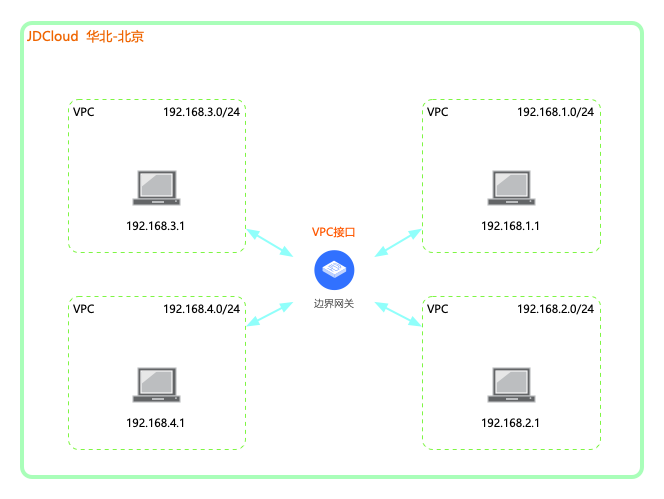

## 云端多VPC互通
本教程将为您介绍如何通过边界网关，实现同地域多VPC互通。

### 业务场景
同一地域内三个以下VPC需互通时，尽量选用“VPC对等连接”，时延小、配置简单；当需要互通的VPC数量较多时，可基于边界网关创建与不同VPC连接的边界网关接口，简化配置部署。

```
  当前仅支持同地域同账号下的VPC通过边界网关进行通信。
  多VPC互联通前，应规划好所有需互通的VPC内网段，尽量保证VPC内的网段不会重叠。如果网段重叠实在不可避免，需要合理配置VPC与边界网关的路由传播范围，保证同一路由表内网段不重叠。
```



### 前置条件
使用专线连接前，请先阅读相关[使用限制](../Introduction/Restrictions.md)。

### 配置步骤


### 详细步骤

###### 步骤1.创建边界网关
a)登录[京东云边界网关控制台](https://cns-console.jdcloud.com/host/borderGateway/list)；  <br />
b)选择使用专线的地域，点击创建边界网关；<br />
c)边界网关支持运行BGP路由协议，当前京东云边界网关的BGP ASN固定为65000，后续会开放修改；<br />

更多内容，详见[边界网关管理](../Operation-Guide/Border-Gateway-Management/Border-Gateway-Configuration.md)。

###### 步骤2.创建VPC接口
a)登录[京东云VPC接口控制台](https://cns-console.jdcloud.com/host/vpcAttachment/list)；  <br />
b)选择使用专线的地域，点击创建VPC接口；<br />
c)选择步骤1中创建的边界网关，选择要通过该边界网关路由流量的VPC，选择要传播到该边界网关路由表中的VPC网段，创建VPC接口后，被选择的网段将自动添加到该边界网关的传播路由表中，下一跳指向此步骤创建的VPC接口；<br />

更多内容，详见[VPC接口管理](../Operation-Guide/Border-Gateway-Management/VPC-Attachment-Configuration.md)。

###### 步骤3.配置路由
在VPC和边界网关之间创建VPC接口后，可以在VPC路由表中设置将边界网关路由表的路由传播到VPC路由表。
a)登录[京东云VPC路由表控制台](https://cns-console.jdcloud.com/host/routeTable/list)；  <br />
b)点击相应的VPC路由表，进入VPC路由表详情页；<br />
c)在“路由传播”Tab中将展示从边界网关中学习到的路由条目，可添加路由传播。点击“添加”，选择与该路由表所在VPC之间创建了VPC接口的边界网关，选择要传入该路由表的边界网关路由的网段范围。选定后，会自动将边界网关有效路由表中处于该范围内的目的端路由传入该路由表。

更多内容，详见[配置边界网关路由](../Operation-Guide/Route-Management/Border-Gateway-Route-Configuration.md)和[配置VPC路由](../Operation-Guide/Route-Management/VPC-Route-Configuration.md)。

###### 步骤4.测试连通性
a)登录[京东云云主机控制台](https://cns-console.jdcloud.com/host/compute/list)，在创建了多VPC互联地域下，在要进行内网互通的VPC中分别创建一台云主机，确认该云主机所在子网的路由表中存在正确去往其它VPC内网网段的路由；  <br />
b)使用a中创建的云主机ping其它VPC中的一台实例的内网地址，验证内网通信是否正常；<br />
