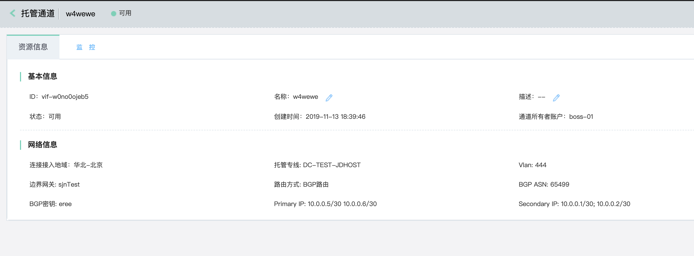

## 托管通道
托管通道(Hosted Private Virtual Interface)，托管通道是在托管专线上区分业务流的逻辑通道，不同的托管通道处理不同的业务，托管通道之间相互隔离、互不影响。

```
  请提前规划好托管区和VPC内的网段，需保证托管区内的网段和VPC内的网段不会重叠。
```

### 操作步骤
##### 1.创建托管通道
已存在“可用”状态的托管专线的客户可以使用托管通道。
a)登录[京东云托管通道控制台](https://cns-console.jdcloud.com/host/hVif/list)；  </br>
b)选择地域，点击“创建”；</br>
c)输入托管通道的名称，选择托管专线、边界网关，指定vlanId、路由方式、客户端设备的BGP ASN、BGP密钥、BGP互联地址，描述，创建托管通道；</br>
d)创建托管通道后，经过一段时间的配置下发后，托管通道进入“可用”状态，配置下发过程涉及云端配置下发，以及和客户端的vlan打通、BGP Session建立、BGP路由学习等，请提前在客户端设备中完成相关配置；</br>

```
  仅可用状态的托管专线支持创建托管通道。
  当前仅支持访问同账号的VPC资源。

  托管通道参数说明：
  vlanId：同一条托管专线上可以创建多条托管通道，不同的托管通道使用不同的vlanId进行区分及隔离，vlanId即vlan号。
  BGP ASN：京东云的专线设备和客户端设备之间运行BGP路由协议，京东云使用的BGP ASN为64512，客户端支持使用的BGP ASN范围为：65001~65499。
  BGP密钥：当前BGP密钥配置不生效，此处可任意指定，但配置客户端时请不要配置BGP密钥。
  路由互联地址：用于在京东云和客户端之间建立BGP Session的互联地址，基于高可用性的角度，请分别指定两对/30的地址，/30的地址中，客户端使用第一个地址，京东云使用第二个地址。互联地址支持10/8、172.16/12、192.168/16三个内网网段的地址。
```

```
  托管通道各状态说明：
  配置中：托管通道配置下发过程中的状态，请同步进行客户端配置；
  可用：托管通道配置下发完成，并与客户端建立BGP Session后的状态，此时可正常进行通信；
  不可用：表示托管通道当前不能够正常通信，待故障排除后，托管通道进入“可用”状态；
  删除中：当客户不再需要使用托管通道时，可对托管通道进行删除，删除过程需要清除相关配置，会持续一段时间，待配置清除后，托管通道删除完成；
```


##### 2.修改托管通道
您可对托管通道的名称、描述进行修改。</br>
a)登录[京东云托管通道控制台](https://cns-console.jdcloud.com/host/hVif/list)；  </br>
b)选择相应的托管通道，进入托管通道详情页面；</br>
c)支持修改托管通道名称、描述，各配置项的限制同创建托管通道；</br>


##### 3.删除托管通道
若您不再需要托管通道，可将其删除。</br>
a)登录[京东云托管通道控制台](https://cns-console.jdcloud.com/host/hVif/list)；  </br>
b)选择相应的托管通道，点击操作列中的“删除”；</br>

