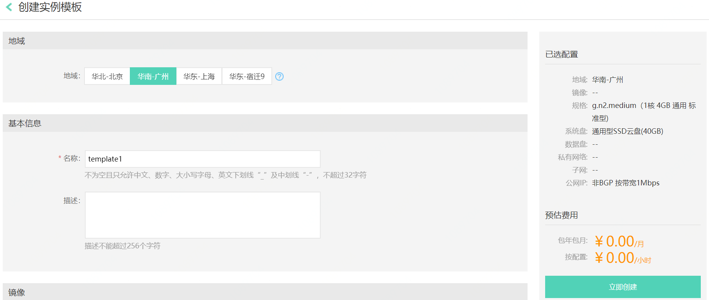
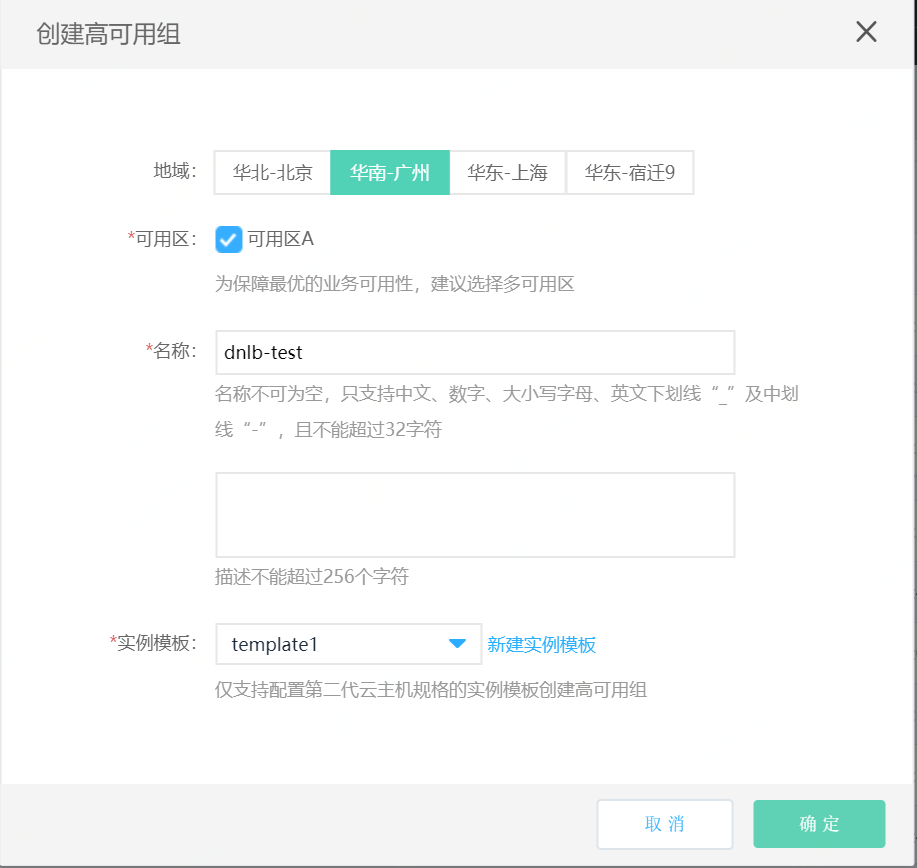

# 创建高可用组
## 操作步骤
### 创建实例模板
 1.在京东云控制台左侧导航栏选择 **弹性计算**>> **云主机**>> **实例模板**，进入实例模板列表页。
 
 2.点击 **创建** 按钮，进入实例模板创建页面
 
 3.选择地域：选择新建实例模板对应的地域，如果所选地域限额已满，可以通过提交工单提升限额。
 
    > 注意:不可跨地域使用实例模板，例不支持使用华南-广州地域的实例模板创建华北-北京的云主机。

 4.按照下图设置实例模板其他参数，参数解释详见[云主机-创建实例模板](http://docs.jdcloud.com/virtual-machines/create-instance-template)。
 
   - 镜像：高可用组内云主机均将以选择的镜像进行创建。
   - 规格：选择第二代云主机规格，仅第二代云主机规格的实例模板支持创建高可用组。
   - 存储：京东云提供云硬盘和本地硬盘两种类型。
   - 网络：选择云主机所在的私有网络和子网，选择子网后将显示该子网内还可创建的云主机数量。如果暂时没有子网，可以通过快速入口新建子网，并在“云主机网络”进行选择。
   - 公网带宽：本指南中的云主机统一通过分布式网络负载均衡绑定的公网IP提供服务，暂不需绑定公网IP，点击 **暂不购买**。如您场景下的后端云主机需单独绑定公网IP提供服务，请配置公网带宽。
   - 登录信息：配置高可用组内云主机的登录信息。

 5.点击 **立即创建**，完成创建模板的操作。
 
### 创建高可用组
 1. 选择 **弹性计算**>> **高可用组**，进入高可用组列表页。
 
 2. 点击 **创建** 按钮，在弹出的对话框中配置如下参数：
    - 地域：选择高可用区所在地域。如果所选地域限额已满，可以通过提交工单提升限额。
    - 可用区：为保障最优的业务可用性，建议选择多可用区。高可用组内云主机将在高可用组内均匀分布。降低当单个可用区出现物理故障时对您业务的影响。
    - 实例模板：选择高可用组内创建云主机所使用的模板，请注意需选择配置了第二代云主机规格的实例模板。此处选择上一步创建的实例模板。
 
 
 3. 点击 **确定** 按钮完成创建高可用组的操作。

