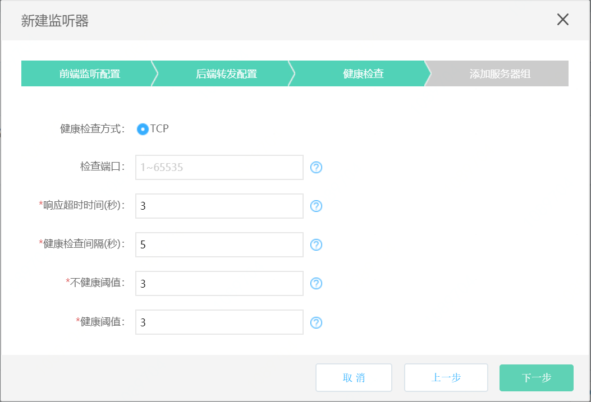
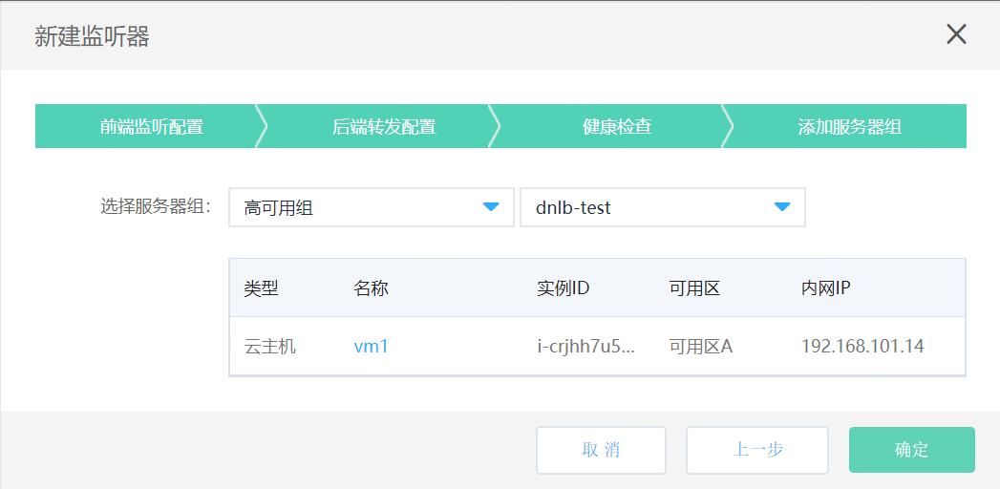

# 分布式网络负载均衡管理
要实现分布式网络负载均衡能够监听和转发客户端服务请求，需至少配置一个监听器和后端服务器。同一个分布式网络负载均衡可配置多个监听器和后端服务，多个监听器可对应一个后端服务。
## 操作步骤
1.您可以在分布式网络负载均衡列表页通过以下两种方式，进入监听器列表页。    
   - 点击 **名称**  栏下的指定分布式网络负载均衡，进入该分布式网络负载均衡详情页。点击 **监听器** 页签，进入监听器列表页。
   - 点击 **操作** 栏下的 **添加监听** 链接，进入监听器列表页。
     
2.点击 **新建监听器** 按钮，在弹出的配置向导对话框中配置监听协议和端口。
> 注意
    
    - 同一DNLB下，监听端口不能重复。
    - 监听协议和端口配置后不允许修改。
       

3.点击 **下一步**，进入后端服务配置页签。选择默认后端服务类型为 **新建后端服务**。如已有后端服务满足业务需求，可选择已有后端服务，本指南中选择新建一个后端服务。 配置后端服务参数：
   - 后端协议：后端服务器提供服务时使用的协议，默认显示为TCP。    
   - 端口：后端服务器接收服务请求的端口。 
   - 调度算法：分布式网络负载均衡将服务请求分发到后端服务器的算法。加权源IP是根据源IP地址进行的哈希算法，将相同源IP的服务请求分发到同一后端服务器，同时考虑后端服务器的权重，按权重比例分发服务请求；加权五元组是根据报文五元组（协议、源IP、源端口、目的IP和目的端口）进行的哈希算法，将相同五元组的服务请求分发到同一后端服务器，同时考虑后端服务器的权重，按权重比例分发服务请求。    
 
 
 4.点击 **下一步** ，进入健康检查页签。本指南中健康检查参数都是用默认值。
 
 
 5.点击 **下一步**，进入添加服务器组页签。选择服务器组类型为 **高可用组**，选择已创建的高可用组。
 
 
 6.点击 **确定** 按钮完成操作。
