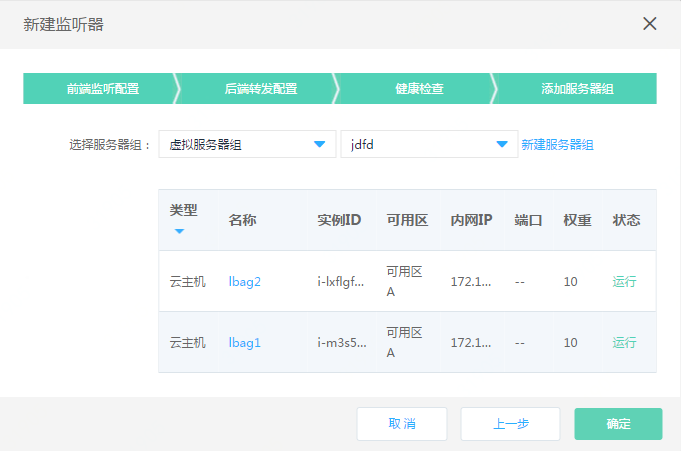
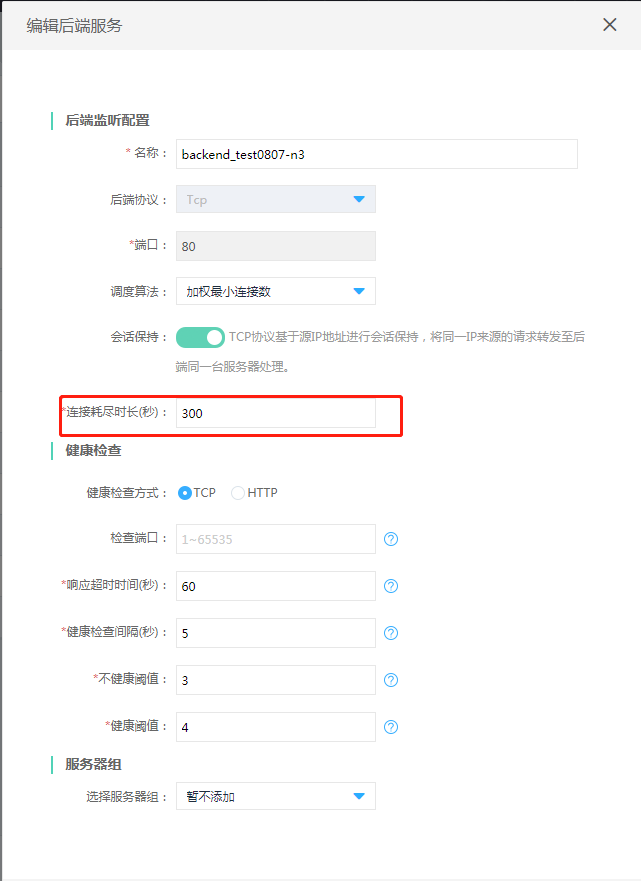

# 部署支持连接耗尽的TCP监听器策略

## 准备与规划

- 网络准备

	根据业务部署需要，提前规划负载均衡和作为后端服务器的云主机、容器的地域、可用区、私有网络等【注意：作为后端服务器的云主机、容器需要与负载均衡同一地域、私有网络】。

- 服务器准备

	需提前创建承载业务流量的云主机、容器，并确保打开监听所需的端口，合理配置安全组、ACL策略。

- 负载均衡实例

	创建一个负载均衡实例，并设置地域、可用区、网络、安全组等配置。

## 创建一个TCP监听器

- 前端监听配置：
	
	点击 **添加** 创建一个监听器：选择TCP协议，配置监听端口、空闲连接超时。

	

- 后端转发配置：可以新建或者选择已有的后端服务，注意只能选择后端协议为TCP类型的后端服务。
	
	这里新建一个后端服务：配置后端服务名称、协议（TCP）、端口为80、调度算法选择加权轮询、会话保持开关。

    **另外重点注意连接耗尽（connection draining）超时时间设置。当一个服务器从“虚拟服务器组”或者高可用组（AG）中摘除时，只有已建立的TCP连接报文会继续向该服务器转发、直到连接耗尽时间超时为止，新建立的TCP连接将不会向该服务器转发。**

	

- 配置健康检查：设置健康检查相关参数，这里使用TCP方式。

	

- 添加服务器组：根据业务需要选择虚拟服务器组、高可用组。

	根据业务需要选择虚拟服务器组、高可用组。

	

- 如没有可用的虚拟服务器组，点击 **新建虚拟服务器组** 创建一个新的虚拟服务器组，可选云主机、容器，定义实例的端口、权重。
	
	注：只能选择与负载均衡同私有网络下的云主机、容器资源。

	

- 至此，已创建完成基于TCP协议的监听器，可在监听器列表查看。

	

# 修改配置支持连接耗尽的TCP监听器策略

## 修改后端服务的连接耗尽

- 进入负载均衡实例的后端服务

	从负载均衡实例->具体实例名称->后端服务->编辑
  
    

- 修改后端服务配置

	在后端服务找到特定后端服务名称，从“操作”点击“编辑”进行连接耗尽（connection draining）超时时间设置。当一个服务器从“虚拟服务器组”或者高可用组（AG）中摘除时，只有已建立的TCP连接报文会继续向该服务器转发、直到连接耗尽时间超时为止，新建立的TCP连接将不会向该服务器转发。

    如果不需要连接耗尽功能，可以把时长设置为0。

    
