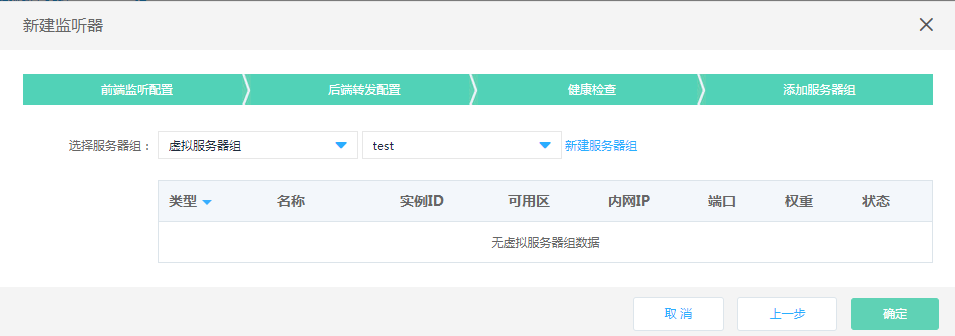
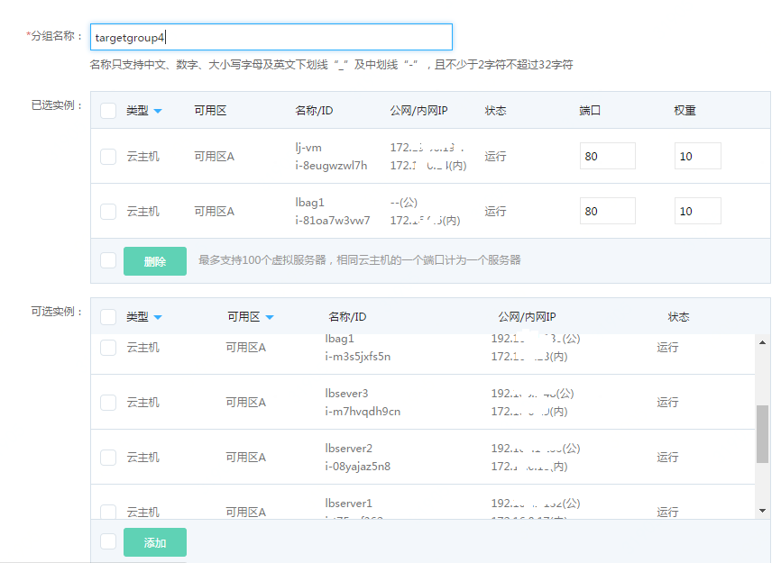
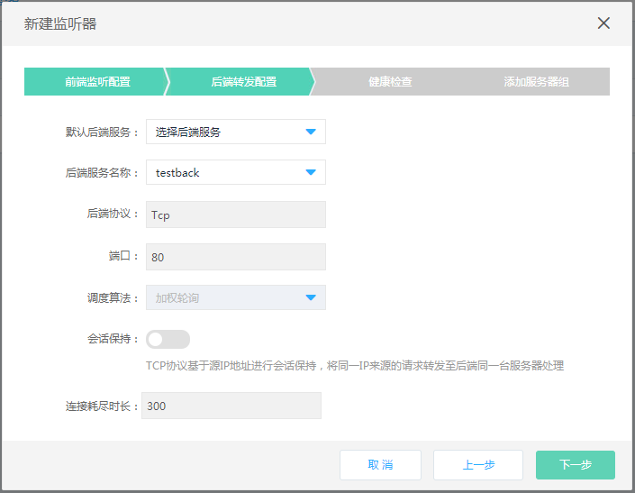
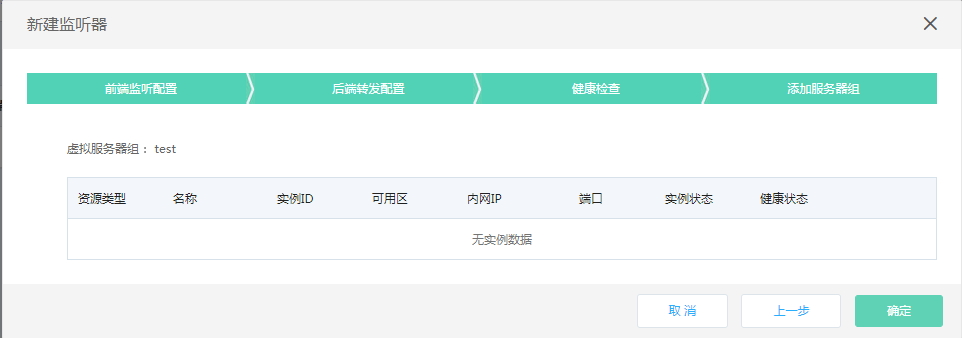

# 快速部署基于相同业务的多个监听器

  假如您的业务需要同时支持多个监听器、并需要复用后端服务，可以用如下方式实现快速部署。

## 准备与规划

- 网络准备

  根据业务部署需要，提前规划负载均衡和作为后端服务器的云主机、容器的地域、可用区、私有网络等【 注意：作为后端服务器的云主机、容器需要与负载均衡同一地域、私有网络】。	
 
- 服务器准备

  需提前创建承载业务流量的云主机、容器，并确保打开监听所需的端口，合理配置安全组、ACL策略。

- 负载均衡实例

  创建一个负载均衡实例，并设置地域、可用区、网络、安全组等配置。

## 创建一个TCP协议的监听器策略

#### 1. 前端监听配置：
	
- 配置监听协议为TCP，端口80；

- 空闲连接超时：设置空闲连接超时时间；

#### 2. 后端转发配置：
	
- 默认后端服务：选择新建后端服务；

- 后端服务名称：定义后端服务名称，命名为“testback”；

- 后端协议：根据监听协议显示对应的默认协议；

- 端口：定义后端转发端口；

- 调度算法：根据业务需要选择，这里指定为加权轮询；

- 会话保持：开启；

- 连接耗尽：连接耗尽超时时间设置；

- 配置健康检查：选择健康检查方式为：TCP

#### 3.添加服务器组：

- 根据业务需要选择虚拟服务器组、高可用组。

- 如没有可用的虚拟服务器组，点击 **新建虚拟服务器组** 创建一个新的虚拟服务器组，可选云主机、容器，定义实例的端口、权重【注：只能选择与负载均衡同私有网络下的云主机、容器资源】。

#### 4. 监听器策略已创建完成：

- 基于TCP协议的监听器，可在监听器列表查看。

- 此时，在后端服务列表中已同步创建了一个名为“testback”的资源。

## 复用后端服务创建另一个TCP监听器

#### 1. 前端监听配置：

- 配置前端监听协议为TCP，端口为8080；

- 设置空闲连接超时时间；

#### 2. 后端服务转发：

- 选择使用已有后端服务：testback【注：直接使用已经存在的backend相关信息，与之前TCP监听复用同一后端服务配置、健康检查、服务器组。】；

#### 3. 通过这种方式，可以快速创建复用相同后端服务的多个监听器。

  注意：请确认业务场景可以复用后端服务的所有配置，如相同的后端转发端口等。

