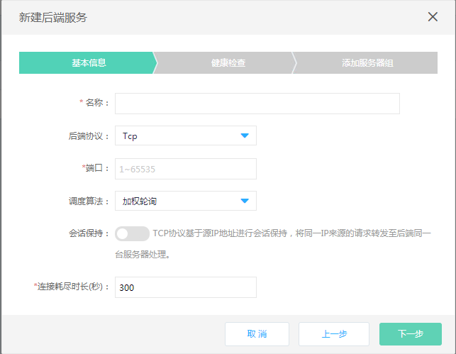

# 后端服务管理

## 添加后端服务

#### 1. 通过负载均衡-详情-后端服务进入后端服务管理页；

#### 2. 点击 **新建后端服务**，打开后端服务创建页；

#### 3. 后端服务设置：
	
##### 基本信息：
	
- 名称：定义后端服务名称；
	
- 后端协议：可选tcp 【注意：后端协议为tcp时，只能绑定监听协议为tcp的监听器】；

- 端口：输入范围1~65535，不同后端服务的端口可以重复；

- 调度算法：支持加权轮询、加权最小连接数和源IP；

- 会话保持：默认关闭，打开支持基于TCP的会话保持，缺省为1440秒；

- 连接耗尽：配置连接耗尽超时时间，范围为【0，3600】秒，缺省为300秒；

##### 健康检查设置：

- 选择健康检查方式：HTTP、TCP；

- 设置检查端口：输入范围1~65535，如不填写默认为后端实例接收负载均衡流量的端口；

- 响应超时时间(s)：输入范围2~60秒,此为健康检查响应的最大超时时间；

- 健康检查间隔(s):输入范围为5~300秒,此为健康检查的时间间隔；

- 不健康阈值：输入范围1~5，此为后端实例从成功到失败的连续健康检查失败次数；

- 健康阈值：输入范围1~5，此为后端实例从失败到成功的连续健康检查成功次数；

- 正常态码：输入范围2xx（等价于200-299）、3xx（等价于300-399）、4xx（等价于400-499）；

- 检查路径：仅健康检查方式为HTTP时填写，必须以“/”开头、最多支持5级目录，不得超过100字符。

	

##### 添加服务器组：

- 选择服务器组类型：虚拟服务器、高可用组，或者可以暂不添加；

- 虚拟服务器组：系统会自动筛选出当前可以绑定的服务器组列表，如没有可用的服务器组，可点击 **新建虚拟服务器组** 进行创建【注：可选服务器组中的后端实例必须与负载均衡处于相同地域、私有网络、可用区下。】；

- 高可用组：系统会自动筛选出当前可以绑定的高可用组，如没有可用的高可用组，请前往高可用组页面进行创建}【注：可选高可用组中的后端实例必须与负载均衡处于相同地域、私有网络、可用区下。】；

## 管理后端服务

1. 查看后端服务详情：点击后端服务名称进入后端服务详情页，可查看后端服务配置信息、更换绑定的后端服务器组（见下文）；

2. 查看绑定的服务器组：列表页点击后端服务名称，查看后端服务关联的服务器组信息和健康状态；

3. 编辑后端服务：编辑后端服务器组相关配置信息（见下文）；

4. 删除后端服务：删除成功后后端服务将与绑定的服务器组自动解除关联，已关联监听器的后端服务不可删除；

	
## 更换后端服务绑定的服务器组

1. 通过负载均衡-详情-后端服务-详情打开后端服务详情，点击 **更改**，更换绑定的服务器组；

2. 通过负载均衡-详情-后端服务-编辑打开后端服务编辑页，更换绑定的服务器组；

	
## 编辑后端服务

1. 通过负载均衡-详情-后端服务-编辑打开后端服务编辑页；

2. 编辑后端服务配置项，其中后端协议、端口不可编辑，其余项均可编辑证书：如监听器有绑定的证书，可修改；

	

