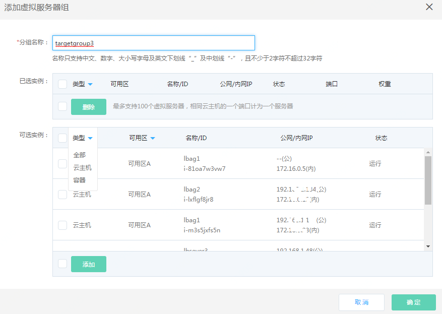

# 创建虚拟服务器组

##### 1. 通过网络负载均衡-详情-虚拟服务器组进入虚拟服务器组列表页。

##### 2. 点击【新建虚拟服务器组】创建一个新的虚拟服务器组。

- FSR模式的NLB仅允许添加实例类型的虚拟服务器组。

- FullNAT模式的NLB可以添加实例类型和IP类型的虚拟服务器组。

##### 3. 实例类型的虚拟服务器组添加实例步骤：在可选实例列表选择要添加的实例，点击【添加】将选择的实例添加到已选实例列表，配置端口和权重，点击【确定】完成添加实例类型的虚拟服务器组操作。

- 端口：实例提供服务的端口，输入范围为1-65535。如不填写本参数，默认使用后端服务的端口。

- 权重：实例在整个虚拟服务器组中所占的权重，输入范围为0-100。权重越高的实例被分发到服务请求的概率越大。权重为0表示NLB不向该实例分发任何服务请求。

         注意：
         * 服务器组中的后端实例必须与网络负载均衡属于同一地域的同一私有网络。
         * 同一实例可通过不同端口注册到同一虚拟服务器组。

##### 4. IP类型的虚拟服务器组添加IP步骤：点击【注册新IP】增加一条记录，配置IP、端口和权重，可根据需求添加多条记录，点击【确定】完成添加IP类型的虚拟服务器组操作。

- IP：注册的后端服务器的IP地址。输入范围为10.0.0.0/8、172.16.0.0/12和192.168.0.0/16。当后端服务器位于VPC外（例如：通过专线和VPC peering互通的后端服务器）时，请使用IP注册到虚拟服务器组。

- 端口：IP对应的后端服务器提供服务的端口，输入范围为1-65535。如不填写本参数，默认使用后端服务的端口。

- 权重：IP对应的后端服务器在整个虚拟服务器组中所占的权重，输入范围为0-100。权重越高的后端服务器被分发到服务请求的概率越大。权重为0表示NLB不向该后端服务器分发任何服务请求。

         注意：
         * 同一IP可通过不同端口注册到同一虚拟服务器组。

后期再补图。

